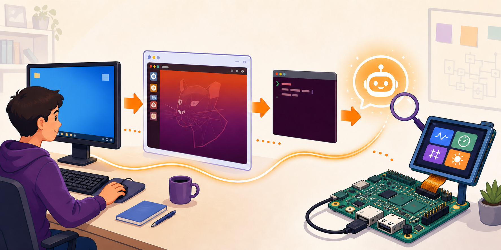
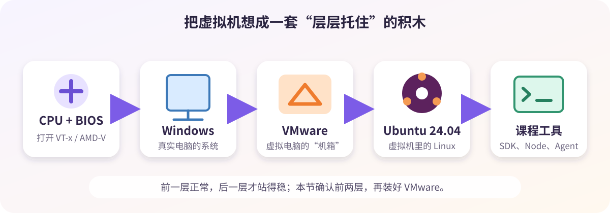
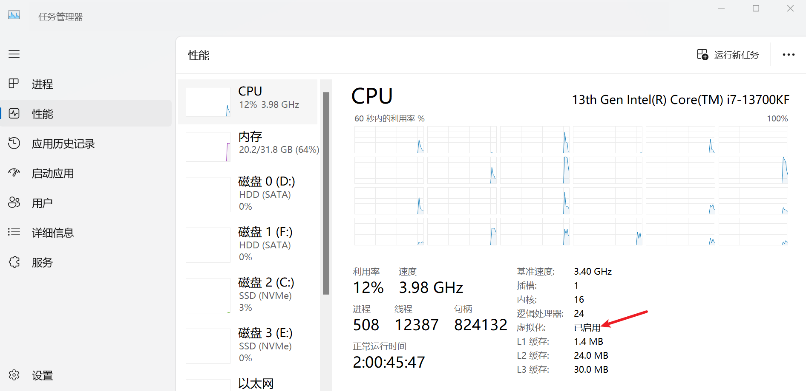

# 00 VMware Workstation 安装



## 先看懂这张图



| 名称 | 小白理解 | 本节怎么做 |
| --- | --- | --- |
| 宿主机（Host） | 真实的 Windows 电脑 | 安装 VMware |
| 虚拟机（VM/Guest） | VMware 里的“软件电脑” | 下一节打开 Ubuntu |
| VT-x / AMD-V | CPU 虚拟化开关 | 确认“已启用” |
| Hyper-V / VBS | Windows 虚拟化与安全功能 | 先保持原样 |
| 嵌套虚拟化 | 让虚拟机里再运行虚拟机 | 本课程不用开启 |

## 安装前准备

| 检查项 | 最低要求 | 推荐 |
| --- | --- | --- |
| 系统 | Windows 10/11 64 位 | 更新到稳定版本 |
| 内存 | 16 GB | 32 GB |
| SSD 可用空间 | 150 GB | 250 GB 以上 |
| 权限 | 能安装软件 | 准备好管理员密码 |
| 安装包 | 课程交付包或 [Broadcom 官网](https://support.broadcom.com/) | 记录来源 |

> 大空间留给 Ubuntu、SDK 和编译结果。使用 VMware 17.6.x 或课程验证过的更高版本；不要使用论坛、陌生网盘或“绿色版”。

## 按步骤安装

### 1. 查看电脑信息

在 Windows 按 `Win + R`，输入 `msinfo32` 后回车。

成功标志：能看到 Windows 版本、OS Build、CPU 和内存。

### 2. 检查虚拟化

打开“任务管理器 → 性能 → CPU”，找到“虚拟化”。



成功标志：虚拟化显示“已启用”。

若显示“已禁用”，重启进入 BIOS/UEFI，开启 `Intel Virtualization Technology`、`VT-x`、`VMX`、`SVM Mode` 或 `AMD-V` 中与本机对应的选项。常见入口键是 `F2`、`Delete`、`F10` 或 `Esc`。

> 只按电脑或主板准确型号查看厂商说明，不要顺手修改其他 BIOS 选项。

### 3. 运行安装包

在文件资源管理器中找到课程交付的 `.exe`，右键选择“以管理员身份运行”。确认发布者可信后，再允许 UAC。

成功标志：VMware 安装向导正常打开。

### 4. 完成安装

没有特殊需求时保留默认组件，按当前许可完成确认；安装结束后重启 Windows。

成功标志：开始菜单中能找到并打开 VMware Workstation。

### 5. 记下版本

打开“VMware → Help → About”，记录完整的 Version 和 Build。

成功标志：VMware 主界面正常打开，没有阻断错误。

记录排错信息：

```text
Windows / OS Build:
CPU / RAM:
Virtualization / VBS:
VMware Version / Build:
VM Storage Directory:
检查日期:
```

`VM Storage Directory` 应位于空间充足的本机 SSD，不要放在网盘同步目录或课程原始资料目录中。

## 完成检查

- [ ] 任务管理器显示“虚拟化：已启用”
- [ ] VMware 主界面能打开
- [ ] 已记录 VMware 版本、Build 和安装包来源
- [ ] 已准备虚拟机专用 SSD 目录

## 故障速查

| 现象 | 先做什么 | 不要做什么 |
| --- | --- | --- |
| VT-x / AMD-V 已禁用 | 查任务管理器；按厂商说明开启 BIOS 虚拟化，完整关机再开机 | 不必同时开启 VT-d、IOMMU 或嵌套虚拟化 |
| Device Guard / Hyper-V 不兼容 | 记录 Windows Build、VMware 版本和完整报错；先升级到课程支持版本 | 不要先关闭安全功能；这会影响 WSL2、Sandbox 和 Memory Integrity |
| 安装程序没反应 | 确认文件非 0 字节、已完整解压到本地、账号有管理员权限；保存错误码 | 不要反复运行来路不明的安装包 |
| 虚拟网络异常 | 重启 Windows；仍异常时用同一安装包选择 Repair | 不要手工删除 VMnet 网卡、驱动或注册表项 |
| 已装旧版本 | 先在 Help → About 记录版本并关闭所有虚拟机；按官方升级说明操作 | 不要把 Repair 当升级 |

## 参考资料

- [Broadcom：安装 VMware Workstation Pro](https://knowledge.broadcom.com/external/article/387947/installing-vmware-workstation-pro.html)
- [Broadcom：下载 VMware Workstation Pro](https://knowledge.broadcom.com/external/article/344595/downloading-vmware-workstation-pro.html)
- [Broadcom：升级 VMware Workstation Pro](https://knowledge.broadcom.com/external/article/343514/upgrading-from-vmware-workstation-pro-14.html)
- [Broadcom：启用宿主机虚拟化技术](https://knowledge.broadcom.com/external/article/318916)
- [VMware：Workstation 与 Hyper-V 共存](https://blogs.vmware.com/cloud-foundation/2020/05/28/vmware-workstation-now-supports-hyper-v-mode/)
