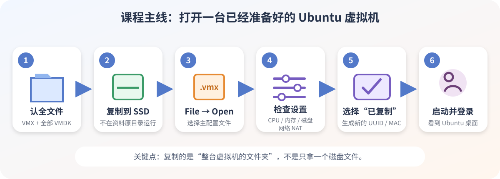
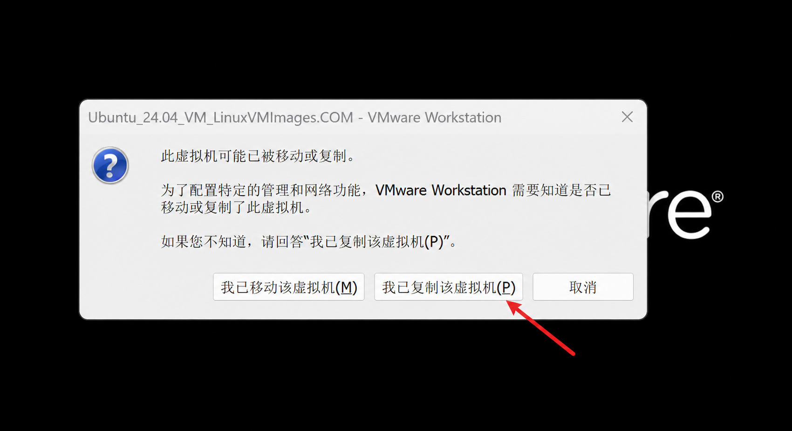
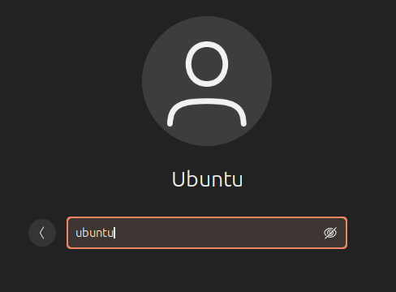

# 01 Ubuntu 24.04 虚拟机创建（导入课程 VM）

本节把课程提供的 Ubuntu 24.04 虚拟机复制到本机并第一次开机，不从零安装 Ubuntu。



## 先认两个文件

| 文件 | 小白理解 | 注意 |
| --- | --- | --- |
| `.vmx` | 虚拟机配置单：CPU、内存、网卡等 | 用 VMware 打开它 |
| `.vmdk` | 虚拟硬盘：Ubuntu、文件和软件 | 不能漏掉配套文件或分卷 |

> 必须从课程正式交付渠道取得完整虚拟机。下载地址、包名、主 `.vmx` 和登录账号均以交付说明为准；本轻量文档仓库不提供或猜测这些信息。

## 准备与配置

- 已完成[上一节](00-vmware-workstation.md)，Windows 虚拟化已启用；
- 压缩包已在 Windows 中完整解压；
- 在本机 SSD 准备虚拟机目录，例如 `D:\VirtualMachines`；
- 不要在网盘同步目录或课程原始资料目录中运行虚拟机。

| 项目 | 检查基线 | 推荐值 |
| --- | ---: | ---: |
| vCPU | 4 | 8，且不超过宿主机逻辑线程一半 |
| 内存 | 8 GB | 12–16 GB；宿主机仅 16 GB 时先分 8 GB |
| 虚拟磁盘 | 120 GB | 160–200 GB，可增长 |
| 网络 / 固件 | NAT / UEFI | NAT / UEFI |
| 嵌套虚拟化 | 关闭 | 关闭 |
| 3D 加速 | 可开启 | 黑屏时关闭复测 |

## 按步骤创建

### 1. 复制完整目录

在 Windows 文件资源管理器中，把包含 `.vmx`、全部 `.vmdk`、NVRAM 等文件的**整个目录**复制到本机 SSD。

成功标志：复制完成，课程原始目录没有改动。

### 2. 打开虚拟机

进入“VMware → File → Open”，在复制后的目录中选择交付说明指定的主 `.vmx`，不要选 `.vmdk`。

成功标志：VMware 左侧出现 Ubuntu 虚拟机。

### 3. 检查配置

点击“Edit virtual machine settings”，按上表检查 CPU、内存、磁盘和 NAT；不要开启嵌套虚拟化。

成功标志：概览页显示刚刚确认的配置。

### 4. 第一次启动

点击一次绿色启动按钮。出现移动或复制询问时，选择“我已复制该虚拟机”。



成功标志：Ubuntu 开始启动。

### 5. 登录 Ubuntu

只使用课程交付说明中的账号，不要反复猜密码。实际账号以交付说明为准：



密码为ubuntu

成功标志：进入 Ubuntu 桌面。

### 6. 修改密码

按 `Ctrl + Alt + T` 打开 Ubuntu 终端，执行：

```bash
passwd
```

依次输入当前密码、新密码、再次输入新密码。输入时不显示字符或星号是正常现象。

成功标志：终端显示密码更新成功。

### 7. 正常关机

打开 Ubuntu 右上角系统菜单，选择“关机”，等待 VMware 显示已关机。

成功标志：虚拟机完全停止。

> 虚拟磁盘不足时先看这份镜像的课程扩容说明。只放大 VMDK，不会自动放大 Ubuntu 分区和 ext4 文件系统。正常关机优先；VMware“断电”只在系统完全无响应时使用。

## 文件类型不一样怎么办

| 看到的文件 | 处理方式 |
| --- | --- |
| `.vmx` + 配套 `.vmdk` | 按本节主线，复制完整目录后打开主 `.vmx` |
| `.ova` / `.ovf` | VMware → File → Open / Import |
| `.iso` | 按对应课程说明新建虚拟机并安装；完成后断开虚拟 CD/DVD 中的 ISO |
| 只有单独 `.vmdk` | 暂停，核对交付说明或联系课程支持 |

## 完成检查

- [ ] 完整目录已复制到本机 SSD，课程原始目录未改动
- [ ] VMware 能打开交付说明指定的主 `.vmx`
- [ ] 首次询问时选择“我已复制”，网络为 NAT
- [ ] 能用交付账号进入桌面并修改默认密码
- [ ] Ubuntu 能正常关机并再次从虚拟硬盘启动

## 故障速查

| 现象 | 处理 |
| --- | --- |
| 缺少虚拟磁盘 | 关机，检查完整目录和全部 VMDK；重新复制，不创建同名空磁盘 |
| 黑屏或花屏 | 完全关机，关闭 3D acceleration 后重试；仍失败时保存 VMware Build、虚拟机版本和 `vmware.log` |
| 内存不足 | 关闭 Windows 大型软件，调低虚拟机内存；不要超过 Windows 当前可用内存 |
| 密码不对 | 检查大小写、键盘布局、输入法和交付说明；不要反复猜测 |
| 改后忘记密码 | 按 Ubuntu 密码恢复流程处理；原始默认密码不会恢复工作副本 |
