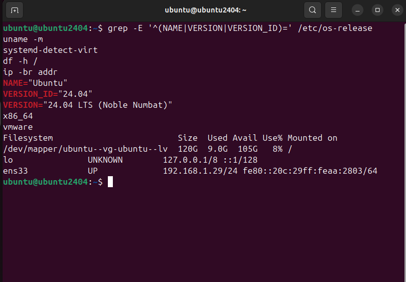
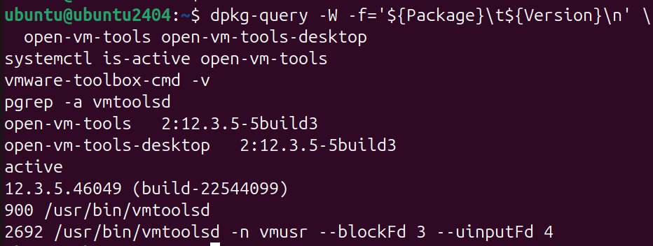
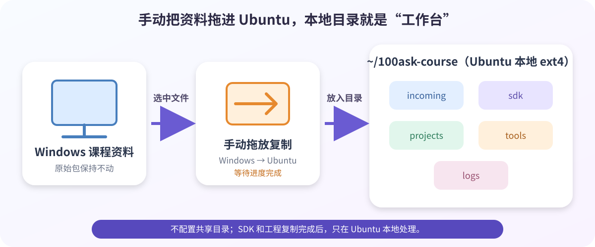
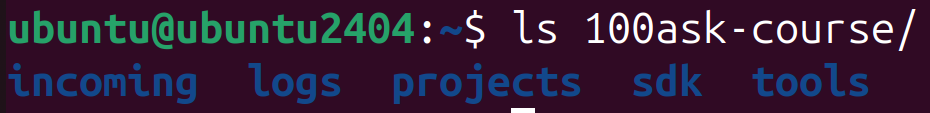
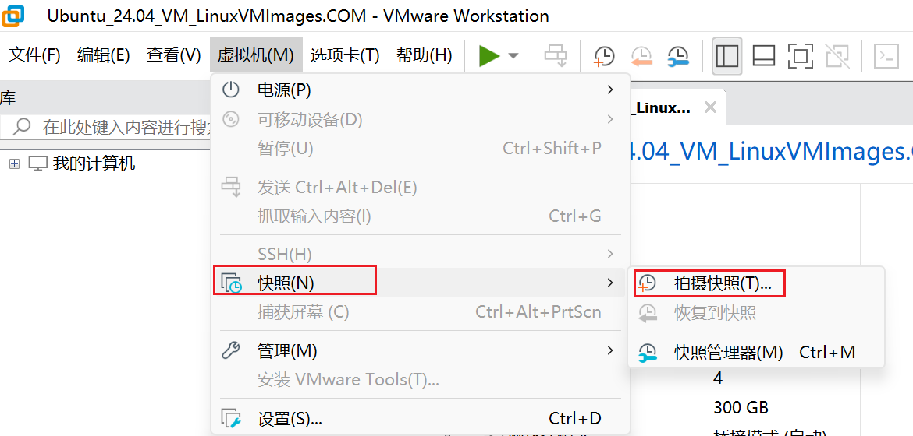
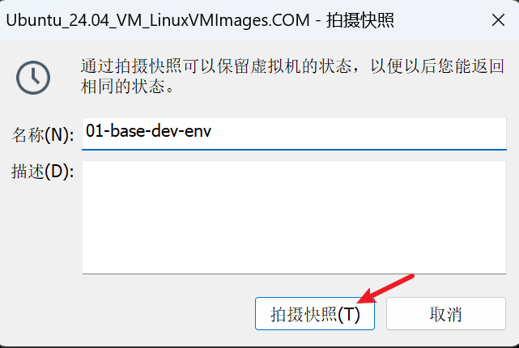
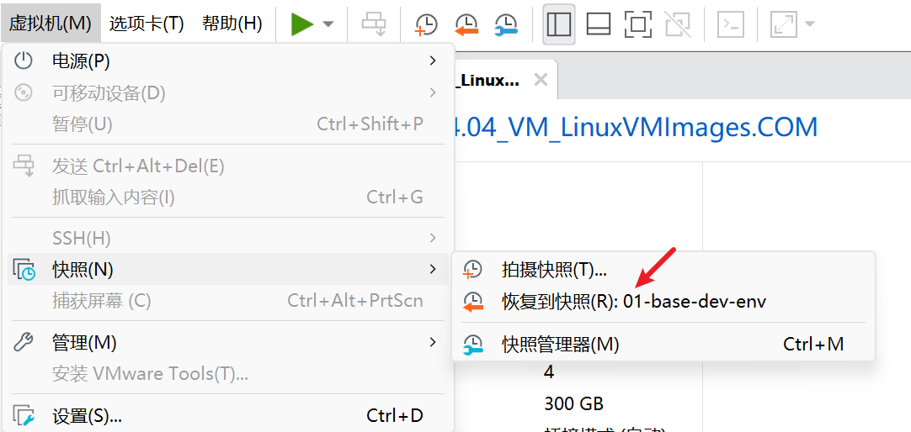

# 02 Ubuntu 24.04 虚拟机基础配置

> 这里只装通用工具。交叉编译器和各厂商 SDK 依赖留到对应平台章节。

## 终端小抄

按 `Ctrl + Alt + T` 打开 Ubuntu 终端。

| 看到的内容 | 意思 |
| --- | --- |
| `ubuntu@ubuntu2404:~$` | 不复制 `$`；`~` 是个人目录 |
| `$HOME` | 个人目录，例如 `/home/ubuntu` |
| `sudo` | 临时管理员权限；密码不回显是正常的 |
| `Ctrl + Shift + V` | 在终端中粘贴 |

## 1. 检查系统和网络

在 Ubuntu 终端逐组运行：

```bash
grep -E '^(NAME|VERSION|VERSION_ID)=' /etc/os-release
uname -m
systemd-detect-virt
df -h /
ip -br addr
```



```bash
nmcli device status
ip route
getent hosts archive.ubuntu.com
timedatectl status
```

| 检查项 | 成功标志 |
| --- | --- |
| 系统 / 架构 / 虚拟机 | Ubuntu 24.04 / `x86_64` / `vmware` |
| 网卡 / 路由 | `connected` 或 `UP`；有 `default via` |
| DNS / 时间 | 能解析 IP；时间同步正常 |
| 磁盘 | 根分区空间充足 |

### 可选：apt 下载很慢

网络正常就跳过。先备份 Ubuntu 24.04 的 DEB822 源文件：

```bash
sudo cp -n /etc/apt/sources.list.d/ubuntu.sources /etc/apt/sources.list.d/ubuntu.sources.bak
grep -n '^URIs:' /etc/apt/sources.list.d/ubuntu.sources
```

仅当输出确有 `archive.ubuntu.com` 时替换普通源：

```bash
sudo sed -i -E 's|https?://archive\.ubuntu\.com/ubuntu/?|https://mirrors.tuna.tsinghua.edu.cn/ubuntu|g' /etc/apt/sources.list.d/ubuntu.sources
grep -n '^URIs:' /etc/apt/sources.list.d/ubuntu.sources
sudo apt update
```

原地址不同就按 TUNA 说明修改 `URIs:`。安全更新源建议保留官方地址。

## 2. 安装 VMware Tools

```bash
sudo apt update
sudo apt upgrade -y
sudo apt install -y open-vm-tools open-vm-tools-desktop
```

前三条没有阻断错误后，再运行：

```bash
sudo reboot
```

重新登录后检查：

```bash
dpkg-query -W -f='${Package}\t${Version}\n' \
  open-vm-tools open-vm-tools-desktop
systemctl is-active open-vm-tools
vmware-toolbox-cmd -v
pgrep -a vmtoolsd
```

看到包版本、`active` 和 `vmtoolsd` 即可。



> Ubuntu 24.04 使用软件仓库中的 `open-vm-tools`，不要安装旧式 `VMwareTools*.tar.gz`。

## 3. 手动复制 Windows 与 Ubuntu 文件

本课程不配置共享目录，资料直接在两个文件管理器之间拖放。

### 3.1 确认使用 Xorg

在 Ubuntu 终端运行：

```bash
echo "$XDG_SESSION_TYPE"
```

看到 `x11` 就继续。若看到 `wayland`：注销 Ubuntu → 登录界面选择用户 → 点击右下角齿轮 → 选择“Ubuntu on Xorg”→ 登录。

### 3.2 Windows 复制到 Ubuntu

1. 在 Windows 桌面新建 `hello.txt`。
2. 打开 Ubuntu 的“文件”窗口，进入“下载”。
3. 把 `hello.txt` 从 Windows 拖进 Ubuntu 窗口。

看到 Ubuntu“下载”目录中出现 `hello.txt`，双击能打开即可。

### 3.3 Ubuntu 复制回 Windows

把 Ubuntu 中的 `hello.txt` 拖回 Windows 桌面，再打开确认一次。

> 拖不动时先重启 Ubuntu；仍无效就用 U 盘临时中转。

## 4. 建立课程工作区



```bash
mkdir -p "$HOME/100ask-course"/{incoming,sdk,projects,tools,logs}
mkdir -p "$HOME/100ask-course/projects/agent-sandbox"
chmod 700 "$HOME/100ask-course"
ls "$HOME/100ask-course/"
```



| 目录 | 放什么 |
| --- | --- |
| `incoming` | Windows 传入、尚未确认的文件 |
| `sdk` | 校验并解压后的 SDK |
| `projects` | 实验工程和 `agent-sandbox` |
| `tools` | Agent 等工具源码 |
| `logs` | 不含密码或密钥的日志 |

遇到权限问题先查所有者，不要执行 `chmod -R 777`。

## 5. 安装通用开发工具

```bash
sudo apt install -y \
  build-essential git git-lfs curl wget ca-certificates \
  unzip zip p7zip-full xz-utils zstd file rsync \
  python3 python3-venv python3-pip \
  cmake ninja-build pkg-config ripgrep jq tree \
  minicom openssh-client
```

```bash
git lfs install
```

看到类似 `Git LFS initialized` 即完成。

## 6. 安装 Node.js 24

nvm 管理 Node.js 版本，不要使用 `sudo npm`。

```bash
curl -o- https://raw.githubusercontent.com/nvm-sh/nvm/v0.40.6/install.sh | bash
```

```bash
source "$HOME/.nvm/nvm.sh"
nvm install 24
nvm alias default 24
nvm use 24
node --version
npm --version
```

`node --version` 以 `v24.` 开头即可。新终端找不到 nvm 时，先运行 `source "$HOME/.nvm/nvm.sh"`。

## 7. 保存环境体检记录

```bash
{
  date -Is
  grep -E '^(NAME|VERSION|VERSION_ID)=' /etc/os-release
  uname -a
  df -h /
  git --version
  python3 --version
  cmake --version | head -n 1
  ninja --version
  node --version
  npm --version
  vmware-toolbox-cmd -v
} | tee "$HOME/100ask-course/logs/part0-base-env.txt"
```

确认各项有输出，且日志不含 API Key 或密码。

## 8. 创建快照

先正常关闭 Ubuntu，再按图操作：



快照名称填写 `01-base-dev-env`：



以后可从同一菜单恢复：



> 快照是短期“存档点”，不是备份。真正备份时要先关机，再把完整虚拟机目录复制到另一块磁盘。

## 完成检查

- [ ] Ubuntu、NAT、DNS 和时间正常
- [ ] `open-vm-tools` 为 `active`，文件能在 Windows 与 Ubuntu 之间拖放
- [ ] 课程五个目录和 `projects/agent-sandbox` 已创建
- [ ] Git、Python、CMake、Ninja、Node 24 和 npm 能显示版本
- [ ] 已保存 `part0-base-env.txt` 并创建 `01-base-dev-env` 快照

## 故障速查

| 现象 | 简单处理 |
| --- | --- |
| `apt` 无法解析域名 | 查网络三项命令；先修 NAT/DNS，不覆盖 `/etc/resolv.conf` |
| `apt` / `dpkg` 被锁定 | 等软件更新窗口或当前 apt 完成，不删除锁文件 |
| 拖放无效 | 确认是 `x11` 且 Tools 为 `active`，然后重启；仍失败就用 U 盘中转 |
| 剪贴板或缩放无效 | 确认 Tools 为 `active` 并重启 Ubuntu |
| `node` / `nvm` 找不到 | 执行 `source "$HOME/.nvm/nvm.sh"`，再执行 `nvm use 24` |
| npm 权限错误 | 停止叠加 sudo，检查当前用户目录所有权 |
| TLS 证书错误 | 修复时间、代理或 CA；不要用 `curl -k` 绕过校验 |

## 参考资料

- [Broadcom：新 Linux Guest 使用 open-vm-tools](https://knowledge.broadcom.com/external/article/329055/linux-tar-tools-and-osp-are-not-supporte.html)
- [Broadcom：Linux 虚拟机启用拖放与复制粘贴](https://knowledge.broadcom.com/external/article/320995)
- [清华 TUNA：Ubuntu 软件仓库镜像使用帮助](https://mirrors.tuna.tsinghua.edu.cn/help/ubuntu/)
- [nvm：官方安装与更新说明](https://github.com/nvm-sh/nvm#installing-and-updating)
- [Node.js：Node.js 24 LTS 迁移与支持周期](https://nodejs.org/en/blog/migrations/v22-to-v24)
