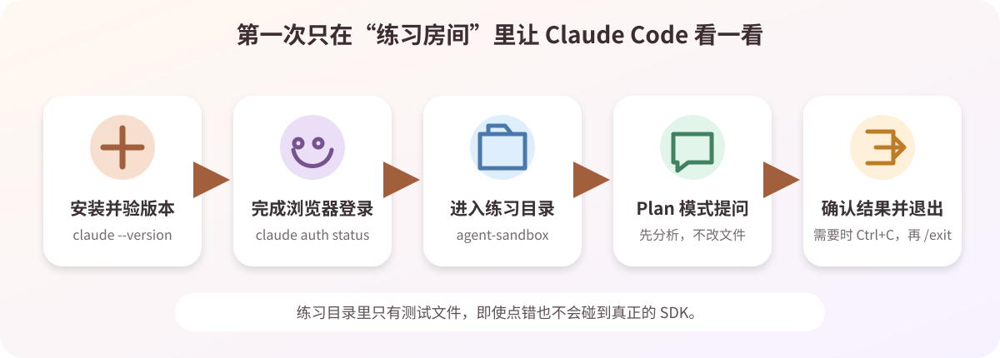

# 03 Claude Code 安装与第一次只读体验

> 目标：在 Ubuntu 中装好 Claude Code，完成登录，并在练习目录中用 Plan 模式做一次只读提问。Claude Code 是可选 AI 助手，不影响后续 SDK 编译。

按上图依次完成：建立练习目录 → 安装 → 登录 → Plan 模式体验 → 退出。

## 开始前确认

| 检查项 | 要求 |
| --- | --- |
| Ubuntu | 已完成[02 虚拟机基础配置](02-vm-base-setup.md)，网络正常 |
| 当前用户 | 普通用户，不是 `root` |
| 账号 | 能使用 Claude Code 的 Pro、Max、Team、Enterprise 或 Console 账号 |
| 安全范围 | 第一次只进入 `agent-sandbox`，不要进入真实 SDK |

> 截至 2026-08-26，Claude 免费方案不含 Claude Code。账号暂时不可用时，可跳过本节，改用 Codex 或 Harness。

## 1. 建立练习目录

在 Ubuntu 终端执行：

~~~bash
mkdir -p "$HOME/100ask-course/projects/agent-sandbox"
cd "$HOME/100ask-course/projects/agent-sandbox"
pwd
~~~

最后一行应类似：

~~~text
/home/你的用户名/100ask-course/projects/agent-sandbox
~~~

`$HOME` 是当前用户的主目录；`pwd` 用来确认“我现在在哪里”。

## 2. 安装并检查

使用 Anthropic 官方原生安装器：

~~~bash
curl -fsSL https://claude.ai/install.sh | bash
~~~

安装结束后，**关闭终端并重新打开**，再执行：

~~~bash
command -v claude
claude --version
claude doctor
~~~

| 命令 | 成功时会看到 |
| --- | --- |
| `command -v claude` | 一个以 `claude` 结尾的路径 |
| `claude --version` | 版本号，不必与课程截图相同 |
| `claude doctor` | 检查完成，没有阻止启动的错误 |

> 不要加 `sudo`，也不要换成论坛或网盘中的脚本。若健康检查只有普通提示，不必立刻重装。

## 3. 登录账号

在 Ubuntu 终端启动：

~~~bash
claude
~~~

按屏幕提示完成：

1. 浏览器打开后登录有权限的账号；
2. 学校或公司账号要选对组织；
3. 浏览器提示成功后回到原终端；
4. 若网页给出一次性登录码，把它粘贴到原终端的 `Paste code here if prompted` 提示后。

如果虚拟机没有自动打开浏览器，复制终端给出的地址，使用 Ubuntu 或 Windows 浏览器打开即可。

进入 Claude Code 后，输入：

~~~text
/exit
~~~

回到 Ubuntu 终端，确认登录状态：

~~~bash
claude auth status
~~~

只要状态不是“未登录”就算成功。

> 登录地址、一次性登录码和 `~/.claude` 中的认证文件都属于隐私信息，不要截图、上传或发给别人。

## 4. 用 Plan 模式完成第一次提问.

> 需要先登录或者填写API，可根据你购买API-Key的使用文档进行操作！

在 Ubuntu 终端执行：

~~~bash
cd "$HOME/100ask-course/projects/agent-sandbox"
claude --permission-mode plan
~~~

界面显示 **Plan** 后，在 Claude Code 输入框粘贴：

~~~text
请只读检查当前目录，不要创建、修改或删除任何文件。
请告诉我当前目录是什么、里面有哪些内容，并用三句话解释 Plan 模式适合做什么。
~~~

正确结果是：Claude 能说明目录情况，即使目录为空也不会自行创建文件。

回答结束后输入：

~~~text
/exit
~~~

如果它仍在生成回答，可先按 `Ctrl + C` 停止，再输入 `/exit`。

## 验收表

| 结果 | 完成 |
| --- | :---: |
| `claude --version` 能显示版本 | □ |
| `claude doctor` 无阻断错误 | □ |
| `claude auth status` 显示已登录 | □ |
| 当前目录是 `agent-sandbox` | □ |
| Plan 模式没有修改文件 | □ |
| `/exit` 能返回 Ubuntu 终端 | □ |

## 常见问题速查

| 现象 | 先这样处理 |
| --- | --- |
| `claude: command not found` | 重开终端，再运行 `command -v claude`；仍失败时保留安装报错并重新执行官方安装命令 |
| 浏览器没有打开 | 不要关闭登录终端；复制登录地址到浏览器，网页若给登录码就粘回原终端 |
| 登录后无权限 | 检查账号套餐、组织和管理员策略；能登录网页不等于已开通 Claude Code |
| `doctor` 提示多套安装 | 运行 `type -a claude` 记录所有来源；不要按路径名字批量删除 |
| 网络页面打不开 | 检查 Ubuntu 网络、DNS 和系统时间，再重试登录 |

## 参考资料

- [Anthropic：Claude Code 安装](https://code.claude.com/docs/en/installation)
- [Anthropic：Claude Code 认证](https://code.claude.com/docs/en/authentication)
- [Anthropic：Claude Code CLI](https://code.claude.com/docs/en/cli-usage)
- [Anthropic：权限模式](https://code.claude.com/docs/en/permission-modes)
