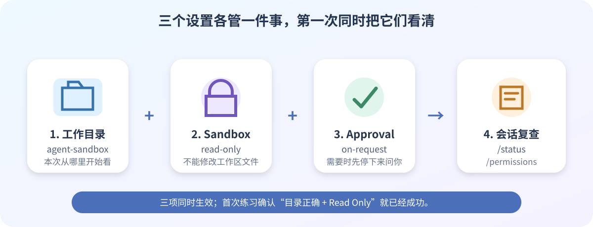

# 04 Codex CLI 安装与第一次只读体验

> 目标：在 Ubuntu 中安装 Codex CLI，用 ChatGPT 账号登录，并以 Read Only 权限查看练习目录。Codex 是可选 AI 助手，不是编译器。

按上图依次完成：建立练习目录 → 安装 → 登录 → 检查只读权限 → 提问并退出。

## 开始前确认

| 检查项 | 要求 |
| --- | --- |
| Ubuntu | 已完成[02 虚拟机基础配置](02-vm-base-setup.md)，网络正常 |
| 当前用户 | 普通用户，不是 `root` |
| 账号 | 能使用 Codex 的 ChatGPT 账号；组织账号还需管理员允许 |
| 安全范围 | 第一次只进入 `agent-sandbox` |

本节使用 **Sign in with ChatGPT**。ChatGPT 权限与 OpenAI Platform API 余额是两套体系，本节不需要 API Key。

## 1. 建立练习目录

在 Ubuntu 终端执行：

~~~bash
mkdir -p "$HOME/100ask-course/projects/agent-sandbox"
cd "$HOME/100ask-course/projects/agent-sandbox"
pwd
~~~

最后一行应类似：

~~~text
/home/你的用户名/100ask-course/projects/agent-sandbox
~~~

Codex 会把启动位置当作本次工作目录，所以运行前一定先看 `pwd`。

## 2. 安装并检查

使用 OpenAI 官方 standalone 安装器：

~~~bash
curl -fsSL https://chatgpt.com/codex/install.sh | sh
~~~

安装结束后，**关闭终端并重新打开**，再执行：

~~~bash
command -v codex
codex --version
codex --help
~~~

| 命令 | 成功时会看到 |
| --- | --- |
| `command -v codex` | 一个以 `codex` 结尾的路径 |
| `codex --version` | 版本号 |
| `codex --help` | 当前版本支持的参数 |

> 不要加 `sudo`，也不要使用来源不明的安装脚本。版本号变化是正常的，参数以本机 `--help` 为准。

## 3. 使用 ChatGPT 登录

在 Ubuntu 终端执行：

~~~bash
codex login
~~~

浏览器打开后登录 ChatGPT、选择正确工作区并授权。浏览器显示成功后，回到原终端。

若虚拟机无法自动打开浏览器，先确认当前版本支持设备码：

~~~bash
codex login --help
~~~

帮助中能看到 `--device-auth` 时，再运行：

~~~bash
codex login --device-auth
~~~

打开终端显示的网址，输入一次性设备码并授权。个人安全设置或组织管理员未启用设备码时，这条支线可能不可用，此时回到普通 `codex login`。

最后确认状态：

~~~bash
codex login status
~~~

输出表明已通过 ChatGPT 登录即可。

> 登录 URL 和一次性设备码都是临时认证信息，不要截图或转发。看到 401/403 时先查账号权限，不要急着重装软件。

## 4. 用 Read Only 权限启动

在 Ubuntu 终端执行：

~~~bash
cd "$HOME/100ask-course/projects/agent-sandbox"
codex --sandbox read-only --ask-for-approval on-request
~~~

两个参数的作用：

| 参数 | 白话解释 |
| --- | --- |
| `--sandbox read-only` | 只能读工作区，不能改文件 |
| `--ask-for-approval on-request` | 需要额外动作时先询问 |

进入 Codex 后依次输入：

~~~text
/status
~~~

确认工作目录指向 `agent-sandbox`，再输入：

~~~text
/permissions
~~~

当前权限应为 **Read Only**。若出现选择器，只选择 Read Only，本节不要切换到自动写入或不受限权限。

## 5. 完成第一次只读提问

在 Codex 输入框粘贴：

~~~text
请只读检查当前目录，不要创建、修改或删除任何文件。
请告诉我当前目录路径、里面有哪些内容，并解释第一次查看真实 SDK 时为什么应先使用只读权限。
~~~

目录为空也没关系。正确结果是 Codex 能说明情况，而且没有创建文件。若出现与任务无关的高权限请求，先拒绝，再缩小问题范围。

回答结束后输入：

~~~text
/exit
~~~

看到 Ubuntu 的 `$` 提示符就表示已经退出。生成过程中可按 `Ctrl + C` 停止当前任务。

## 验收表

| 结果 | 完成 |
| --- | :---: |
| `codex --version` 能显示版本 | □ |
| `codex login status` 显示 ChatGPT 登录 | □ |
| `/status` 中的目录正确 | □ |
| `/permissions` 显示 Read Only | □ |
| 第一次提问没有修改文件 | □ |
| `/exit` 能返回 Ubuntu 终端 | □ |

## 常见问题速查

| 现象 | 先这样处理 |
| --- | --- |
| `codex: command not found` | 重开终端；运行 `command -v codex` 和 `type -a codex`，避免叠加多种安装 |
| 浏览器回调失败 | 查看 `codex login --help`；支持时改用设备码，并检查网络和系统时间 |
| 登录后出现 401/403 | 运行 `codex login status`，再检查 ChatGPT 工作区和管理员权限 |
| `/status` 目录不对 | 输入 `/exit`，在正确目录重新启动 |
| 权限不是 Read Only | 在 `/permissions` 选 Read Only；不确定时退出并用本节完整命令重启 |

## 参考资料

- [OpenAI Docs：Codex CLI](https://learn.chatgpt.com/docs/codex/cli)
- [OpenAI Docs：Codex 命令与斜杠命令](https://learn.chatgpt.com/docs/developer-commands?surface=cli)
- [OpenAI Docs：Codex 认证](https://learn.chatgpt.com/docs/auth)
