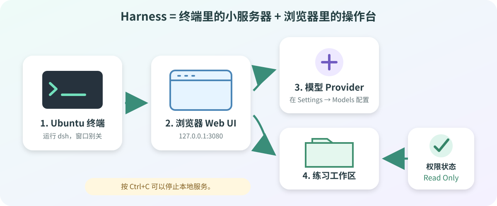

# 05 DeepSeek Harness 安装与第一次启动

> 目标：在 Ubuntu 中启动固定版本的 DeepSeek Harness，用浏览器打开 Web UI，并以 Read Only 权限选择练习目录。模型账号留到下一节配置。



## 先看懂两个终端

| 窗口 | 用途 | 什么时候关闭 |
| --- | --- | --- |
| **终端 A** | 启动 Harness，小服务器持续运行 | 最后回到这里按 `Ctrl + C` |
| **Ubuntu 浏览器** | 打开操作页面、选择工作区 | Harness 停止后页面会断开 |
| **终端 B** | 检查 3080 端口，可选 | 检查结束即可关闭 |

Harness 是可选 AI 工具，不是 SDK 编译器。当前仍是 **Developer Preview**，本课程固定使用 `0.1.1-rc.2`，避免全班界面和参数不一致。

## 开始前确认

| 检查项 | 要求 |
| --- | --- |
| Ubuntu | 已完成[02 虚拟机基础配置](02-vm-base-setup.md) |
| 用户 | 普通用户，不是 `root` |
| Node.js | 课程使用 24.x |
| 网络 | npm 能访问官方 Registry |
| 内存 | 建议给虚拟机 12–16 GB |
| 工作区 | 只选 `agent-sandbox`，不要选整个主目录或真实 SDK |

## 1. 准备工作区和 Node.js

在 Ubuntu 终端执行：

~~~bash
mkdir -p "$HOME/100ask-course/projects/agent-sandbox"
cd "$HOME/100ask-course/projects/agent-sandbox"
pwd

source "$HOME/.nvm/nvm.sh"
nvm use 24
node --version
npm --version
npm config get registry
~~~

| 检查项 | 正确结果 |
| --- | --- |
| `pwd` | 以 `/100ask-course/projects/agent-sandbox` 结尾 |
| `node --version` | 以 `v24.` 开头 |
| `npm --version` | 显示数字版本 |
| Registry | `https://registry.npmjs.org/` |

## 2. 在终端 A 启动 Harness

由于典型的 **Node.js 堆内存**的较小，DeepSeek的 Web 服务需要比较大的内存，所以需要增大Node.js 内存限制。

```
# 临时增大 Node.js 内存限制
NODE_OPTIONS="--max-old-space-size=4096"

# 持久化设置
echo 'export NODE_OPTIONS="--max-old-space-size=4096"' >> ~/.bashrc
source ~/.bashrc
```

执行后，这个窗口会一直运行，这是正常现象：

~~~bash
DSH_PERMISSION_MODE=read-only \
  npx --yes @deepseek-ai/dsh web --no-open
~~~

如果安装比较慢，也没有任何进度提示，可选择下面的方式进行全局安装：

```
npm install -g @deepseek-ai/dsh
# 之后直接使用 dsh 命令启动
DSH_PERMISSION_MODE=read-only dsh web --no-open
```


看到下面地址就表示服务已启动：

~~~text
http://127.0.0.1:3080
~~~

| 命令片段 | 作用 |
| --- | --- |
| `DSH_PERMISSION_MODE=read-only` | 本次会话默认只读 |
| `@0.1.1-rc.2` | 锁定课程版本 |
| `web` | 启动浏览器操作台 |
| `--no-open` | 不自动开浏览器，由我们手动打开 |

> 终端 A 没有返回 `$` 并不是卡死，它正在运行服务。浏览器使用期间不要关闭它。


## 3. 在 Ubuntu 浏览器打开页面

在 Ubuntu 浏览器地址栏输入：

~~~text
http://127.0.0.1:3080
~~~

`127.0.0.1` 表示“这台 Ubuntu 虚拟机自己”。第一次练习不要把服务开放到 Windows 或公网。

页面打开后按顺序操作：

1. 点击 `Choose workspace`（选择工作区）或同义按钮。
2. 选择 `$HOME/100ask-course/projects/agent-sandbox`，确认页面显示 `agent-sandbox`。
3. 打开 Permissions 或 General Settings，确认权限是 **Read Only**。

界面能打开就完成了本节主目标。还未配置 Provider、API Key 和模型时，不能发送聊天属于正常现象；下一节会处理。

> Read Only 限制的是对练习工程的修改。Harness 仍可能在 `~/.dsh` 保存自己的设置和会话状态。

## 4. 用终端 B 检查服务

保持终端 A 运行，再打开终端 B：

~~~bash
ss -ltnp | grep ':3080'
curl -I http://127.0.0.1:3080
~~~

| 命令 | 成功标志 |
| --- | --- |
| `ss ...` | 能看到 3080 正在监听 |
| `curl -I ...` | 返回 HTTP 响应头，不是 `Connection refused` |

## 5. 回到终端 A 停止服务

在终端 A 按：

~~~text
Ctrl + C
~~~

出现 `$` 提示符就表示服务已停止；刷新浏览器后页面应无法连接。若第一次按键只是在收尾，可稍等后再按一次。

## 验收表

| 结果 | 完成 |
| --- | :---: |
| Node.js 版本以 `v24.` 开头 | □ |
| `npm view` 返回 `0.1.1-rc.2` | □ |
| 启动命令包含固定版本和 `read-only` | □ |
| 浏览器能打开 3080 页面 | □ |
| 工作区是 `agent-sandbox`，权限是 Read Only | □ |
| 我知道终端 A 运行时不能关闭 | □ |
| `Ctrl + C` 能停止服务 | □ |

## 常见问题速查

| 现象 | 先这样处理 |
| --- | --- |
| Node.js 不是 24 | 运行 `source "$HOME/.nvm/nvm.sh"`、`nvm use 24`，再查版本 |
| npm 超时或证书错误 | 检查 `npm ping`、Registry、DNS 和系统时间；校园网按管理员要求配置代理或 CA |
| 页面无法连接 | 确认终端 A 仍在运行，再用终端 B 检查 3080 |
| 3080 已被占用 | 运行上方端口检查命令；旧 Harness 回原终端按 `Ctrl + C`，不要盲目结束未知进程 |
| 页面能开但不能聊天 | 这是尚未配置 Provider 的正常现象，下一节继续 |
| 内存不足退出 | 运行 `free -h`；关闭确认不需要的任务，正常关机后再调整虚拟机内存 |

> 不要通过关闭 TLS 证书校验解决 npm 问题，也不要改成全局安装或删除未知缓存目录。一次只改变一个条件，保留完整报错。

## 参考资料

- [DeepSeek Harness 官方仓库](https://github.com/deepseek-ai/deepseek-harness)
- [DeepSeek Harness：Web UI 快速开始](https://deepseek-harness.github.io/deepseek-harness/en/guide/quickstart)
