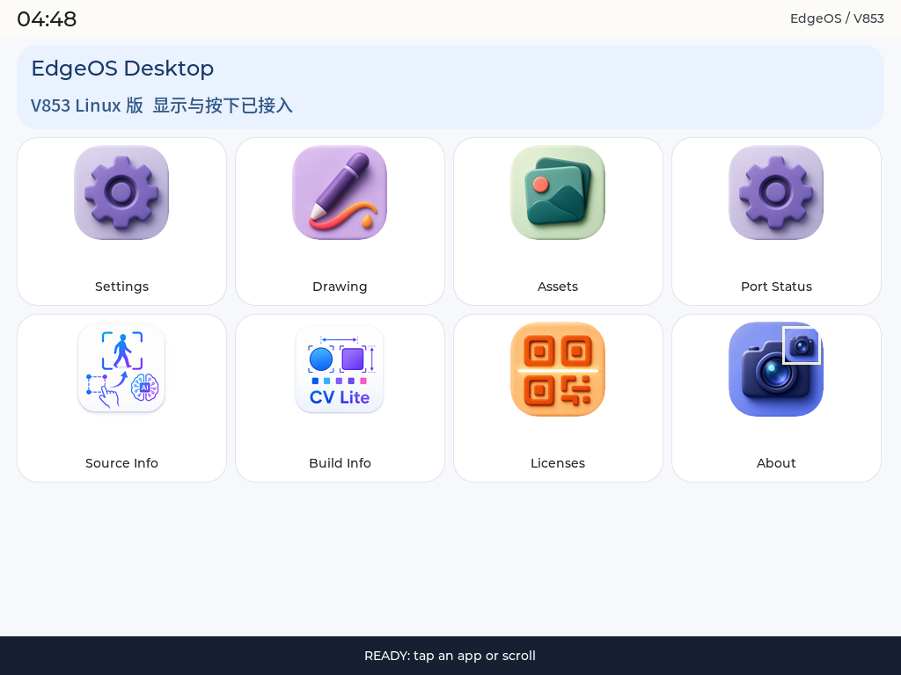

# 26 跑起 EdgeOS 桌面

本节先把 EdgeOS 桌面跑起来：复用图标和字体，接入已验证的 LVGL 显示、触摸与页面导航。暂不接入相机、NPU、OTA 等硬件服务。

与前面运行单个 LVGL 示例不同，这一节开始组织一个完整桌面：主页展示应用入口，点击后切换页面，返回时恢复桌面，绘图页还需要管理自己的画布。学习重点是把这些 UI 组织好，并让它们使用 V853 已经打通的显示和输入通道。

*这是开发板 framebuffer 截图，不是设计稿。截图正常不等于物理触摸已经通过验收。*

## 开始前

先完成 [LCD 与 Touch 适配](../v853-tina-linux/09_LCDScreenAdaptation.md) 和 [LVGL 应用集成](../lvgl9-porting/22-integrate-with-tina-sdk.md)，并使用前文已配置好的 LYNX、SSH 和开发板连接。

后续各章沿用下面的实操目录；如果你的目录不同，让 Agent 先查找并确认：

| 内容 | 虚拟机路径 |
| --- | --- |
| Tina SDK | `/home/ubuntu/100ask-course/sdk/tina-v853-100ask` |
| EdgeOS | `/home/ubuntu/Downloads/edgeos` |
| LVGL | `/home/ubuntu/Downloads/lvgl9` |

你负责提出需求、观察屏幕和必要的手指操作；AI Agent 负责查源码、改代码、编译、传输、抓图和整理结果。每次发送一个步骤的提示词，确认结果后再继续。

:::tip 已有新版时
本章是核心桌面的学习步骤，不是要求恢复旧版本。如果已经完成第 28 节，请保留现有设置功能，只检查差异，不覆盖成早期示例。
:::

## 1. 找到需要移植的代码

主要修改 `v853-port/main.c`，复用 `EdgeOS_Desktop/apps/` 下的图标和字体。显示与触摸分别通过 LVGL 的 fbdev、evdev 接入 Linux。

### 先理解三个层次

~~~text
EdgeOS 页面、导航、图标与字体
                ↓
LVGL 对象、事件与刷新循环
                ↓
Linux framebuffer 和输入设备 → LCD 与触摸屏
~~~

上层决定“画什么、点击后去哪”，中间层负责绘制与事件分发，底层负责实际显示和输入。只要前面的 LCD 与 Touch 已正常工作，本节通常应集中修改应用入口，而不是重新修改显示驱动或 LVGL 内核。

阅读源码时可以先抓住几个位置，不必一次读完所有文件：

| 位置 | 阅读重点 |
| --- | --- |
| `g_apps[]` | 桌面有哪些入口，各自进入哪个页面 |
| `init_layout()` | 可用宽高如何变成边距、列数和卡片尺寸 |
| `show_desktop()` 与页面函数 | LVGL 对象如何创建、清理和切换 |
| 点击与返回回调 | 触摸事件如何改变当前页面 |
| `main()` | 显示、输入、初始页面和刷新循环如何串起来 |

Settings、Drawing 是主要交互入口；Assets、Source Info、Build Info 等页面帮助检查资源和构建信息。它们不代表相机、推理或升级服务已经完成移植。

把下面的请求发送给 Agent：

~~~text
请检查虚拟机中的 EdgeOS、LVGL 和 Tina SDK，暂时不要修改。
找到 V853 的 main.c、Makefile、图标与字体，以及 SDK 软件包。
说明哪些是可复用的 UI，哪些依赖尚未接通的硬件服务。
同时通过 LYNX 核对目标开发板及活动任务，给出需要修改的文件。
~~~

**检查结果：** 能指出桌面入口、页面切换、显示与触摸初始化的位置；不把有图标但没有后端的功能标记为可用。

## 2. 适配布局并编译

桌面从运行时读取可用宽高，按空间调整卡片、内容页和画布，不依赖某一个固定屏幕尺寸。

### 布局为什么要集中计算

如果卡片、标题和画布分别写死尺寸，调整某一处后，其他对象仍可能越界。当前方案先在 `edgeos_layout_t` 中保存布局结果，再让各页面使用同一套边距和内容区尺寸。

卡片宽度的基本关系是：

~~~text
可用宽度 = 页面宽度 − 左右边距
卡片宽度 = (可用宽度 − 列间距总和) ÷ 列数
~~~

这只是计算思路，不是让读者直接替换一段代码。Agent 还要核对父容器的 padding、边框和实际内容宽度，避免“算起来能放下，Flex 排版却换到下一行”。

桌面采用横向四列、竖向两列；详情页与画布分别使用自己的可用区域。内容过多时应滚动，而不是不断缩小字体。绘图页面退出时还需要释放画布缓冲，防止每次进入都多占一份内存。

### 修改与构建

~~~text
请备份后完善 V853 桌面入口：
复用原版图标和字体，保留 Settings、Drawing 和详情页导航。
从 LVGL display 读取宽高，统一计算边距、列数和卡片尺寸；
桌面横向四列、竖向两列，内容不足时允许纵向滚动。
保留点击与滑动区分，返回按钮和画布不能超出可用空间。
不要改动原版资源、LVGL 或未接通的硬件后端。
完成后交叉编译，保留严格警告检查，报告产物路径、Build ID 和编译结果。
~~~

**检查结果：** 编译成功，产物是目标 ARM 程序；卡片、详情和画布都使用运行时布局，而不只是修改了两个尺寸常量。

这里有三个容易混淆的检查项：

- **目标架构：** 虚拟机负责执行交叉编译，生成的是开发板程序，不是 Windows 或虚拟机自身运行的程序。
- **构建身份：** Build ID 用于区分版本；Source ID 用于说明源码快照。部署后还要核对实际运行路径和启动日志。
- **构建成功：** 以实际编译退出结果和产物检查为准。`-Wall -Wextra -Werror` 帮助在运行前发现应用层问题，不应遇到警告就直接关闭它。

Agent 的交付不必是一整屏日志，正文中看“修改了什么、是否编译成功、产物在哪里”即可，完整输出保存到证据目录。

## 3. 临时运行并验证

本章先做预览，不替换正式程序。正式部署在下一章完成。

### 为什么先停止正式监督服务

板端正式桌面由 `S99edgeos-v853` 管理。只结束 UI 进程但保留监督服务时，旧程序可能再次被启动，与预览程序争用 framebuffer，表现为画面突然切回旧版。因此应先记录服务状态，再让 Agent 临时停止服务。

预览文件放在本轮专用的 `/tmp` 路径，便于隔离测试与收尾。这个路径不是正式安装位置，重启后也不能依靠它提供开机桌面。传输时仍需记录目标设备，不能把“发现一台 ADB 设备”直接当作确认了本项目开发板。

~~~text
请通过 LYNX 确认设备身份且无冲突任务，再将产物经虚拟机、Windows
传到板端本轮专用的 /tmp 路径，确认传输完成、文件非空且大小符合预期。
记录正式服务状态，临时停止监督服务，用实际触摸节点启动预览。
保存启动日志和 framebuffer 截图，检查桌面、图标和返回入口。
请逐项提示我打开 Settings、返回、进入 Drawing 并绘图；
由你同步检查日志和页面，未执行的手指测试明确标记为待验收。
不要重启、断电、烧录或替换 /usr/bin/edgeos-v853。
~~~

**检查结果：** 日志出现 `EDGEOS_READY`，画面完整；点击后确实进入目标页面，返回后回到桌面。不能只凭“点击已发送”判定导航通过。

### 怎样看画面与交互结果

先看显示：状态栏、桌面卡片和底部区域是否完整，文字是否被截掉，图标是否出现错色。Agent 抓取 framebuffer 时，要依据实际 stride、位深和活动缓冲区解码；不能仅凭原始文件大小猜测图像格式。

再看交互：轻点 Settings 应打开对应页面，返回应回到桌面；在 Drawing 中连续滑动应留下笔迹；快速滑动应用区不应误打开卡片。一次完整检查要把用户动作、页面变化和日志对应起来。

如果当前只能进行事件注入，先验证页面事件链，并保留手指测试为待办。注入成功不能证明触摸面板的坐标准确，也不能替代现场对 LCD 背光和刷新效果的观察。

## 4. 结束预览

结束时先确认要停止的是本轮预览进程，而不是正式服务或其他测试任务。正确的顺序是“预览退出 → 清理本轮文件 → 恢复正式服务 → 从新连接检查”。恢复服务的命令返回成功后，还需要确认实际程序和显示已经恢复。

~~~text
请只停止本轮预览进程，确认退出后删除本轮临时程序和测试器。
恢复原有正式服务，从新连接核对程序路径、进程和显示输出。
保留构建日志、文件身份及实机截图，列出通过与未测试的项目。
~~~

**检查结果：** 原正式桌面恢复运行，没有遗留预览进程，也没有刷写固件。

## 实操记录与验收

本章已有记录完成了源码适配、严格编译、板端临时启动和横向屏幕抓图，并在结束后恢复了正式服务。该轮没有执行手指导航和绘图测试。

对照本节开头的截图，可以看到桌面已经能承载多个入口。这说明页面和资源复用的方向可行；下一章要进一步让页面中的数据可信，并解决“测试时正常，正式启动却仍是旧版本”的部署问题。

| 要验收什么 | 怎么判断 |
| --- | --- |
| 程序启动 | 正确的 Build ID、显示与触摸节点，无初始化错误 |
| 页面显示 | 桌面和内容完整，无裁切或错位 |
| 导航与绘图 | 实际操作与页面日志对应，画布有连续笔迹 |
| 多屏布局 | 各目标屏幕分别测试；代码支持不等于实机通过 |
| 预览收尾 | 预览退出，原正式服务和显示恢复 |

遇到问题再看：排查与原始证据

- 预览画面被覆盖：检查正式监督服务是否仍在拉起旧程序。
- 找不到触摸屏：按设备名称核对实际事件节点，不写死 `eventN`。
- 图像错色或错位：核对 framebuffer 的位深、stride、通道顺序和活动缓冲区。
- LYNX 无返回或串口被占用：停止无效等待，不抢占未知进程；说明原因后使用已确认目标的可用通道。
- 编译失败：先处理第一条有效错误，不通过关闭警告检查掩盖问题。

本章早期预览 Build ID：`edgeos-v853-26-desktop-adaptive`。原始日志位于虚拟机 `/home/ubuntu/Downloads/edgeos/evidence/20260904/part3`。它是历史预览记录，不代表当前正式版本。

下一步：[27 完善系统信息页并正式部署](./27-edgeos-settings.md)。
