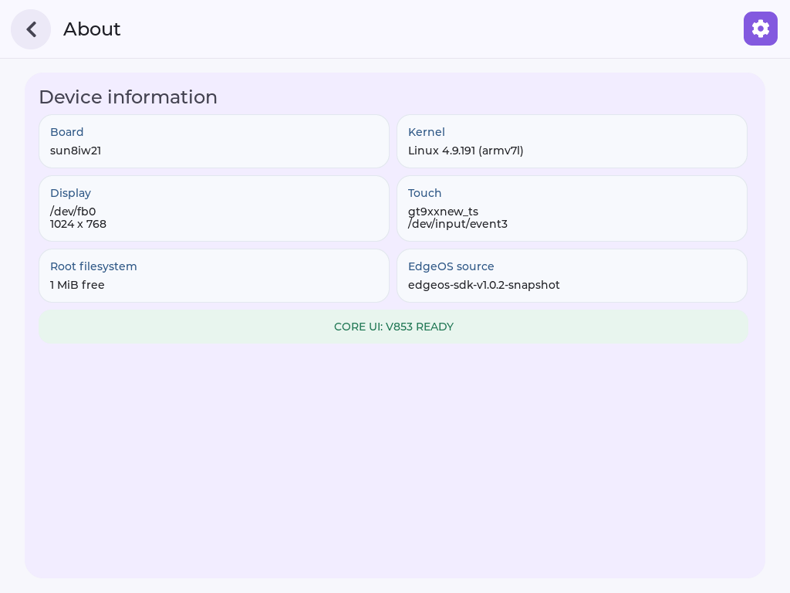

# 27 完善系统信息页

本节先完成设置中心中的 **About 系统信息页**，再把验证后的程序正式部署到开发板。Wi-Fi、亮度等可操作设置在 [第 28 节](./28-edgeos-settings-services.md) 接入。

选择系统信息页作为第二步，是因为它不需要修改无线连接或电源状态，却能同时练习数据采集、长文本排版、页面返回和正式部署。它也是后续排查问题的入口：看到程序实际使用的设备和构建信息，比一段固定的“设备正常”文案更有帮助。

*图为后续风格优化版的实机页面。本节讲解其中的信息采集、布局和部署方法；当前导航为 Settings → About。*

## 本节要完成什么

让页面显示真实系统信息，处理换行和返回，并确认板端运行的是正式部署的新程序，而不是临时预览。源码目录与工具连接沿用 [第 26 节](./26-edgeos-desktop-ui.md)。

| 页面字段 | 数据来源 |
| --- | --- |
| Board | 设备树中的板卡型号 |
| Kernel | Linux 内核与架构 |
| Display | LVGL / framebuffer 运行时信息 |
| Touch | 程序实际使用的输入设备名与节点 |
| Root filesystem | 根文件系统可用空间 |
| EdgeOS source | 本次构建的 Source ID |

读取失败应显示“不可用”，不能用假数据或零值掩盖失败。Source ID 是构建标签，还应结合实际运行路径和启动日志确认版本。

## 1. 完善信息与布局

### 数据采集与页面绘制分开

当前源码用 `collect_settings_info()` 收集信息，由 `show_system_info()` 创建页面。系统信息保存在 `edgeos_settings_info_t` 中，既包含显示值，也包含部分字段的采集成功状态。

这种组织方式让两类问题更容易区分：字段本身不正确时检查采集逻辑；字段正确但显示不全时检查 LVGL 布局。不要一开始就把所有系统调用和格式化文本都塞进一个 Label 的创建函数。

读取数据还要注意三个细节：

1. **Touch 使用实际设备。** 程序启动时选中的输入设备应被记录下来，页面显示该设备名与节点。不能在页面中随意再找一个同名设备，也不能用“自动检测”代替真实结果。
2. **空间计算先扩展位宽。** 在 `statvfs()` 成功后，先将块数量和块大小转为 64 位，再相乘。若先用较小类型相乘，再转为 64 位，之前发生的溢出无法补救。
3. **失败和零值分开。** 读取失败应显示 `Unavailable`；真正的零剩余空间则是另一种结果。显示为整数 MiB 时还会有向下取整，不能只比较两个工具打印的数字。

当前实现中的空间计算核心如下，前提是已经检查 `statvfs()` 返回成功：

~~~c
uint64_t free_bytes =
    (uint64_t)fs.f_bavail * (uint64_t)fs.f_frsize;
~~~

### 页面布局怎么组织

返回按钮放在滚动内容区之外，信息卡片放在内容区中，标题和状态条参与正常排版。这样内容变长时，用户可以继续向下滚动，返回入口不会一起消失。

长文本要分两层考虑：采集缓冲区是否已经截断内容，以及 Label 是否能换行显示。开启换行只能解决第二个问题，无法恢复采集时已经丢失的字符。现有实现具备换行和滚动基础，但完整的截断提示、超长内容和失败分支仍需专项验证。

~~~text
请检查 EdgeOS V853 的系统信息页，备份后只修改必要代码。
将信息采集与页面绘制分开，六个字段都使用真实数据来源；
Touch 显示实际打开的设备，存储计算使用 64 位中间值。
信息卡片按可用空间排版，长文本换行，内容区可纵向滚动，
返回按钮始终可达。读取失败要明确提示。
如果已有新版设置分类，保留现有功能，把这些信息放在 About 中。
~~~

**检查结果：** 信息卡片不再是一段静态说明；标题、字段、状态与返回按钮不互相遮挡。

本节信息页主要在进入页面时采集数据，Touch 身份则来自程序启动时的记录。它不是实时性能监控页，也没有因此获得设备热插拔支持。后续 Wi-Fi 等动态状态需要另外安排后台查询与 UI 刷新。

## 2. 对照板端数据

“页面显示了内容”只是第一步。交叉验证需要在同一轮运行中，使用独立方式读取同一项数据，再与页面比较。不要拿昨天保存的日志核对今天更换后的系统。

~~~text
请编译修改后的程序，通过 LYNX 核对设备身份后进行板端验证。
逐项对照页面与设备树、uname、framebuffer、输入设备和文件系统数据。
重复进入信息页并返回，保存页面日志与实机截图。
检查长文本和内容滚动；没有实际触发的情况不要写成通过。
如果临时运行预览，测试结束后恢复原正式服务。
~~~

**检查结果：** 页面与独立读取的系统数据一致，进入和返回都有对应日志。注入点击只能验证事件链，现场手指操作仍需单独验收。

已有实操中，页面的板卡标识 `sun8iw21` 与设备树一致；内核 `Linux 4.9.191 (armv7l)` 与 `uname` 一致；Touch 的 `gt9xxnew_ts` 与所用事件节点也已交叉核对。它们是当时设备的结果，不应写死到 UI 中。

存储字段需要按相同单位比较。例如系统工具返回 KiB，而页面显示整数 MiB 时，应先换算并考虑取整。Display 也要区分可见尺寸与虚拟缓冲区尺寸，不能把双缓冲所占的高度当成实际画面高度。

完成单次核对后，再重复打开和返回，检查页面是否重叠、数据是否仍可采集、进程是否退出。资源快照没有增长，只能说明该次测试未观察到增长，不足以证明长期没有内存泄漏。

## 3. 正式部署并保留新版

:::warning 预览不等于部署
只更新 `/tmp` 程序或虚拟机源码，不会自动更新开机运行的桌面。需要核对 SDK 实际编译的源文件，以及服务启动的 `/usr/bin/edgeos-v853`。
:::

### 三个位置必须连起来核对

| 位置 | 要确认的问题 |
| --- | --- |
| 适配源码 | 修改是否保存在当前 `v853-port` 中 |
| SDK 构建目录与产物 | 软件包是否复制并编译了这些修改 |
| 板端正式路径与进程 | 服务是否真正启动了这份产物 |

实操曾出现“预览已经变好，但设置 UI 还是旧的”：原因是新版只在 `/tmp` 运行，SDK 生成目录和正式程序没有同步更新。解决办法是让修改进入软件包构建与正式启动路径，而不是继续重复打开预览截图。

SDK 包位于 `package/gui/v853-edgeos-desktop`。Agent 应核对 `Build/Prepare` 使用的源码目录；后续增加头文件时，也要检查依赖和复制规则。否则改了头文件，构建却仍可能沿用旧结果。

### 安装前为什么需要暂存

直接覆盖运行中的程序不利于处理复制中断。这里先把新程序传到板端，确认传输完成并检查文件大小，再在正式目录准备待安装文件；旧进程退出后，用重命名完成替换。overlay 必须有足够空间容纳暂存文件，备份优先保存在 Windows 或虚拟机。

这是应用层更新，不会因此生成新的完整固件。也不要为了替换一个 UI 程序而删除整个 overlay 或重刷全部分区。

~~~text
请将已验证的设置页面通过 SDK 软件包正式构建、部署，并保留新版。
先核对 LYNX 目标设备及活动任务，确认没有烧录或供电冲突。
检查软件包使用的源码和构建依赖，设置可区分的 Build ID。
备份当前正式程序，检查 overlay 空间，确认新版传输完整；
停止监督服务与旧进程，确认退出后原子替换 /usr/bin/edgeos-v853。
启动原监督服务，从新连接核对运行路径、Build ID 和页面。
不要烧录固件，不要回退到旧信息页；保留备份，清理本轮临时文件。
~~~

**检查结果：** 正式服务运行的是新产物，重新打开设置仍显示新页面。不要只凭文件名、复制成功或服务命令退出码判断。

如果中途失败，应先检查失败发生在替换前还是替换后：替换前保留原正式文件，查明暂存或退出问题；替换后若新版无法启动，则核验备份后恢复。不要在状态不清楚时连续重复替换、重启或清理文件。

## 4. 验证重启后仍生效

需要测试正常重启时，再单独发送以下请求；不把它混入日常页面检查。

重启验证同时检查两件事：新程序是否已写入持久存储，以及启动服务能否自动拉起它。只重启 UI 进程无法覆盖完整开机流程；仅看到 ADB 重新在线，也不能说明桌面已经启动完毕。

~~~text
请通过 LYNX 确认没有冲突任务，记录当前程序身份和 boot_id，
执行一次正常系统重启，等待开机流程完成。
从新连接检查 boot_id 已变化、正式服务自动启动、程序身份仍正确，
再验证设置页与返回路径。不要手动补启动后宣称开机自启成功。
如果无法安全恢复连接，先说明原因，不执行重启。
~~~

**检查结果：** 重启后新版自动运行。板端应用持久部署、正常重启和完整固件烧录是三项不同的验证。

已有记录中，ADB 先恢复，桌面服务稍后才启动。Agent 等待初始化完成后再次检查，而不是立即判定失败或手动补启动。`boot_id` 用来区分是否经历了新的系统启动，Build ID 和实际运行路径用于核对启动后的程序版本，两者不能互相代替。

## 已有实操结论

| 项目 | 已有结果 |
| --- | --- |
| 六项系统信息 | 与板端数据交叉核对一致 |
| 页面与返回 | 信息页版本完成 20 轮注入点击往返 |
| 正式部署 | SDK 产物已部署到正式服务路径 |
| 正常重启 | 信息页版本已验证自动启动 |
| 长文本压力、异常数据 | 尚未完整验收 |
| 竖向实体屏幕、手指操作 | 尚未完整验收 |

这些信息页与重启记录属于早期 `v1.0.4-settings-adaptive`。后续功能与当前程序身份以第 28 节为准，不要为了复现本节而安装旧版本。

遇到问题再看：为什么 UI 还是旧的？

让 Agent 按下面顺序核对：

1. SDK 软件包是否复制了最新源码，而不是旧生成目录。
2. 新产物是否完整传输，启动日志中的 Build ID 是否符合本轮构建。
3. 运行进程指向 `/usr/bin` 还是 `/tmp`。
4. 监督服务是否仍启动旧程序，或有多个进程争用显示。
5. 停止后是否已真正退出，再替换并从新连接复查。

overlay 空间不足时停止部署，不删除整个覆盖层来腾空间。需要回退时使用已验证的备份，不盲目使用只读分区中更旧的程序。

历史构建与证据位置

- 信息页正式版本：`edgeos-v853-27-tina-v1.0.4-settings-adaptive`。
- SDK 软件包：`package/gui/v853-edgeos-desktop`，该阶段发布号为 `2`。
- 虚拟机证据：`/home/ubuntu/Downloads/edgeos/evidence/20260905-settings-production`。
- 该阶段生成过配套完整固件并核对镜像内程序，但没有执行该镜像的烧录验收。
- LYNX 用于绑定设备和安全检查；控制接口异常时，实际传输与抓图采用已核对设备的宿主机 ADB，不能把全部操作描述为经 LYNX Shell 完成。

下一步：[28 接入 Wi-Fi、亮度和常用设置](./28-edgeos-settings-services.md)。
