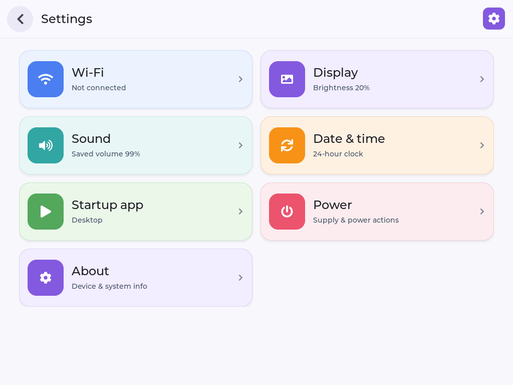
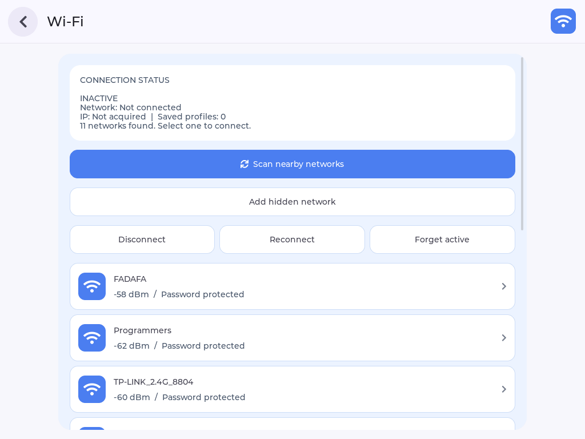
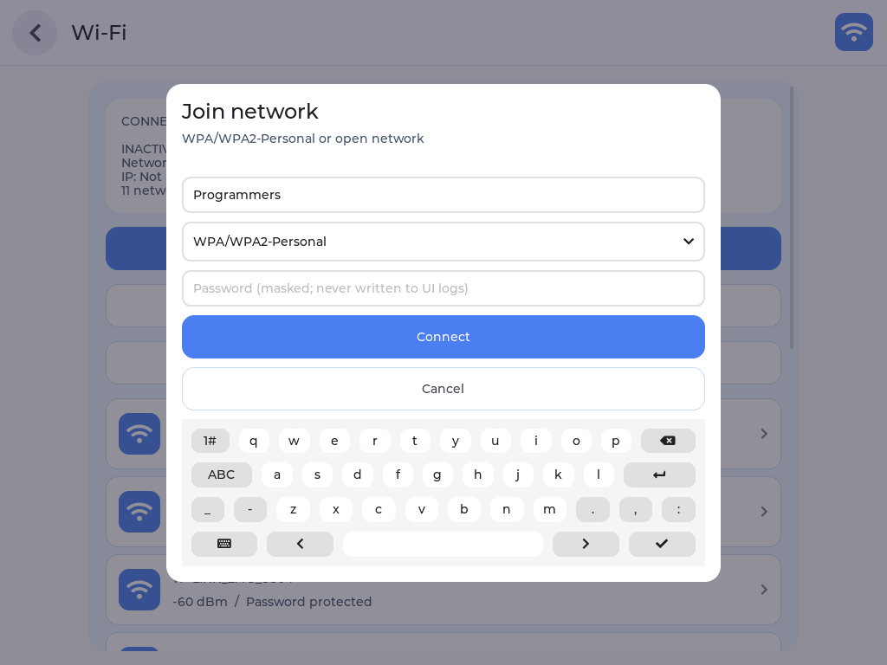
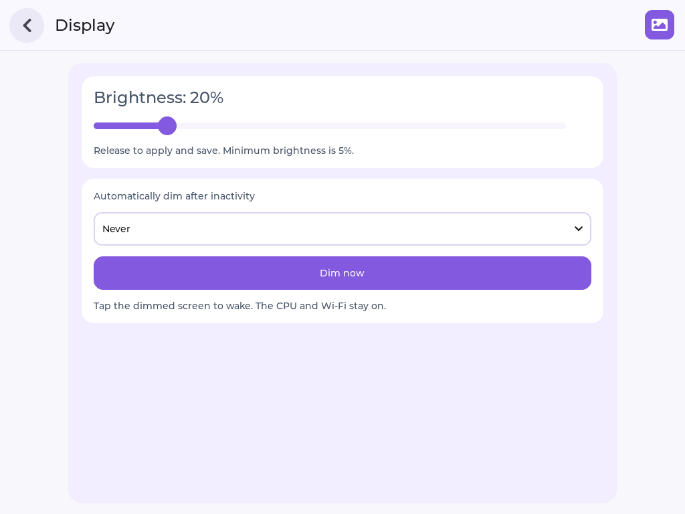
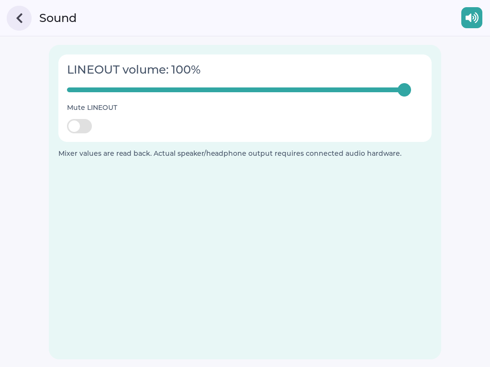
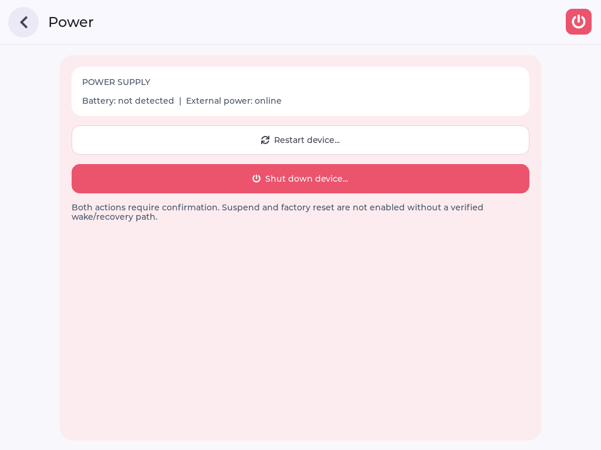
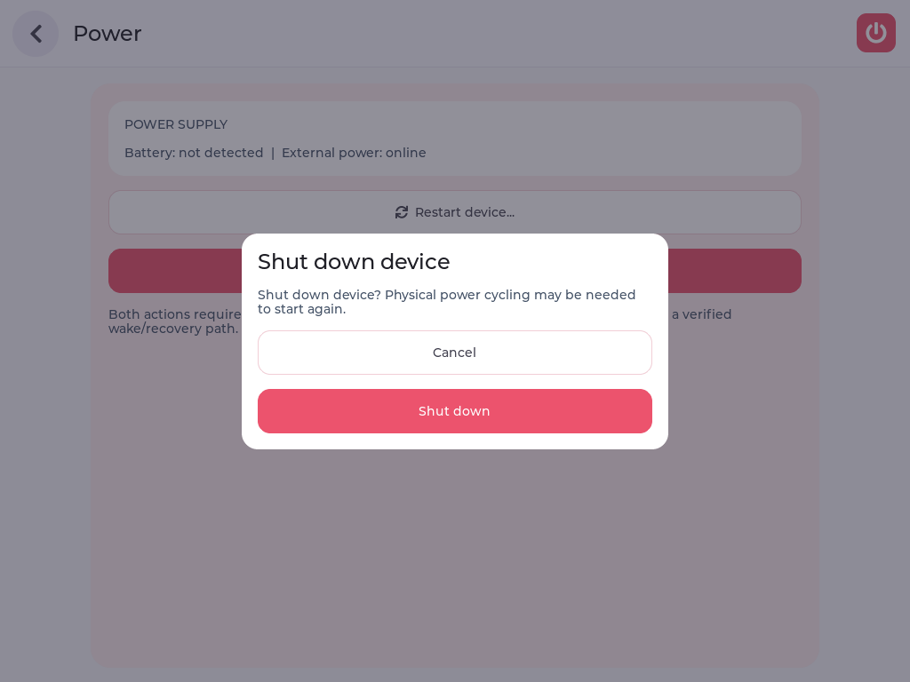

# 28 接通常用设置

把 Wi-Fi、亮度、声音、时间偏好、启动应用和电源操作接到 Tina Linux 的真实接口，并统一为 EdgeOS 风格的设置界面。

前一章主要是“读取并显示信息”，这一章开始让用户通过控件改变系统状态。除了画出按钮和滑块，还需要处理后台任务、失败反馈、配置保存和危险操作确认。学习时可以按功能逐项推进，不必一次改完全部设置。

*本页截图来自已正式部署的 `v1.1.1-settings-style`，不是设计稿。源码与连接准备沿用 [第 26 节](./26-edgeos-desktop-ui.md)，正式部署方法见 [第 27 节](./27-edgeos-settings.md)。*

## 先看功能范围

| 功能 | 已有实现与验证 | 还需要验证 |
| --- | --- | --- |
| Wi-Fi | 真实扫描、热点列表、密码表单、空密码拦截 | 真实认证、获取 IP、保存后重连与忘记网络 |
| 亮度 | 滑块写入与回读；功能版验证过调暗和点击唤醒 | 不等同于系统深度休眠 |
| 声音 | LINEOUT 音量、静音读写 | 扬声器或耳机实际试听 |
| 时间与启动 | 桌面时区、时钟格式、启动应用及偏好保存 | 未实现系统校时、RTC 或 NTP |
| 电源 | 供电状态、重启与关机确认；功能版验证过重启 | 实际关机后重新上电 |
| About | 系统信息与返回导航 | 长文本压力及异常数据测试 |

本章设置版本不提供没有后端的相机、OTA、恢复出厂或深度休眠入口；摄像头在 [第 29 节](./29-edgeos-camera.md) 单独接入。竖向布局检查已通过，但竖向实体屏幕与物理手指操作仍待完整验收。

## 1. 接口与 UI 分开实现

主要文件位于 `/home/ubuntu/Downloads/edgeos/v853-port/`：

| 文件 | 负责什么 |
| --- | --- |
| `main.c` | 桌面入口、导航、启动应用与定时器 |
| `settings_ui.h` | 分类卡片、详情、弹窗和控件 |
| `settings_backend.h` | 无线、背光、音量和偏好保存 |
| `Makefile` | 构建及依赖；同时核对 SDK 软件包配置 |

### 先统一交互，再连接后端

设置首页负责分类，不应塞入所有操作。进入详情后再显示状态、控件和说明，配网或电源确认则使用弹窗。当前页面关系是：桌面进入 Settings，分类卡片进入详情，详情返回分类；取消弹窗留在原详情页。

参考 EdgeOS 原版时，主要保留以下视觉规则：

- **分类清楚：** 彩色图标块配浅色卡片，标题下显示状态或当前偏好，而不只是功能介绍。
- **样式连续：** 详情页继续使用对应分类色，白色分组承载控件，主操作更醒目。
- **返回统一：** 圆形返回按钮固定在头部，滚动内容时仍可操作。
- **信息诚实：** 保存的音量偏好与驱动实际回读可以不同，应标清含义；“未连接”和“服务不可用”也不能混为一谈。

宽屏双列、窄屏单列是分类首页的策略，不要求所有详情页也强行分成两列。密码输入页应优先保证输入框、取消按钮和键盘可达，而不是维持与首页相同的卡片尺寸。

### UI 不等待网络操作完成

扫描与连接可能持续数秒。如果在 LVGL 点击回调中一直等待，返回按钮和整个桌面也会失去响应。当前做法是由 `sf_submit()` 提交任务，后台更新状态快照，UI 定时读取并通过 `sf_wifi_render()` 更新显示。

同一时刻只处理一个无线任务；页面退出后，后台不能继续访问已销毁的 LVGL 控件。将“任务状态”与“页面对象”分开，才能在用户返回或重新进入页面时安全显示结果。

~~~text
请检查 SDK 已有的 Wi-Fi、背光、声音和电源接口，优先复用现有服务。
参考 EdgeOS 原版设置风格，使用彩色图标、浅色卡片、状态副标题、
圆形返回按钮和居中确认框；宽屏双列，窄屏单列并允许滚动。
将 UI 与后端分开，不增加没有实现的开关，不改动用户网络配置。
已有功能先核对，不重复实现；报告需要修改的文件与验证方法。
~~~

**检查结果：** 每个可操作控件都有真实接口和错误反馈。网络任务在后台运行，只有 UI 主线程更新 LVGL 对象。

## 2. Wi-Fi 扫描与配网

复用板端已有的 `wifi_daemon` 和 `wpa_supplicant`，不要启动第二套无线管理服务。配网支持开放网络和 WPA/WPA2-Personal；企业认证、WEP 和 WPA3-only 不在当前支持范围。

### 扫描不是立即返回热点列表

扫描流程可以理解为：

~~~text
点击扫描 → 后台发出 SCAN → 等待扫描完成事件
         → 读取 SCAN_RESULTS → 更新热点列表
~~~

`SCAN` 返回 OK 只表示请求已接受，不表示列表已经更新。当前实现先订阅事件，等待 `CTRL-EVENT-SCAN-RESULTS` 后读取结果，再展示 SSID、信号强度和安全类型。重复名称会合并，隐藏网络通过单独入口填写名称。

空列表也需要解释：它可能是当时没有扫描到网络，也可能是超时或控制接口不可用。Agent 应根据任务结果说明原因，而不是为了让页面“看起来正常”填入演示热点。

~~~text
请通过设置页扫描附近网络，展示 SSID、信号和安全类型。
等待扫描完成，再用 SDK 的 wpa_cli 对照结果。
选择一个加密热点，检查密码遮罩、软键盘、空密码拦截和取消。
不要连接未授权网络，不读取、截图或记录真实密码。
~~~

**已有结果：** 风格优化版扫描到 11 个网络，与同次 `wpa_cli scan_results` 一致；选取热点、表单显示、空密码拦截和取消已复测。网络数量与信号会随现场环境变化。

### 选择热点与输入密码

选择热点后，弹窗带入 SSID；用户确认安全类型并输入密码。当前表单校验 SSID 为 1～32 字节，WPA/WPA2-Personal 密码为 8～63 个可打印 ASCII 字符。长度不符合要求时应在表单内提示，不立即提交连接任务。

密码始终遮罩，不放入 Shell 拼接字符串、进程参数或日志。取消时清空输入并关闭弹窗。连接失败时，本轮新建的配置应被清理，并尝试恢复原活动配置，不能为了重试而删除所有已保存网络。

无线关联、IP 获取和保存配置是不同步骤。设置页通过现有 supplicant 控制接口发起连接，SDK 已有无线服务处理关联事件后的 DHCP；不再启动另一套管理进程争抢接口。

需要真实连接时：发送这段验收请求

~~~text
我会选择授权测试热点，并在板端输入密码。请不要读取或回显密码。
输入完成后，请分别检查无线关联、IP 获取和配置保存是否成功。
需要验证断开、重连或忘记网络时，先与我确认影响范围。
不要把拿到 IP 当作互联网可达，也不要因失败而删除其他保存的网络。
~~~

需要连接时，由用户选择授权热点并在板端输入密码，再请 Agent 分别核对无线关联、IP 获取和保存结果。取得 IP 不等于互联网可达；断开、重连或忘记网络前应确认影响范围。

真实认证、DHCP 和保存后重连尚无实机成功证据。模拟后端测试不能替代这些验收。

## 3. 亮度与其他日常设置

这些功能都采用“读取当前状态 → 用户修改 → 写入后端 → 回读并保存”的思路，但具体接口和生效时机不同。不要因为控件已经移动，就立即提示系统设置成功。

~~~text
请验证显示页的亮度滑块，比较 UI 值、驱动回读和实际显示输出，
结束后恢复原亮度。验证手动调暗与点击唤醒，唤醒点击不能穿透页面。
再核对音量、静音、桌面时区和启动应用；修改后恢复原偏好。
有条件时提示我试听，没有音频设备就标记为待验收。
~~~

### 亮度：区分拖动值与实际值

滑块拖动时先更新页面显示，松手后再写入背光。当前驱动使用原始亮度值，UI 使用百分比，需要转换并进行整数取整；设置 5% 下限是为了降低把屏幕调到不可恢复状态的风险。

写入后由 `sf_brightness()` 回读驱动值，确认成功后更新偏好。如果写入成功但保存失败，页面应说明“当前已生效，但保存失败”，不能把两件事都显示为成功。

**已有结果：** 新滑块设置 53% 时，请求和回读均为原始值 `135`；恢复 20% 后均为 `51`，LCD 和图层保持输出。功能版已验证手动/计时调暗、点击恢复及音量控件读写。

自动调暗根据无操作时长触发，进入调暗前记录原亮度，点击唤醒后恢复。唤醒层需要截获第一次触摸，避免同一次点击又落到背后的按钮。当前策略在配网弹窗和网络任务期间暂缓调暗；它不会挂起 CPU 或关闭 Wi-Fi。

:::warning 背光适配要保留的处理
本 SDK 关闭 `/dev/disp` 描述符可能关闭 LCD 和图层。应用需保持该描述符，并在启动时恢复显示；不能在每次调节后打开再关闭。验证时同时看驱动状态和真实屏幕，不能仅凭 framebuffer 截图判断 LCD 正常。
:::

### 声音：接受正常的档位差异

音量和静音连接 SDK 的 ALSA `LINEOUT volume` 与 `LINEOUT` 控件。硬件音量往往是离散档位，百分比只是 UI 的表达方式：已有测试请求 50%，回读为 `16/31`、约 52%，属于正常量化差异。

因此页面要区分请求值与回读值，不把它当成接口故障。静音则应核对实际开关状态。控件读写通过仍不证明扬声器能出声，还需连接音频硬件并试听；当前记录没有完成这项验收。

### 时间与启动：说明何时生效

桌面时区和 12/24 小时格式只影响应用中的时间显示，不修改系统 RTC，也没有提供 NTP 校时。若系统时间仍从 1970 年开始，切换时区只能改变显示偏移，不能修复系统时间。

启动应用可选 Desktop、Settings 或 Drawing。保存后，下一次桌面服务启动才读取它，当前页面不会立刻切换。测试时应区分“选项保存成功”和“下次启动确实进入该应用”。

### 偏好保存：运行时生效之外的第二步

本地偏好保存在 `/etc/edgeos-desktop.conf`，权限为 `0600`，不包含 Wi-Fi 密码。当前保存流程使用同目录临时文件、同步和重命名，读取时检查值域，避免半写入文件或异常数值直接影响控件。

无线配置仍由 supplicant 管理，不把密钥复制到桌面配置里。功能版已做过偏好与重启恢复验证；当前风格版复测保留了原有时区、启动应用和音量偏好，没有将旧版重启测试重复算作新版本测试。

## 4. 电源确认

电源页读取真实供电状态；没有检测到电池时显示“未检测到”，不把无效值当成电量。重启和关机必须二次确认。

当前板端通过 `/sys/class/power_supply` 获取供电信息。已有实操读到外接电源在线、未检测到电池，因此界面显示相应文字，而不是绘制一个没有依据的电池百分比。

点“重启”或“关机”只打开确认框；取消返回原页面，确认后才执行对应固定命令。确认按钮要写清具体动作，关机提示还应说明可能需要现场重新上电，避免把它当作普通的页面切换。

~~~text
请核对电源页的供电信息，分别打开重启与关机确认框后取消。
检查日志中没有执行电源命令，页面仍可正常操作。
这次只验证界面，不实际重启、关机、恢复出厂或进入烧录模式。
~~~

**已有结果：** 风格优化版两个确认框及取消流程已复测，没有执行电源命令。正常重启曾在上一功能版验证；关机后现场重新上电仍待验收。

没有确认唤醒和恢复路径之前，本节不提供深度休眠或恢复出厂入口。需要做真实电源测试时，应把它作为单独任务安排，不放进每次 UI 修改的自动回归流程。

## 5. 正式部署与最终验收

按第 27 节的方法构建 SDK 软件包并部署，不把预览程序当成正式安装。可直接发送：

~~~text
请备份后构建并正式部署新版设置中心，验证后保留新版。
先通过 LYNX 核对设备与活动任务，检查 SDK 构建包含两个设置头文件。
按正式部署流程核对空间、传输结果、旧进程退出和新服务启动。
逐页验证进入、返回、扫描、亮度回读与确认取消，保存实机截图。
保留原用户偏好，清理本轮临时文件，报告已通过与仍待验收的项目。
不要烧录整机固件；工具不可用时说明实际采用的替代通道。
~~~

这一步除核对 `main.c` 外，还要确认 `settings_ui.h`、`settings_backend.h` 都进入 SDK 的依赖检查与源码复制。设置功能主要在头文件中修改时，漏掉依赖会出现“源码明明改了，构建仍像旧版”的情况。

建议按“分类页 → 七个详情页 → 配网弹窗 → 电源确认 → 返回分类”的顺序检查。页面日志证明导航路径，截图帮助发现排版问题，驱动回读证明实际设置生效；这些证据各有用途，不必全部复制到正文。

完成后只需检查四项：

1. 正式路径运行新版，启动日志中的 Build ID 对应本轮 SDK 构建。
2. 七个详情页都能进入、返回，界面没有裁切或遮挡。
3. 已连接的控件有真实反馈；未完成的认证、试听等项目仍标记为待验收。
4. 备份、日志和截图已保存，测试后的偏好与服务状态明确。

需要追溯时再看：版本、接口与证据

**当前风格版记录**

- Build ID：`edgeos-v853-28-tina-v1.1.1-settings-style`。
- 软件包发布号：`4`；正式路径：`/usr/bin/edgeos-v853`。
- 新版已正式部署；七个详情页导航、扫描、密码表单、亮度和确认取消已复测。
- 横、竖布局通过独立 LVGL 检查，但不是竖向实机验收。
- 本次未重新打包或烧录完整固件，也未重复执行正常重启。

**接口位置**

| 范围 | SDK 文件或板端接口 |
| --- | --- |
| Wi-Fi | `package/allwinner/wifimanager/src/daemon/wifi_daemon.c` |
| DHCP | `package/allwinner/wifimanager/src/core/wifi_udhcpc.c` |
| 无线控制 socket | `/etc/wifi/wpa_supplicant/sockets/wlan0` |
| 背光 ioctl | `lichee/linux-4.9/include/video/sunxi_display2.h` |
| 显示释放行为 | `lichee/linux-4.9/drivers/video/fbdev/sunxi/disp2/disp/dev_disp.c` |
| 正式软件包 | `package/gui/v853-edgeos-desktop/Makefile` |

**历史结果不要混用**

`v1.1.0-settings-services` 验证过自动调暗、声音控件、正常重启和偏好恢复，并生成过完整固件；该固件经过格式与内容核对，但没有烧录验收，也不含当前风格更新。模拟无线测试只验证逻辑，不证明真实认证成功。

LYNX 用于设备绑定及安全状态核对；已记录的控制接口异常发生时，传输、命令、输入注入与抓图使用宿主机 ADB 降级通道，不宣称全部经 LYNX Shell 完成。

虚拟机证据目录：

- 当前 UI：`/home/ubuntu/Downloads/edgeos/evidence/20260905-settings-style`。
- 功能接入：`/home/ubuntu/Downloads/edgeos/evidence/20260905-settings-features`。

至此完成本阶段的“桌面 → 系统信息 → 常用设置”。后续优先补齐真实配网、音频试听与实体屏幕验收，再扩展新功能。
