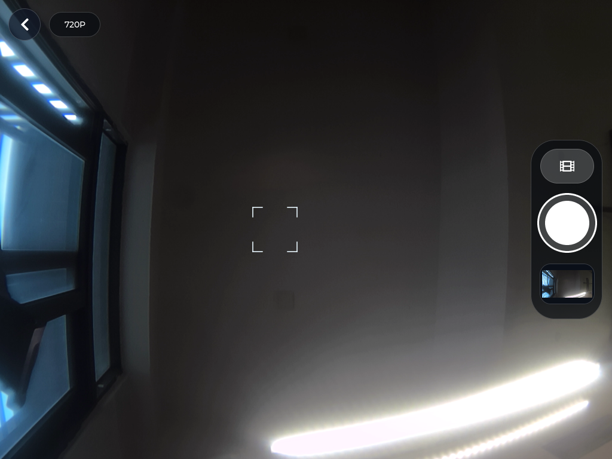

# 29 接入摄像头应用

这一章把 EdgeOS 的相机界面和常用操作移植到 V853：**全屏取景、圆形快门、照片回看、录像与回放、采集规格切换**。底层继续使用 MPP VI→VO 硬件预览，LVGL 只叠加控件，不持续搬运视频像素。

沿用前面的 AI Agent、LYNX 和 SDK 环境，不需要重新配置工具，也不需要重新烧录固件。建议按“确认摄像头 → 对照原版界面 → 接入媒体链路 → 部署验收”的顺序学习。

*截图来自正式部署的 `v1.4.0-camera`，由显示控制器合成视频层和 LVGL 层后回读，不是设计稿或主机拼接。镜头当前朝向室内场景。*

## 1. 核对摄像头与原版应用

~~~text
请通过 LYNX 核对 V853 的设备身份、空闲状态、视频节点和传感器日志。
再对照 EdgeOS_Desktop/apps/main.c 中的 create_camera_view、快门、
录像、最近媒体及规格切换逻辑，列出本次需要移植的界面与操作。
不要直接运行会关闭桌面 UI 图层的显示示例，也不要重新烧录。
~~~

本板存在 `/dev/video0`、`video4`、`video8`、`video12`，首路传感器为 `gc2053_mipi`。前期探针已从首路连续采集 120 帧，本章继续使用它。节点数量不等于摄像头数量；ISP 也会使用视频节点，第二路传感器未完成验收。

本次 LYNX 状态接口确认序列号 `20080411` 在线且无冲突任务。LYNX Shell 此前超时，不能写成已修复；实际板端操作和传输使用固定序列号的 Windows ADB，SDK 编译通过 VM 的 SSH 完成。

### 界面向原版靠齐

原版相机采用全屏视频与小面积深色半透明控件，不是“标题 + 缩小预览窗 + 大按钮”的调试页面。

| 原版交互 | V853 本版实现 |
| --- | --- |
| 全屏取景与半透明控制条 | VO 填满显示区域，按比例居中裁剪，不拉伸画面 |
| 圆形快门、取景框 | 白色拍照快门、角框标记与拍照闪光反馈 |
| 拍照/录像切换 | 切换图标和快门颜色；录像中快门变为红色停止方块 |
| 最近媒体入口 | 照片缩略图可放大查看，视频缩略图带播放标记 |
| 录像状态 | 红色计时标识，停止后完成 MP4 封装 |
| 采集规格切换 | 点击左上规格按钮循环切换，成功后保存配置 |
| 加载与错误提示 | 黑色加载层、等待动画、错误提示和 Retry |

横屏控制条放在右侧，竖屏放到底部；不把原版固定坐标直接套用到所有屏幕。取景框只是视觉标记，**不代表已经接入自动对焦**。界面中的规格标签沿用原版命名，表示采集档位，不是屏幕分辨率。

## 2. 预览走 VI→VO，控件走透明 UI

SDK 位于 `~/100ask-course/sdk/tina-v853-100ask`，媒体参考代码在 `external/eyesee-mpp/middleware/sun8iw21/sample/`：

| 示例 | 本章参考用途 |
| --- | --- |
| `sample_virvi2vo` | VI、ISP、VO 初始化与绑定 |
| `sample_takePicture` | 单帧 JPEG 编码及输入帧、输出码流释放 |
| `sample_virvi2venc2muxer` | H.264 编码与 MP4 封装 |
| `sample_demux2vdec2vo` | MP4 解封装、硬件解码与视频回放 |

~~~text
Sensor → ISP → VI
                 ├─ 虚拟通道 0 → VO → 全屏预览
                 ├─ 虚拟通道 1 → JPEG VENC → 照片
                 └─ 虚拟通道 2 → H.264 VENC → MUX → MP4

LVGL → ARGB framebuffer → 上层控件
视频层 + 控件层 → 显示控制器合成 → LCD
~~~

预览通过 `AW_MPI_SYS_Bind()` 绑定 VI 和 VO，收到首帧渲染事件后才撤掉加载层。没有把 VI 的连续帧转成 RGB 再交给 `lv_image`。应用中使用的图像控件只负责已经保存的照片和缩略图。

透明叠加需要三个条件同时成立：LVGL 输出为 `LV_COLOR_FORMAT_ARGB8888`；相机根背景透明；硬件 UI 图层启用逐像素 Alpha 且位于视频之上。本板实测视频为 `ch[0]/z[0]`，UI 为 `ch[1]/z[16]`，不能把这组编号当作所有设备的固定值。

~~~text
请保留 MPP VI→VO 绑定，把预览改成铺满当前显示区域并保持比例。
LVGL 只绘制原版风格的半透明控件，不整体调低 UI 图层透明度。
检查首帧事件、图层顺序和透明区域，不能仅凭截图看起来像视频就判定通过。
~~~

全屏预览使用居中裁剪，因此取景边缘可能少于完整照片；JPEG 和 MP4 保存完整采集画面。采集档位与显示布局分开设置，更换屏幕不需要把媒体尺寸改成屏幕尺寸。

## 3. 拍照、录像与最近媒体

### 拍照与回看

进入 Camera 默认是拍照模式。点击圆形快门后显示短暂闪光反馈，临时启用 VI 虚拟通道 1，将一帧送入 JPEG 编码器，保存完成后释放帧、码流和临时通道。

照片保存在 `/mnt/UDISK/edgeos-camera/photos/`。本版从早期 BMP 验证升级为 **JPEG 硬件编码**，不影响通道 0 的硬件预览。最近照片显示在控制条中，点击可放大，返回后继续取景。

~~~text
请实际点击快门，确认照片保存后缩略图更新，点击缩略图能够查看，
返回后预览仍正常。把新 JPEG 传回主机，检查能否正常解码以及图像尺寸；
不要只检查“Photo saved”提示，也不要使用旧照片作为本次证据。
~~~

### 录像与回放

点击控制条中的录像图标切换模式，再点击红色圆形快门开始录像。计时标识出现后，快门变成停止方块；再次点击会停止编码并完成 MP4 封装，封装成功后才显示保存提示。

录像使用独立 VI 通道、H.264 编码器和 MUX，预览继续走 VI→VO。录像中禁止切换模式和采集规格；直接返回时也会先收尾保存，不能只隐藏视频窗口。

点击最近视频会先停止相机，再启动 **DEMUX→VDEC→VO** 硬件回放。播放结束提供 Replay；返回后重新开启相机。视频封面使用同名 JPEG，不能把封面能够显示当作视频能够播放的证据。

~~~text
请分别验证开始录像、停止保存、点击最近视频播放、播放到结尾、Replay，
以及回到相机。再测试一次录像中直接返回，检查 MP4 是否完成封装。
把文件传回主机完整解码，记录编码类型和实际帧数，不能只看文件存在。
~~~

本版录像为**无音频 MP4**，单段保护上限为 5 分钟；磁盘空间不足时拒绝开始或提前收尾。这些是当前边界，不代表已经完成音视频同步、长时间录像或异常断电恢复验收。

### 切换采集档位

左上规格按钮循环切换三档采集配置。切换时先释放旧媒体链路，再启动新配置；录像时按钮禁用。成功配置保存在 `/mnt/UDISK/edgeos-camera/capture.conf`，不是只更换按钮文字。

本次三档均实际拍照并在主机确认尺寸；另各录制了一段视频并完整解码。更换传感器后必须重新核对支持的格式和尺寸，不能直接沿用本板结论。

## 4. 编译、部署与资源恢复

应用代码位于 `~/Downloads/edgeos/v853-port/`：

| 文件 | 职责 |
| --- | --- |
| `camera_ui.h` | 原版风格控件、自适应布局、模式和页面状态 |
| `camera_backend.h` | 后台进程、命令/事件通信和超时回收 |
| `camera-gallery.h` | 保存后 JPEG 的有界解码与图像内存管理 |
| `camera-mpp.c` | VI→VO 预览、全屏裁剪、诊断截图 |
| `camera-media.h` | JPEG 拍照、H.264/MP4 录像与收尾 |
| `camera-playback.h` | MP4 硬件回放和 EOF 清理 |
| `build-camera-mpp.sh` | 使用 SDK 配置与运行库构建辅助程序 |

Tina 软件包位于 `package/gui/v853-edgeos-desktop/`。JPEG 解码库用于照片查看，不参与连续预览；MPP 辅助程序还依赖板端对应的 musl、glog、ALSA、libstdc++ 等运行库。

~~~text
请构建 Tina 桌面软件包，核对界面程序、辅助程序及依赖。
部署前保留旧版本，确认新产物传输完整；停止旧 UI 和媒体进程后再替换。
启动正式服务，核对版本、运行路径和启动日志，再复测拍照与媒体回看。
只更新应用，不重新烧录。根分区空间不够时先说明部署位置和回退方式。
~~~

本板采用数据分区增量部署：两个程序位于 `/mnt/UDISK/edgeos-camera/bin/`，`/usr/bin/edgeos-v853` 和 `/usr/bin/edgeos-camera-mpp` 为符号链接。SDK 软件包仍将实体文件安装到 `/usr/bin`，供后续完整固件使用。

退出时停止通道、解除绑定、回收 MPP 辅助进程，并恢复桌面图层。这份 SDK 在释放 `/dev/disp` 时会关闭 LCD，因此退出、切换规格或进入回放有短暂显示恢复过程，**目前不是完全无闪烁切换**。相机运行期间暂停原有自动调暗逻辑，退出后恢复。

## 5. 用实测结果验收

`/dev/fb0` 只包含 LVGL 控件，不包含 VO 视频。本文截图使用显示控制器 writeback 和 DMA-BUF `DISP_CAPTURE_COMMIT2`；不能把 framebuffer 的透明区域当作相机黑屏，也不能在主机拼图冒充实机合成结果。

本次已验证：

- 原版风格全屏取景、拍照反馈、最近照片放大和返回。
- 三档 JPEG 均可解码；三段 MP4 分别完整解码出 462、152、119 帧。帧数是文件验证结果，不等于统一时长的性能对比。
- 录像中直接返回后，生成的视频仍可完整解码。
- 硬件回放收到首帧和结束事件，Replay 可重新播放，返回相机恢复预览。
- 正式程序连续进入、退出相机 10 次全部通过；每次退出后视频层和辅助进程均释放，桌面进程回到单线程。设置、绘图及再次进入相机也完成页面切换回归。
- 横、竖向主机布局各执行 5 轮，检查按钮边界、透明区、录像时按钮禁用及页面清理。它不替代第二种实体屏幕验收。

触摸操作通过 evdev 注入完成，不等同于完整物理手指验收。第二路摄像头、自动对焦、录音、完整相册管理、长时间压力测试和断电启动仍需独立验收。

构建身份、文件与证据位置

构建标识：`edgeos-v853-29-tina-v1.4.0-camera`；UI 风格标识：`edgeos-glass-v2`。

部署文件包括桌面程序 `edgeos-v853` 和媒体辅助程序 `edgeos-camera-mpp`。

本轮测试媒体包括 `edgeos-3938-498941540.jpg`、`edgeos-3998-360247235.jpg`、`edgeos-4015-396049827.jpg`，以及 `edgeos-3954-580559589.mp4`、`edgeos-4274-278995950.mp4`、`edgeos-4036-634043379.mp4`。正式部署后又拍摄 `edgeos-4357-740563948.jpg`。文件名来自板端未校准时钟，不能作为真实拍摄日期。

VM 证据目录：`~/Downloads/edgeos/evidence/20260905-camera-style/`，包含修改前源码、软件包备份、构建日志、布局测试与媒体记录。

板端上一版备份：`/mnt/UDISK/edgeos-camera/backup/edgeos-v1.3.0-mpp` 与 `helper-v1.3.0-mpp`。上一版指南保存在文档仓库 `notes/edgeos-camera-v1.3-before-style.md`。

完成标准是：**界面与主要相机操作对应原版，媒体功能真实可用，预览仍走硬件链路，退出与回看后资源能够正确切换。**
