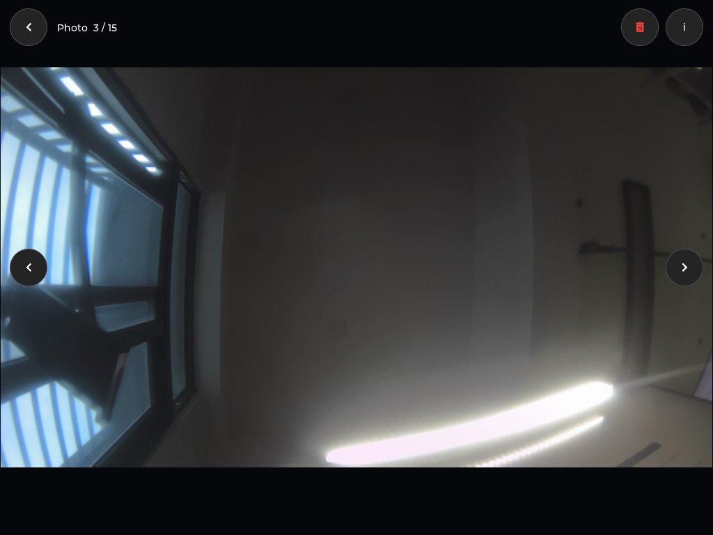
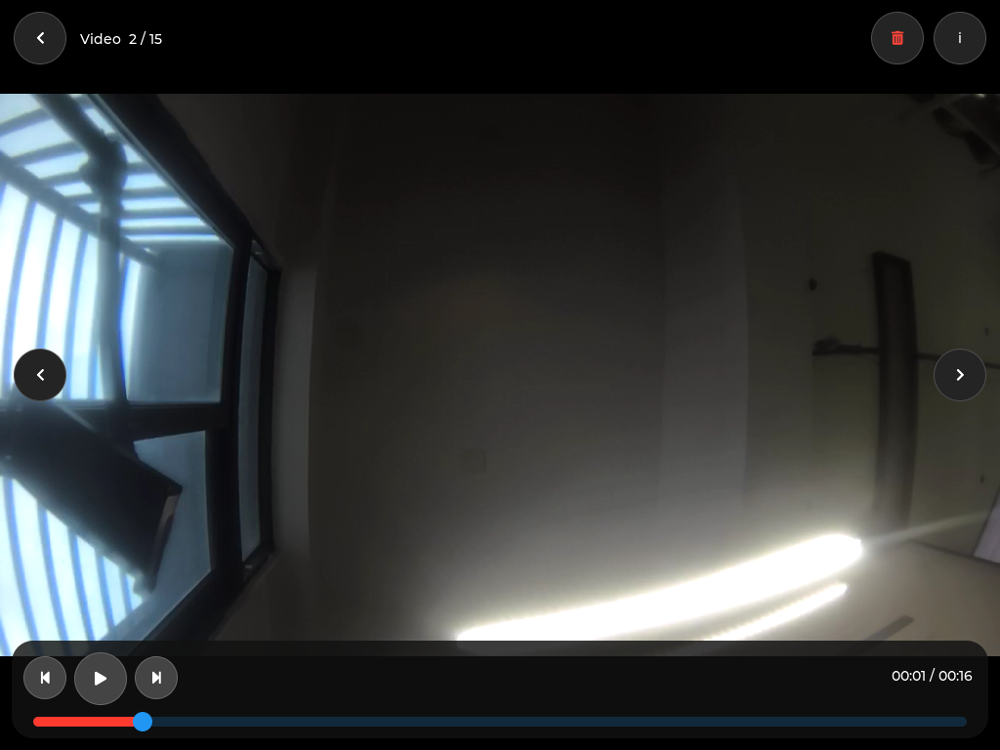

# 30 接入相册应用

上一章已经能够拍照和录像，这一章继续接入独立的 **Gallery 相册**，让保存的媒体能够集中浏览、播放和管理。UI 参考 EdgeOS 原版：浅色日期分组网格、圆角缩略图、深色查看页、文件信息和多选操作。

照片由 LVGL 显示；视频继续使用 **MPP DEMUX→VDEC→VO 硬件回放 + LVGL 透明控件**。不把视频逐帧转成图片交给 LVGL，也不需要重新烧录固件。

*实机照片查看页：保持图片比例，提供返回、前后切换、删除和文件信息。本文配图选用不含可辨识人物的室内媒体；不是 UI 设计稿。*

## 1. 对照原版功能

先让 AI Agent 阅读 EdgeOS 的相册实现，而不是只根据应用名称画一个文件列表。

~~~text
请对照 EdgeOS_Desktop/apps/main.c 中的 create_gallery_view、
gallery_refresh、gallery_open_media_index 以及选择、删除和播放控制逻辑，
把相册接入 V853 桌面。保持原版的视觉风格与主要操作，
布局随当前显示区域调整，不照搬固定坐标。
沿用现有媒体目录，不修改或清空用户原有照片。
~~~

| 原版体验 | 本版实现 |
| --- | --- |
| 日期分组与圆角网格 | 按文件修改时间倒序排列；横屏四列、竖屏两列 |
| 图片和视频混合浏览 | JPEG、历史 BMP 照片和相机生成的 MP4；视频带播放标记 |
| 同名视频封面 | `名称.mp4` 配合 `名称.jpg`，封面不重复显示成一张照片 |
| 照片查看 | 保持比例、前后切换、横向滑动切换、点击画面显隐控件 |
| 视频控制 | 暂停/继续、时间进度、进度条定位、回到开头、跳到末尾、结束后重播 |
| 文件信息 | 类型、尺寸、大小、修改时间、存储位置和文件名 |
| 选择与删除 | 单项删除、多选、取消和确认弹窗；删除后刷新列表 |

本版有一项有意保留的安全差异：**删除操作移动到媒体目录的 `.trash`，不永久清除文件**。删除视频时，同名 JPEG 封面一起移动。暂未提供回收站页面，可通过 AI Agent 核对并恢复。

桌面 Gallery 管理整个媒体目录；Camera 控制条中的最近媒体入口仍保留上一章的快速回看方式。当前不包含图片编辑、双指缩放、云同步或通用文件管理器。

## 2. 接通媒体目录与缩略图

本次应用源码位于虚拟机 `~/Downloads/edgeos/v853-port/`，SDK 位于 `~/100ask-course/sdk/tina-v853-100ask`。相册与相机共用板端目录：

~~~text
/mnt/UDISK/edgeos-camera/photos/
├─ edgeos-….jpg       照片
├─ edgeos-….mp4       视频
├─ edgeos-….jpg       与视频同名时作为封面
└─ .trash/            已确认删除的媒体，不参与相册扫描
~~~

~~~text
请先检查媒体目录、挂载状态和文件类型，记录原有文件列表并做好备份。
实现非递归扫描、按时间排序和同名封面去重，只接受普通文件，
不要跟随符号链接。进入相册或点击刷新时更新列表，
缩略图按可见区域分批解码，滚动和手指按下时暂停加载。
~~~

`gallery_data.h` 负责索引、解码与可恢复删除，`gallery_ui.h` 负责网格、查看页和交互。JPEG 使用 libjpeg 缩放解码，BMP 兼容早期验证版本生成的 24 位无压缩图片；原图与缩略图缓冲区分别管理，退出时释放。

为限制资源使用，当前最多保留 120 项媒体，目录扫描也有条目上限；达到上限会显示提示。这是面向嵌入式设备的小型相册，不是无限容量图库。损坏图片不会当作正常照片，无法解码时显示提示或保留占位图。

### 处理绘图内存不足

实操中曾出现“网格出来了，但第一张缩略图后界面卡住”：基础移植配置的 LVGL 内存池只有 64 KiB，圆角图片合成需要额外的临时图层。

最终为桌面应用提供独立的 `v853-port/lv_conf.h`，将 LVGL 内存池配置为 8 MiB，并让独立构建和 SDK 软件包都使用它。没有修改前面基础 LVGL 教程的配置。修改配置后必须重编译 LVGL 相关对象，只重编译 `main.c` 不够。

## 3. 浏览照片与查看信息

从桌面打开 Gallery，点击照片进入查看页。左右按钮用于切换媒体，顶部返回回到列表；右上角 `i` 打开文件信息。图片保持比例，允许留黑边，不为填满显示区域而拉伸。

~~~text
请在板上打开相册，检查 JPEG、历史 BMP 和视频封面是否显示。
选择不含人物的照片，验证打开、前后切换、文件信息和返回列表；
核对信息中的尺寸与主机实际解码结果是否一致。
保存实机截图，并另外检查横屏、竖屏布局是否越界。
~~~

本次实机信息页正确显示了测试照片的类型、大小和图像尺寸。板上时间尚未校准，因此相册会出现 `1970-01-01`；这是文件时间，不是相册日期解析错误。本章没有擅自修改系统时钟或历史媒体时间。

## 4. 硬件播放视频

点击带播放标记的缩略图，应用启动媒体辅助进程。收到首帧事件后，查看页背景变为透明，显示下面的 VO 视频层；LVGL 仅绘制工具按钮和进度条。

*图中为暂停状态。截图通过显示控制器合成后回读，包含硬件视频层与 LVGL 控件；只截 framebuffer 无法证明视频层正常。*

控制链路参考 SDK 的 `sample_demux2vdec2vo`：

| 操作 | 底层处理 |
| --- | --- |
| 打开视频 | DEMUX 解封装，VDEC 硬解码，VO 输出，CLOCK 同步 |
| 暂停/继续 | 协调 DEMUX、VDEC、VO 和 CLOCK 的状态 |
| 定位 | 暂停链路，DEMUX Seek，重置解码/显示/时钟状态，再按原状态继续 |
| 播放结束 | 接收 EOF，关闭链路，恢复 UI 显示；播放按钮可重新启动 |
| 返回或切换媒体 | 先结束旧播放进程，再打开目标页面或媒体 |

~~~text
请实际播放上一章保存的 MP4，检查首帧事件和持续递增的播放时间。
依次验证暂停、继续、拖动定位、回到开头、跳到末尾和重播。
暂停时的定位不能重复执行暂停命令；返回时等待资源释放完成。
请同时检查进程、日志和显示层，不能只凭视频封面或成功提示验收。
~~~

定位按编码关键帧进行，并非逐帧精确。暂停时定位会更新目标时间，画面通常在继续播放后刷新。当前重点支持本机相机产生的 H.264 MP4；未验收任意编码格式或音频播放，不能据此承诺通用视频播放器能力。

### 退出顺序不能省略

回归时发现，提前解除绑定会影响 VO 最后几帧归还，并可能造成显示硬件继续引用已释放的解码缓冲区。最终按 SDK 示例调整：先停止 VO，再停止 VDEC、DEMUX 和 CLOCK；在隧道仍可归还帧时销毁 VO 通道，关闭视频层并等待驱动处理，再销毁解码器等资源。

本板辅助进程关闭显示设备后，主 UI 还需恢复 LCD 和 framebuffer 图层。因此视频结束或返回时可能短暂黑屏，尚不是无缝切换。

## 5. 安全验证删除

点击查看页的垃圾桶可删除单项；列表右上角 Select 进入多选，选中后使用底部 Delete。两种入口都必须再次确认，Cancel 不应改变文件。

~~~text
请只复制新的 gallery-test-* 测试媒体来验证删除，保留原文件。
先测试取消，再测试单项删除和多选删除。检查视频与同名封面
是否一起进入 .trash，确认测试媒体仍能正常打开，
并检查原有媒体未被移动或删除。不要清空整个媒体目录。
~~~

删除前会再次核对文件的设备号、inode、大小和修改时间。如果文件在扫描后被替换或改变，操作应失败并提示，而不是删除另一个文件。每次移动使用独立子目录，避免覆盖已有回收文件。

本次仅移动了两张测试照片、一段测试视频及其封面，原有 19 个文件保持不变。测试文件仍在 `.trash/deleted-…/`，可以恢复。此方式不会释放磁盘空间；空间不足时，应另行确认需要永久清理的具体文件。

~~~text
请列出本次 .trash 中的测试文件及原路径，确认文件可用后恢复指定文件。
如果原路径已经存在同名文件，请停止，不要覆盖。
~~~

## 6. 构建、部署与验收

~~~text
请把相册源码、专用 LVGL 配置和播放控制一起纳入
v853-edgeos-desktop 软件包，先确认构建成功，再检查产物是否完整传输。
部署时保留上一版程序，仅切换桌面程序与媒体辅助程序，
不要烧录固件，也不要改写照片目录。
最后验证相册与相机、设置、桌面之间的切换并记录结果。
~~~

本次使用 `v1.5.0-gallery` 桌面版本，SDK 软件包修订为 `0.1.0-9`；媒体辅助程序部署为 `helper-v1.5.0-r1`，包含退出顺序修复。上一版 `v1.4.0` 的程序文件仍保留，可在停止应用后恢复两个程序入口，不需要回滚媒体文件。

LYNX 状态接口确认板卡 `20080411` 在线且无冲突任务；会话失效后重新初始化再检查。实际编译通过虚拟机 SSH，板端传输与操作使用固定序列号的 ADB。LYNX Shell 此前的超时问题没有在本章解决，不能写成全部操作均通过其 Shell 完成。

| 验收项目 | 本次结果 |
| --- | --- |
| SDK 软件包构建 | 通过，UI 与媒体辅助程序均生成 |
| 媒体索引 | 实机读取 15 项原有媒体；视频封面不重复计数 |
| 照片与信息页 | 实机显示、前后按钮与返回通过 |
| 视频控制 | 暂停/继续、暂停后定位、开头/末尾定位、EOF 与重播已实测 |
| 资源切换 | 修复后连续 5 轮视频打开、暂停、返回，无遗留播放进程；正式包再次回归通过 |
| 其他应用 | 相机 VI→VO 首帧与安全退出、设置入口均正常 |
| 删除安全 | 单项、多选与取消已实测，原有 19 个媒体文件保持不变 |
| 横竖屏布局 | 主机两种布局各循环 5 次，通过控件边界与生命周期断言 |
| 数据防护 | 主机测试通过：封面去重、符号链接忽略、损坏 JPEG、120 项上限、过期索引拒绝删除 |

横竖屏主机检查不等于两块屏幕都已实测；横向滑动与快速连续触控还需要手指操作体验验收。本次没有断电重启、重新烧录，也没有测试存储介质突然断开。

虚拟机证据保存在 `~/Downloads/edgeos/evidence/20260905-gallery/`，包含构建、布局测试及数据测试日志。排查时先看 `EDGEOS_GALLERY_GRID`、`EDGEOS_GALLERY_VIEW`、`EDGEOS_GALLERY_TRASH` 和 MPP 的首帧、进度、结束事件，再决定是否需要修改 UI 或媒体链路。
