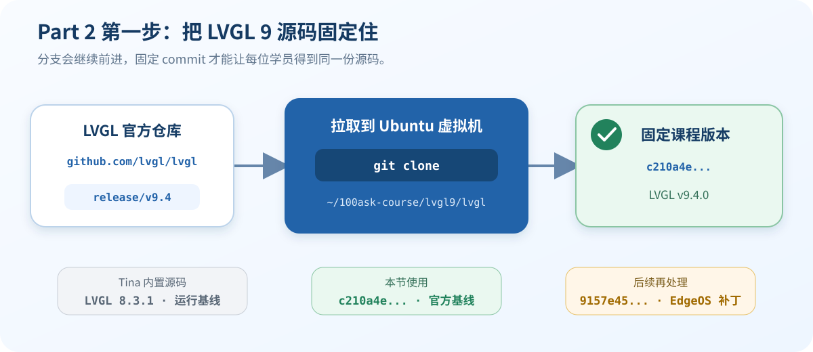

# 13 下载并固定课程使用的 LVGL 9 源码

> Part 1 的 `lv_examples 0` 只用于验证 LCD 和 Touch。本节开始准备课程真正要移植的 LVGL 9 源码。

**下面的命令在 Ubuntu 虚拟机执行，不是在开发板串口中执行。**

## 先看结论

| 对象 | 本课程怎么用 |
| --- | --- |
| Tina 内置 LVGL 8.3.1 | 只作为默认固件的运行基线 |
| LVGL 官方源码 | 使用 `release/v9.4` 的固定 commit |
| EdgeOS 补丁后 revision | 后续分析补丁时使用，本节不直接 checkout |

课程固定的官方 commit：

~~~text
c210a4efa2f474d0223d3e91c79963e1ae4ac0bc
~~~

## 1. 获取源码

1. 在 Ubuntu 虚拟机中打开终端。

2. 建立独立目录：

   ~~~sh
   mkdir -p ~/100ask-course/lvgl9
   cd ~/100ask-course/lvgl9
   ~~~

3. 拉取 LVGL 9.4 分支：

   ~~~sh
   git clone --single-branch --branch release/v9.4 \
       https://github.com/lvgl/lvgl.git lvgl
   ~~~

> 不要添加 `--depth 1`。浅克隆可能找不到课程固定的旧 commit。

## 2. 固定版本

进入源码目录：

~~~sh
cd ~/100ask-course/lvgl9/lvgl
~~~

切换到课程固定版本：

~~~sh
git checkout --detach \
    c210a4efa2f474d0223d3e91c79963e1ae4ac0bc
~~~

看到 `detached HEAD` 不用紧张，它表示源码已经停在固定位置，不会跟着分支自动变化。

## 3. 检查结果

执行：

~~~sh
git rev-parse HEAD
grep 'Configuration file for' lv_conf_template.h
git status --short
~~~

正确结果应满足：

- 第一条输出完整的 `c210a4e...` commit。
- 第二条能看到 `v9.4.0`。
- 最后一条没有输出，表示源码没有被意外修改。

## 两个 commit 不要混淆

~~~text
LVGL 官方基线 c210a4e...
        + EdgeOS 的 LVGL 补丁
EdgeOS 补丁结果 9157e45...
~~~

本节先使用官方基线 `c210a4e...`。`9157e45...` 不是官方 tag，留到后续分析 EdgeOS 补丁时再处理。

## 异常速查

| 现象 | 处理方法 |
| --- | --- |
| `git clone` 连接失败 | 检查 Ubuntu 网络后重试，不要改用来源不明的源码包 |
| checkout 提示找不到 commit | 删除浅克隆目录，按本节命令重新完整拉取 |
| 出现 `detached HEAD` | 正常现象，继续执行版本检查 |
| `git status --short` 有输出 | 先确认修改来源，不要带着未知改动进入编译 |

## 验收清单

- [ ] 源码位于 `~/100ask-course/lvgl9/lvgl`。
- [ ] `git rev-parse HEAD` 与课程固定 commit 完全一致。
- [ ] 配置模板显示 `v9.4.0`。
- [ ] 能说明 `c210a4e...` 与 `9157e45...` 的区别。
