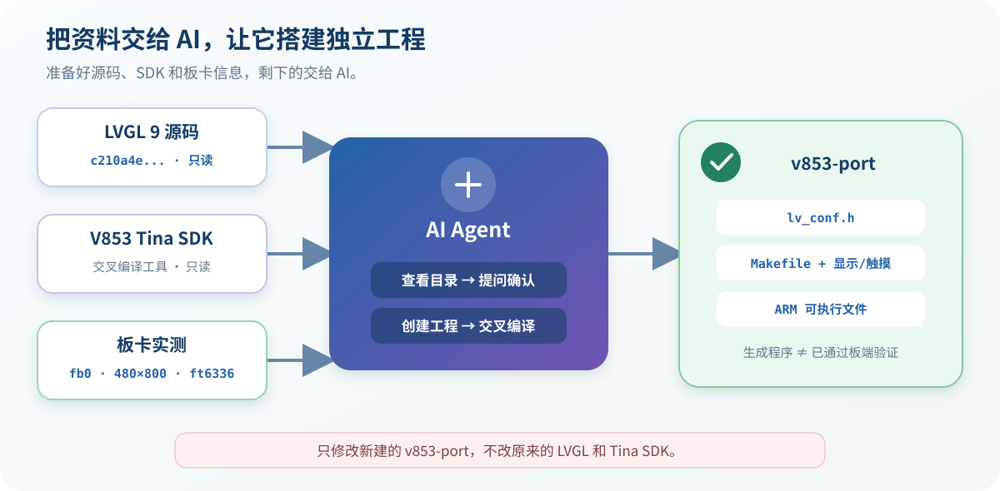
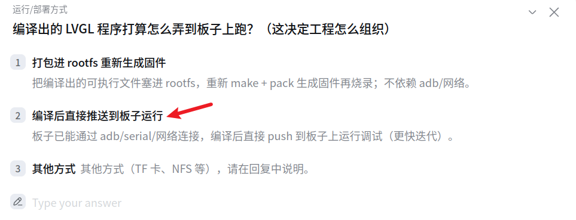
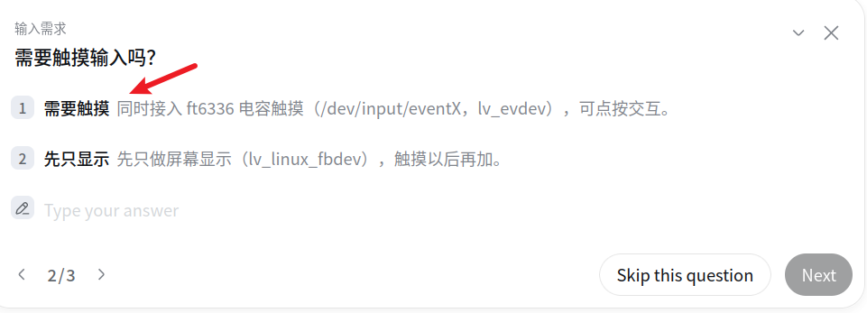
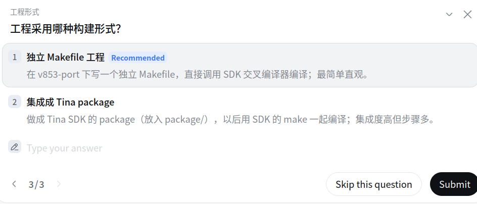
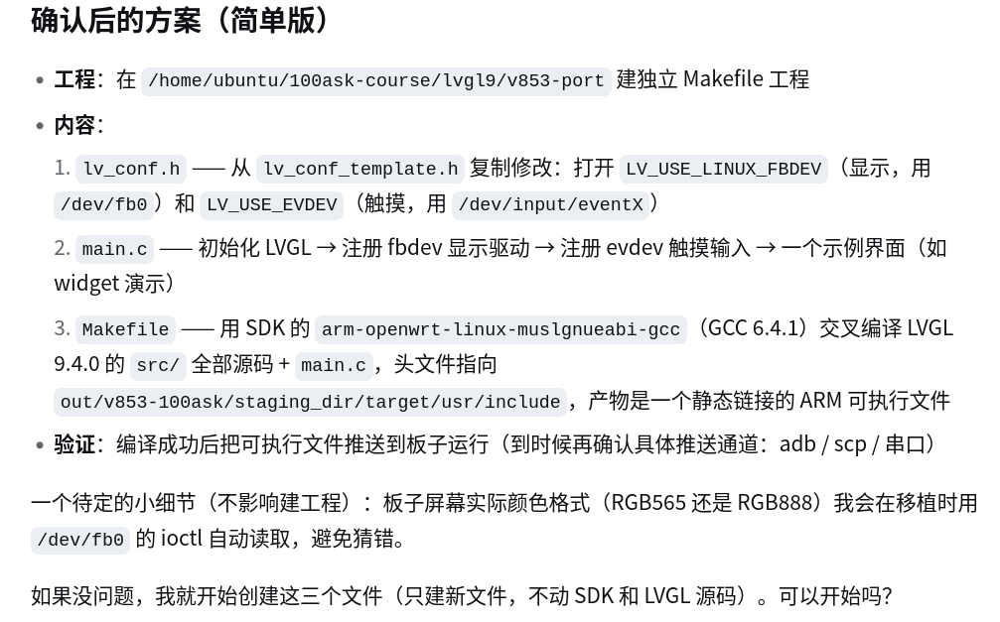

# 16 让 AI 帮我们搭好 V853 的 LVGL 9 工程

> 不会写 Makefile，也不熟悉 LVGL 的 Linux 接口？没关系。把目标和目录告诉 AI，遇到选择题时按本节说明选择即可。

## 做完后会得到什么

AI 会在下面的新目录中建立一个独立工程：

~~~text
/home/ubuntu/100ask-course/lvgl9/v853-port
~~~

工程中主要会有：

- `lv_conf.h`：LVGL 配置。
- `main.c`：程序入口，以及显示和触摸的接入代码。
- `Makefile`：调用 Tina SDK 的 V853 编译器。
- ARM 可执行文件：后续复制到开发板运行。

这一节先让 AI **创建工程并编译成功**。代码中会准备 LCD 和触摸功能，但是否真的能显示、能点击，还要在第 17～19 节分别验证。

## 1. 用普通话告诉 AI 要做什么

不需要写专业提示词，把下面这段发给 AI 即可：

~~~text
请帮我把 LVGL 9 移植到 V853 开发板上。

LVGL 源码在：
/home/ubuntu/100ask-course/lvgl9/lvgl

Tina SDK 在：
/home/ubuntu/100ask-course/sdk/tina-v853-100ask

新工程放在：
/home/ubuntu/100ask-course/lvgl9/v853-port

LCD 使用 /dev/fb0，触摸屏是 ft6336，event 编号可能会变化。

请先看看这些目录，帮我设计一个简单的独立工程。不要修改原来的 LVGL 和 Tina SDK；需要我选择时直接问我。
~~~

这已经足够。编译器在哪里、配置文件怎么写，应由 AI 查看现有源码和 SDK 后再决定。

## 2. 回答 AI 的三个问题

不同 AI 的问法可能略有区别，但要表达的选择是一样的。

### 问题 1：程序以后怎样放到开发板？

本阶段先做独立应用，不重新打包固件，所以选择 **2　编译后直接推送到板子运行**。

这里只是在确定工程形式，并不是现在就开始烧录固件。

### 问题 2：需要触摸操作吗？

桌面系统需要点击和滑动，所以选择 **1　需要触摸**。

### 问题 3：工程采用哪种构建方式？

选择 **1　独立 Makefile 工程**。这种方式结构简单，适合先把程序跑通；集成进 Tina SDK 放到第 22 节再做。

## 3. 检查 AI 汇总的方案

完成选择后，AI 会先整理准备执行的方案：

不用看懂图里的每个专业词，只检查四件事：

1. 新工程放在 `v853-port`。

2. 使用独立 Makefile，并调用 Tina SDK 中的 V853 编译器。

3. 工程包含 LCD 显示和触摸输入。

4. 不修改原来的 LVGL 源码和 Tina SDK。

图中提到的“推送到板子运行”是后续验证方式。本节先完成工程创建和交叉编译。

## 4. 让 AI 开始执行

方案没有问题时，只需回复：

~~~text
没问题，就按这个方案开始吧。先创建工程并完成编译，不要修改原来的 LVGL 和 Tina SDK。完成后告诉我结果。
~~~

这句话很普通，但目标、范围和停止位置都说清楚了。

## 5. 弹出权限申请时怎么选

可以批准：

- 读取 LVGL 源码和 Tina SDK。
- 在 `v853-port` 中创建文件。
- 调用 SDK 中已有的编译工具。

先拒绝并询问原因：

- 修改原来的 `lvgl/` 或 Tina SDK。
- 安装软件、联网下载或删除文件。
- 清理、打包或重新编译整个 Tina SDK。
- 烧录固件或重启开发板。

拿不准时直接问 AI：

~~~text
为什么需要这个权限？会修改哪些文件？
~~~

## 6. 怎么判断真的编译成功

让 AI 把关键结果单独列出来：

~~~text
请帮我确认是不是真的编译成功，只把最关键的两三行结果给我看。
~~~

然后检查：

- [ ] `v853-port` 中已经生成 `lv_conf.h`、`main.c` 和 `Makefile`。
- [ ] 编译结果中没有 `error`。
- [ ] AI 确认生成的是 ARM 可执行文件。
- [ ] 原来的 LVGL 源码和 Tina SDK 没有被修改。

做到这里，AI 已经把 V853 的 LVGL 9 初版工程搭起来了。下一节开始在开发板上分别检查 LCD 显示、触摸输入和界面刷新。
