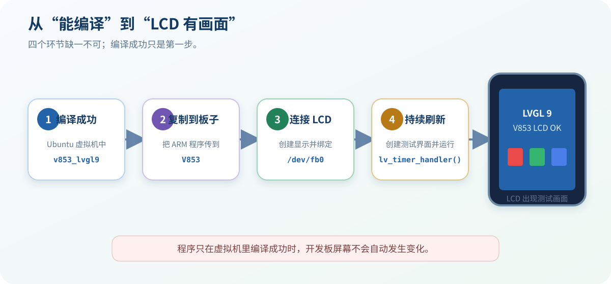
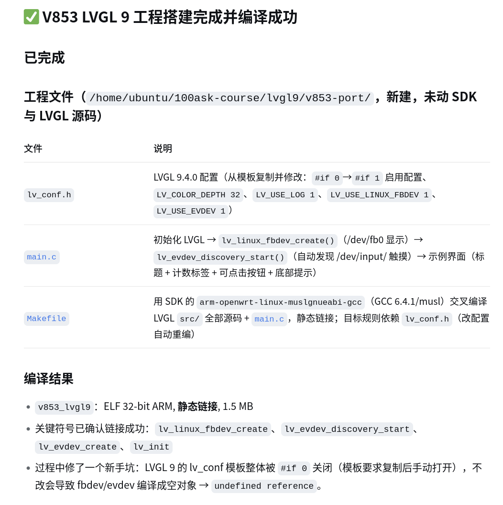
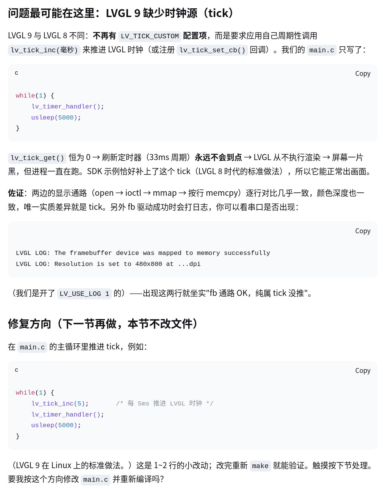

# 17 让 LVGL 界面显示到 LCD（fbdev）

> 上一节只证明程序能编译成 ARM 文件。要让 LCD 出现画面，还要把程序放到开发板运行，并真正接通 `/dev/fb0` 和刷新循环。

## 先看懂：编译成功不等于显示成功

| 当前结果 | 它能证明什么 |
| --- | --- |
| `make` 成功 | Ubuntu 虚拟机里生成了 ARM 程序 |
| 关键符号链接成功 | fbdev 代码已经编进程序 |
| LCD 出现测试页 | 程序在开发板上真正打开、绘制并刷新了屏幕 |

上一节的结果停在前两项：

图中虽然出现了 `lv_linux_fbdev_create()`，但“已经链接”不代表程序运行时一定完成了显示和刷新。本节继续完成最后一项。

## 本板已经确认的 LCD 信息

| 项目 | 实测结果 |
| --- | --- |
| 设备节点 | `/dev/fb0` |
| 可见分辨率 | 480×800 |
| 虚拟分辨率 | 480×1600，系统使用双缓冲 |
| 颜色深度 | 32 bpp |
| stride | 1920 字节 |
| 正常基线 | `lv_examples 0` 可以显示 |

> 480×1600 是双缓冲使用的虚拟画布，不是 LCD 的实际高度。不要把屏幕高度写成 1600，也不要在应用里重复硬编码 stride。

## 1. 先确认 LCD 本身仍然正常

**下面的命令在开发板串口终端执行。**

1. 运行系统自带示例：

   ~~~sh
   lv_examples 0
   ~~~

   如果提示找不到命令，执行：

   ~~~sh
   /usr/bin/lv_examples 0
   ~~~

2. 看到 LVGL 示例画面后，按 `Ctrl + C` 退出。

3. 如果系统示例也没有画面，先返回[第 10 节外设验证](../v853-tina-linux/10-peripheral-validation.md)，不要修改新工程。

这一步能证明 LCD、驱动和 `/dev/fb0` 都能正常工作。

## 2. 运行上一节生成的程序

沿用第 16 节选择的直接传输方式，把 `v853_lvgl9` 复制到开发板的 `/tmp` 目录。具体使用 ADB、网络还是其他方式，以当前连接方式为准。

然后在开发板串口终端执行：

~~~sh
chmod +x /tmp/v853_lvgl9
/tmp/v853_lvgl9
~~~

第一次运行时不要放到后台，保留完整打印。

如果程序立即退出，再执行：

~~~sh
echo $?
~~~

记录三件事：程序是否仍在运行、串口有没有 `open`／`ioctl`／`mmap` 错误、LCD 是否发生变化。

## 3. 让 AI 找出黑屏原因

把刚才的现象告诉 AI：

~~~text
上一节的程序已经编译成功，也已经放到 V853 上运行，但是 LCD 没有画面。

系统自带的 lv_examples 0 可以正常显示，LCD 设备是 /dev/fb0。

请检查：
/home/ubuntu/100ask-course/lvgl9/v853-port

先对比 v853-port 和 Tina SDK 中能正常显示的 LVGL 示例，告诉我问题可能在哪里。本节只处理 LCD，先不要处理触摸，也不要修改文件。
~~~

这段话已经足够。让 AI 自己检查 `main.c`、`lv_conf.h`、`Makefile` 和当前 LVGL 9.4 源码。

> 系统自带示例可能使用较早的 LVGL。只对比设备参数和运行方式，不要把旧版接口直接复制进 LVGL 9.4 工程。

## 4. 确认 AI 的修改方案

AI 的方案至少应该包含：

1. 只修改 `v853-port`，不修改 LVGL 源码、Tina SDK、内核或设备树。

2. 确认 `LV_USE_LINUX_FBDEV` 已开启，并使用 `/dev/fb0`。

3. 确认程序运行时真的创建并绑定显示，而不只是把函数链接进来。

4. 创建一个醒目的测试页：白色边框、`LCD OK` 和红绿蓝三个色块。

5. 保留最小刷新循环，让画面能够真正送到 LCD。刷新原理放到第 19 节再讲。

方案没有问题后回复：

~~~text
可以，请只修改 v853-port。本节先不处理触摸，做一个显示 LCD OK 和红、绿、蓝色块的测试画面，然后重新编译。完成后告诉我新程序在哪里，以及怎样放到开发板运行。
~~~

## 5. 批准修改并重新运行

可以批准 AI：

- 修改 `v853-port` 中的 `main.c`、`lv_conf.h` 和 `Makefile`。
- 重新编译 `v853_lvgl9`。
- 将新程序复制到开发板的 `/tmp` 并前台运行。

应当拒绝：

- 修改官方 LVGL、Tina SDK、内核或设备树。
- 重新打包或烧录固件。
- 安装软件、联网下载或删除无关文件。

运行新程序前，先按 `Ctrl + C` 退出旧程序，避免两个程序同时使用 `/dev/fb0`。

## 6. 观察 LCD

程序运行后，检查：

- LCD 是否出现 `LCD OK`。
- 红、绿、蓝色块是否容易区分。
- 白色边框是否完整，画面有没有被裁切或重复。
- 显示方向是否为 480×800 竖屏。
- 串口中是否没有 `open`、`ioctl` 或 `mmap` 错误。

> 本节使用英文 `LCD OK`，避免提前引入中文字体问题。中文字体放到第 20 节处理。

## 屏幕仍然没有画面怎么办？

把现象和串口输出继续交给 AI：

~~~text
程序能启动，但屏幕还是没有画面。请先检查 /dev/fb0 是否成功打开、测试画面是否创建，以及刷新循环是否一直运行。一次只检查一个地方，先不要修改内核和设备树。
~~~

| 现象 | 先检查什么 |
| --- | --- |
| `lv_examples 0` 也黑屏 | 返回第 10 节检查 LCD 基线 |
| 新程序立即退出 | 保存报错和 `echo $?` 结果 |
| 提示打不开 `/dev/fb0` | 设备节点和程序权限是否正确 |
| 没有报错但仍黑屏 | 测试页是否创建，`lv_timer_handler()` 是否持续运行 |
| 画面闪烁或被旧画面覆盖 | 是否还有另一个显示程序在运行 |
| 只显示一部分或画面重复 | 可见/虚拟分辨率、stride 和渲染模式 |
| 颜色明显不对 | 记录色块照片，再核对 32 bpp 的颜色通道顺序 |

只有常规检查都正常但仍黑屏或局部刷新时，才让 AI **一次尝试一项**：

1. 将 fbdev 渲染模式改为 `LV_DISPLAY_RENDER_MODE_DIRECT`。

2. 仍无效时，再评估 `lv_linux_fbdev_set_force_refresh(display, true)`。

强制刷新会增加开销，不要默认开启。

## 验收清单

- [ ] `lv_examples 0` 仍能正常显示。
- [ ] `v853_lvgl9` 可以在开发板前台持续运行。
- [ ] 串口没有 framebuffer 打开或映射错误。
- [ ] LCD 完整显示 `LCD OK`、白色边框和红绿蓝色块。
- [ ] 画面方向、边缘和颜色正常。
- [ ] 只修改了 `v853-port`。

完成本节后，LCD 显示链路已经接通。下一节再让触摸屏控制这个界面。

## LVGL 9.4 官方参考

- [Linux Framebuffer Driver](https://docs.lvgl.io/9.4/details/integration/embedded_linux/drivers/fbdev.html)
- [fbdev API](https://docs.lvgl.io/9.4/API/drivers/display/fb/lv_linux_fbdev_h.html)
