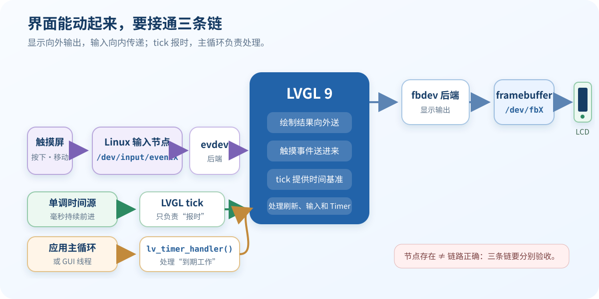

# 19 让 LVGL 持续刷新并响应操作

> 可以把 tick 看成“钟表”，把 `lv_timer_handler()` 看成“值班员”：前者报时，后者按时刷新画面、读取输入并运行 LVGL Timer。

## 学习目标

- 分清 tick 时间源与 `lv_timer_handler()`，不再把两者混为一个定时器。
- 让 LVGL 使用稳定、单调递增的毫秒时间，并按返回值安排下一次处理。
- 验证动画速度、触摸响应和空闲 CPU 表现都正常。

## 前置条件

- 已完成 [18 让触摸屏控制 LVGL 界面](18-touch-input.md)，显示和触摸可以连续运行。
- LVGL 已固定为 `9.4.x`，能够找到 `lv_conf.h` 和应用主循环。
- 已确认系统提供的单调时钟，以及哪个线程负责调用 LVGL。

## 先看懂两条时间线

| 部分 | 它负责什么 | 最容易犯的错 |
| --- | --- | --- |
| tick 时间源 | 告诉 LVGL 已经过了多少毫秒 | 同时使用 `lv_tick_inc()` 和 `lv_tick_set_cb()`，导致时间重复累计 |
| `lv_timer_handler()` | 到点后执行刷新、输入读取和 Timer 回调 | 无休止地快速调用，白白占满 CPU |

`lv_timer_handler()` 返回“距离下一项任务还有多少毫秒”。等待这段时间可以让出 CPU；返回 `LV_NO_TIMER_READY` 表示当前没有运行中的 Timer，并不是报错，应用应等待外部事件后再唤醒处理。

LVGL 默认不是线程安全的。最容易维护的做法是只让一个 GUI 线程调用 LVGL，包括 `lv_timer_handler()`；其他线程通过队列或事件把数据交给 GUI 线程。Timer 回调也在这个处理链中运行，因此应保持短小，不能长时间阻塞。

## 操作步骤

1. 准备环境与版本信息。
2. 执行本节操作并保存完整命令与日志。
3. 按验收标准验证结果。

## 验收标准

- [ ] 工程只使用一种 tick 接入方式，时间持续单调递增。
- [ ] `lv_timer_handler()` 被稳定驱动，并正确处理其返回等待时间。
- [ ] 只有约定的 GUI 线程调用 LVGL；跨线程数据有明确交接方式。
- [ ] 动画计时正常，连续触摸无明显停顿，空闲时 CPU 不持续满载。
- [ ] Timer 回调没有阻塞操作，验证现象和日志已经保存。

## 常见问题

| 现象 | 优先检查 |
| --- | --- |
| 动画过快或过慢 | tick 周期单位是否为毫秒，是否重复接入了两个时间源 |
| 空闲时 CPU 很高 | 是否忽略了 `lv_timer_handler()` 返回的等待时间 |
| 页面空闲后不再刷新 | 收到外部事件后是否重新唤醒并调用处理函数 |
| 偶发崩溃或对象损坏 | 是否有多个线程同时调用 LVGL，Timer 回调是否阻塞过久 |

## 结果说明

本节通过后，LVGL 才真正拥有可靠的“时间感”。此时再测动画和触摸延迟，数据才有意义。

## LVGL 9.4 官方参考

- [Timer Handler](https://docs.lvgl.io/9.4/details/integration/overview/timer_handler.html)
- [Timer](https://docs.lvgl.io/9.4/details/main-modules/timer.html)
- [Tick API](https://docs.lvgl.io/9.4/API/tick/lv_tick_h.html)
- [Threading Considerations](https://docs.lvgl.io/9.4/details/integration/overview/threading.html)
