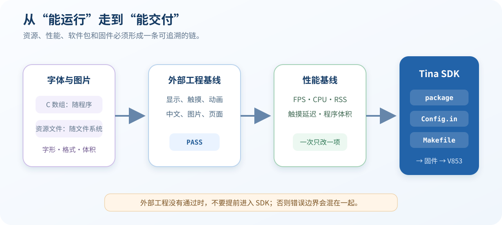

# 20 给 LVGL 界面添加中文字体和图片

> 本工程选择“编译进程序”的资源路线：中文字体转换成 LVGL C 字库，Logo 转换成 ARGB8888 C 数组。运行时不需要字体引擎、图片文件路径或额外解码器。

## 学习目标

- 根据当前 V853 工程理解内嵌资源的声明、编译、链接和使用过程。
- 为实际中文文案生成最小字符子集，保留字体授权文件。
- 核对图片的宽高、颜色格式、stride 和 Alpha 通道。
- 使用同一份源码构建“无资源/有资源”版本，正确比较产物体积。

## 当前工程的资源清单

| 资源 | 当前文件 | 关键参数 |
| --- | --- | --- |
| 中文字体 | `v853-port/assets/fonts/ui_font_24.c` | 24 px、4 bpp、未压缩、Source Han Sans SC |
| 字符范围 | 同上 | ASCII `0x20-0x7E` + `中文图片测试显示正常` |
| 原始 Logo | `v853-port/assets/images/ui_logo.png` | 30×30 |
| LVGL 图片 | `v853-port/assets/images/ui_logo.c` | ARGB8888、stride 120、30×30 |
| 字体声明 | `LV_FONT_DECLARE(ui_font_24)` | 由 `main.c` 引用 |
| 图片声明 | `LV_IMAGE_DECLARE(ui_logo)` | 由 `main.c` 引用 |
| 资源编译开关 | `WITH_RESOURCES` / `ENABLE_RESOURCES` | `1` 时编译两个 C 文件 |

当前 `lv_conf.h` 还启用了 Montserrat 14 和 24，用于英文控件；`LV_USE_FREETYPE=0`、`LV_USE_BMP=0`。这与“资源直接编译进程序”的方案一致。

## 1. 先让 AI Agent 审计资源来源

先使用 **Read Only**，发送：

~~~text
请只读审计 V853 LVGL 9.4 工程的中文字体和图片资源，不要修改或编译。

检查：
- v853-port/assets/fonts/ui_font_24.c
- v853-port/assets/images/ui_logo.png
- v853-port/assets/images/ui_logo.c
- v853-port/main.c
- v853-port/Makefile
- v853-port/lv_conf.h
- Tina SDK 的 package/gui/v853-lvgl9-demo/Makefile

请给出：
1. 字体名称、字号、bpp、字符范围、转换参数和授权文件位置；
2. 图片宽高、LVGL 颜色格式、stride、data_size 和 Alpha 情况；
3. 两个资源的声明符号与 main.c 使用位置；
4. WITH_RESOURCES=1 时 Makefile 是否编译两个资源 C 文件；
5. Tina package 是否复制资源和 SourceHanSansSC 授权文件；
6. 当前是否依赖 FreeType、BMP/PNG 解码器或运行时资源路径；
7. 只列出真实缺失项，不提出与本方案无关的库安装。

按“字体、图片、构建、许可、风险”汇总，然后停止等待。
~~~

:::warning
字体文件和图片都有版权或许可要求。AI 可以帮助转换和检查，但不能替你判断素材是否有权用于课程、产品或商业发布。必须保存原始来源、许可文本和转换参数。
:::

## 2. 生成最小中文字体

当前字库文件头记录的实际转换参数为：

~~~text
--size 24
--bpp 4
--no-compress
--no-prefilter
--format lvgl
--range 0x20-0x7E
--symbols 中文图片测试显示正常
~~~

课程使用 LVGL 仓库内的 Source Han Sans SC 字体，授权文件位于：

~~~text
lvgl/scripts/built_in_font/font_license/SourceHanSansSC/LICENSE.txt
~~~

不要把整套 CJK 字符无条件编译进去。先把界面实际使用的字符串集中成字符清单，去重后再生成字库。后续文案新增汉字时，同步更新 `--symbols` 并重新生成。

需要 Agent 修改字符集时，发送：

~~~text
请只修改 v853-port/assets/fonts/ui_font_24.c，并保留可复现记录。

根据 main.c 中实际出现的中文文案生成 24 px、4 bpp 的最小字符子集；
保留 ASCII 0x20-0x7E。字体只允许使用当前 LVGL 固定源码中的
SourceHanSansSC-Normal.otf，不联网下载或替换字体。

先输出去重后的汉字集合和完整转换命令，等待我确认。生成后检查：
符号名为 ui_font_24，文件头包含转换参数，许可文件仍存在。
禁止修改 LVGL 官方源码、系统字体或 Tina SDK。
~~~

字库生成后，源码中应导出：

~~~c
const lv_font_t ui_font_24 = {
    /* 由转换器生成的字体描述 */
};
~~~

应用中声明并使用它：

~~~c
LV_FONT_DECLARE(ui_font_24);

lv_label_set_text(title, "中文图片测试");
lv_obj_set_style_text_font(title, &ui_font_24, 0);
~~~

若文字显示为方框，先检查缺少的字形是否在字符清单中；UTF-8 源文件编码正确并不代表字库一定包含对应汉字。

## 3. 核对图片转换结果

当前 `ui_logo.c` 的描述符是：

~~~c
const lv_image_dsc_t ui_logo = {
    .header = {
        .magic = LV_IMAGE_HEADER_MAGIC,
        .cf = LV_COLOR_FORMAT_ARGB8888,
        .flags = 0,
        .w = 30,
        .h = 30,
        .stride = 120,
    },
    .data_size = sizeof(ui_logo_map),
    .data = ui_logo_map,
};
~~~

ARGB8888 每像素 4 字节，所以 30 像素宽对应 `stride=120`。透明区域依赖 Alpha 通道；如果错误转换成没有 Alpha 的格式，背景会出现方块。

应用中的使用方式为：

~~~c
LV_IMAGE_DECLARE(ui_logo);

lv_obj_t * logo = lv_image_create(lv_screen_active());
lv_image_set_src(logo, &ui_logo);
~~~

内嵌图片不依赖开发板上的 PNG 文件。`ui_logo.png` 是可编辑源文件，真正参与目标程序编译的是 `ui_logo.c`。

## 4. 把资源加入构建

当前 `v853-port/Makefile` 使用：

~~~makefile
ifeq ($(WITH_RESOURCES),1)
APP_SRC += assets/fonts/ui_font_24.c \
           assets/images/ui_logo.c
endif
~~~

编译器再把 `WITH_RESOURCES` 转成 C 宏：

~~~makefile
-DENABLE_RESOURCES=$(WITH_RESOURCES)
~~~

在 Ubuntu 虚拟机中构建课程资源版本：

~~~bash
LVGL9_ROOT=/home/ubuntu/Downloads/lvgl9
PORT="$LVGL9_ROOT/v853-port"

make -C "$PORT" clean APP=v853_lvgl9-20-resources
make -C "$PORT" \
    LVGL="$LVGL9_ROOT/lvgl" \
    APP=v853_lvgl9-20-resources \
    WITH_RESOURCES=1 \
    WITH_REFRESH_PROBE=1 \
    ADAPTIVE_SLEEP=1
build_status=$?
printf 'BUILD_EXIT_CODE=%s\n' "$build_status"
file "$PORT/v853_lvgl9-20-resources"
~~~

`BUILD_EXIT_CODE=0`、目标为 ARM EABI5 后再部署。调试阶段保留未 strip 程序；传板版本可以使用 SDK 交叉工具链的 `strip --strip-all` 生成单独的 `.deploy` 文件，不要覆盖唯一的调试产物。

## 5. 做一次有效的体积对照

如果要衡量资源增加了多少体积，必须从**同一份 `main.c`、同一提交、同一编译参数**分别构建 `WITH_RESOURCES=0` 和 `1`，每轮都清理对象，然后比较同一种产物：都未 strip，或都已 strip。

不要直接用不同章节留下的二进制做差。课程存档中的 `19-adaptive`、`20-resources` 和 `21-static` 还改变了探针或页面内容，不能把它们的大小差全部归因于字体和图片。

## 6. 在开发板验证字体和图片

运行资源版本后应看到：

- 标题“中文图片测试”没有方框、乱码或缺字。
- 文案“显示正常 LVGL 9.4”完整显示。
- 30×30 Logo 颜色和透明背景正常。
- 五点按钮和滑块仍能响应，资源修改没有破坏输入链路。

2026-08-28 的板端证据来自实际 `/dev/fb0` 抓取，而不是电脑端重画：

| 项目 | 结果 |
| --- | --- |
| 构建标识 | `resources=1 refresh_probe=1 adaptive_sleep=1` |
| 字体 C 文件 | 87,930 字节 |
| 图片 C 文件 | 18,891 字节 |
| 图片格式 | 30×30 ARGB8888，stride 120 |
| 触摸回归 | 51 次点击、37 次滑块值变化 |
| 结论边界 | 证明 framebuffer 渲染和事件处理，不替代真屏颜色、闪烁和手感检查 |

## 7. 为 Tina 软件包保留资源许可

第 22 节的软件包会把应用、字体和图片源码复制到构建目录，并把 Source Han Sans SC 的许可复制为：

~~~text
licenses/SourceHanSansSC-OFL.txt
~~~

最终程序只有一个静态 ELF，字体和图片不会作为独立文件安装到根文件系统。若以后改成运行时文件资源，必须同时增加安装规则、LVGL 文件系统驱动和对应解码器，不能只替换 `lv_image_set_src()` 的路径。

## 常见问题

| 现象 | 优先检查 |
| --- | --- |
| 中文显示为方框 | `--symbols` 是否包含该字、标题是否使用 `ui_font_24` |
| 编译提示 `ui_font_24` 未定义 | 字体 C 文件是否在 `APP_SRC` 中、导出符号名是否一致 |
| 图片符号未定义 | `ui_logo.c` 是否参与编译、声明是否使用 `LV_IMAGE_DECLARE` |
| Logo 有不透明方框 | 是否为 ARGB8888、Alpha 数据是否保留 |
| 图片颜色不对 | 转换颜色格式、通道顺序和显示端 32 bpp 配置 |
| 开启资源后界面布局错乱 | 字体字号改变了控件尺寸，重新检查 Flex/Grid 或约束宽度 |
| 1024×768 页面资源偏在左侧 | 页面仍使用 480×800 绝对坐标，应改成相对布局 |
| 体积对照结果反常 | 是否混用了不同源码、探针开关或 strip 状态 |

## 验收清单

- [ ] 字体来源、许可、字号、bpp、字符清单和转换命令已记录。
- [ ] `ui_font_24.c` 只包含当前页面需要的中文和 ASCII。
- [ ] `ui_logo.c` 为 30×30 ARGB8888，stride 为 120。
- [ ] `WITH_RESOURCES=1` 时两个资源 C 文件参与编译。
- [ ] 中文与 Logo 在真实 framebuffer 和物理屏幕上显示正确。
- [ ] 五点点击与滑块拖动回归通过。
- [ ] 体积比较使用同一源码、同一配置和相同 strip 状态。
- [ ] Tina 集成时保留字体许可文件。

## LVGL 9.4 官方参考

- [Fonts](https://docs.lvgl.io/9.4/details/main-modules/font.html)
- [Images](https://docs.lvgl.io/9.4/details/main-modules/image.html)
- [File System](https://docs.lvgl.io/9.4/details/main-modules/fs.html)
- [Color Format](https://docs.lvgl.io/9.4/details/main-modules/display/color_format.html)

## 版本与变更记录

- 2026-09-04：根据 V853 工程实际字体转换记录、ARGB8888 图片描述符、Makefile 和板端 framebuffer 证据补全。
