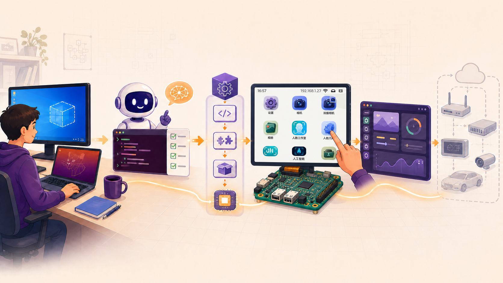
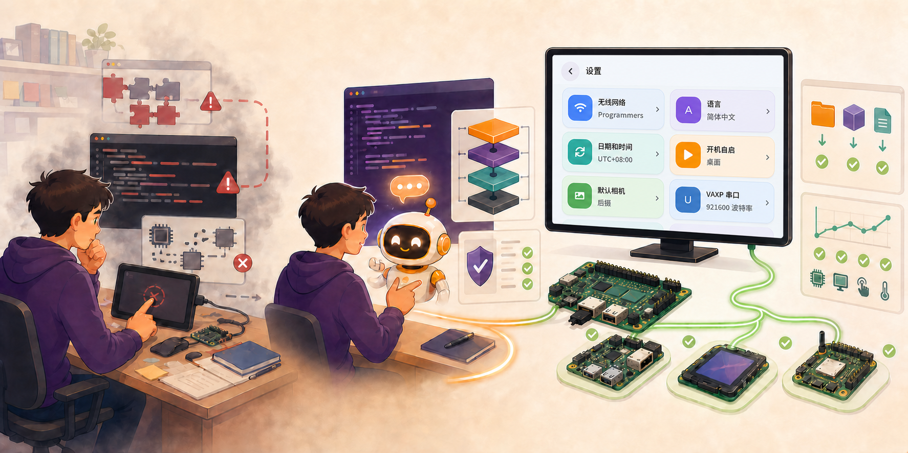

# 课程总览

嵌入式 Linux UI 的难点，从来不只是一张界面。环境版本、SDK 构建、固件烧录、显示与触摸驱动、LVGL 运行时以及资源集成，任何一层都可能让项目停在“能编译但不能运行”。

本课程以 V853 为实践平台，引导你借助 AI Agent 走通从开发环境到 LVGL 9 上板的完整链路，并用日志、产物和板上现象验证每一步。AI Agent 会参与分析、构建和排错，但所有修改都必须遵守明确的工作区、权限边界和验收标准。

*课程从可复现环境出发，依次完成系统构建、板级验证和 UI 上板，再为 EdgeOS 与更多芯片平台的迁移建立基础；图中的桌面界面融合自 DshanPI CanMV-K230 V3 / RT-Smart 实机截图，用作后续移植的产品形态参考。*

:::info 课程核心目标

不是让 AI 替你复制命令，而是建立一套可以复现、可以验证、可以定位问题，也可以迁移到其他平台的嵌入式 UI 工程方法。

:::

## 为什么要学习这门课程

*从工程问题、AI 协作到实机验证，右侧设置中心画面融合自 K230/RT-Smart 的实际运行截图；页面下方保留了未经重绘的原始真机截图。*

### 把碎片知识串成完整工程闭环

嵌入式 UI 不是单独调用几个 LVGL API。课程把环境、工具链、SDK、固件、Linux 设备接口、显示、触摸、刷新、资源和系统集成放到同一条实践链路中，帮助你理解每一层如何影响最终界面。

### 学会让 AI Agent 可控地参与真实工程

从只读分析开始，明确工作目录和修改范围，再逐步授权编译、排错与移植。你会学会要求 AI 给出依据、保存日志、核对产物，而不是接受一句没有证据的“已经完成”。

### 建立分层排错能力

面对编译失败、LCD 黑屏、触摸无响应或刷新卡顿时，你可以把问题定位到开发环境、Tina SDK、固件与连接、Linux 驱动接口、LVGL 运行时或 UI 资源层，而不是反复试错。

### 沉淀可复现、可迁移的工程资产

环境快照、构建日志、固件产物、设备节点验证、性能基线和 Tina 包配置都会成为后续 EdgeOS、V851s、V821、V861 等平台迁移时可复用的输入。

## 你将走通的课程路线

| 阶段 | 核心主题 | 阶段成果 | 状态 |
| --- | --- | --- | :---: |
| [Part 0：课程准备](/docs/course-preparation) | VMware、Ubuntu 24.04、课程工作区与按需选择的 AI 辅助工具 | 得到可复现的 Linux 开发环境，并建立最小权限的 AI 协作方式 | 已开放 |
| [Part 1：V853 系统开发](/docs/v853-tina-linux) | Tina SDK 配置、编译、打包、固件与 LCD/Touch 验证 | 获得 V853 固件和可核对的板级硬件基线 | 已开放 |
| [Part 2：LVGL 9 移植](/docs/lvgl9-porting) | 交叉编译、fbdev、evdev、刷新循环、资源、性能与 SDK 集成 | 得到能显示、能触摸、可持续刷新并可集成进 Tina SDK 的 LVGL 9 应用 | 已开放 |

:::tip 推荐学习顺序

先完成 Part 0 的统一环境，再进入 Tina SDK 编译和板级验证；确认 LCD 与触摸硬件正常后，最后开始 LVGL 9 移植。这样遇到问题时，更容易判断问题来自环境、硬件、Linux 驱动还是应用层。

:::

## 学完你能带走什么

- 一套包含环境检查、日志和快照的 Ubuntu 24.04 开发工作区。
- 一份经过配置、编译和打包验证的 V853 Tina 固件及构建记录。
- 一组 `/dev/fb0`、触摸设备节点和系统示例程序的板上验证结果。
- 一个能够显示、触摸、持续刷新、支持中文字体和图片，并可集成进 Tina SDK 的 LVGL 9 应用。
- 一套以权限边界、证据和验收清单为核心的 AI Agent 协作方法。

## EdgeOS Desktop 真机界面预览

下面的 640 × 480 截图均来自开发板实际运行画面，展示 EdgeOS Desktop 把系统设置、设备能力与 AI 应用组织成统一桌面体验后的产品形态。

:::note 截图与课程阶段

这些界面来自 **DshanPI CanMV-K230 V3 / RT-Smart** 版本，用作后续 EdgeOS V853/Tina 移植的目标体验参考。当前已经开放的 Part 0–2 仍聚焦开发环境、V853 Tina 系统与 LVGL 9 上板基础，不代表这些完整功能已经在 V853 上实现。

:::

  <figure className="course-screenshot-card">
    
    <figcaption><strong>桌面首页</strong>设置、相机、相册与人脸应用入口。</figcaption>
  </figure>
  <figure className="course-screenshot-card">
    
    <figcaption><strong>AI 应用桌面</strong>手部、人体、驾驶、OCR 与 YOLO 应用入口。</figcaption>
  </figure>
  <figure className="course-screenshot-card">
    
    <figcaption><strong>设置中心</strong>统一管理网络、语言、时间、相机和串口。</figcaption>
  </figure>
  <figure className="course-screenshot-card">
    
    <figcaption><strong>A/B OTA 更新</strong>通过网络下载更新，并保护当前可启动系统。</figcaption>
  </figure>
  <figure className="course-screenshot-card">
    
    <figcaption><strong>实例分割</strong>在真实摄像头画面中运行目标检测与分割。</figcaption>
  </figure>
  <figure className="course-screenshot-card">
    
    <figcaption><strong>网络摄像机</strong>双摄切换、画面拼接与 RTSP/RTMP 服务。</figcaption>
  </figure>

[在 EdgeOS_Desktop README 查看全部真机截图](https://github.com/dshanpi/EdgeOS_Desktop#界面预览)

## 后续规划

| 阶段 | 主题 | 状态 |
| --- | --- | :---: |
| Part 3 | EdgeOS V853 移植 | 规划中 |
| Part 4 | V851s、V821、V861 跨平台验证 | 规划中 |
| Part 5 | Camera、MPP、NPU 与性能专题 | 规划中 |

> 后续阶段会按课程实施进度与跨平台验证结果逐步补充，当前导航只展示已经提供正文的章节。
