# 04 Ubuntu 环境搭建

> 课程提供的 Ubuntu 18.04 虚拟机像一间“资料仓库”：我们只从里面取出 V853 SDK。后续开发统一在 Ubuntu 24.04 中完成。

## 学习目标

- 从课程 Ubuntu 18.04 虚拟机中找到真实 SDK。
- 手动把 SDK 搬到 Ubuntu 24.04，并确认文件没有损坏。
- 将 SDK 解压到固定工作目录，为下一节做好准备。
- 安装 Ubuntu 24.04 对应的 Tina SDK 编译依赖。

## 前置条件

- 已完成 [VMware 安装](../course-preparation/00-vmware-workstation.md)和 [Ubuntu 24.04 基础配置](../course-preparation/02-vm-base-setup.md)。
- Windows 已安装 7-Zip，并拿到课程资料的解压密码。
- 三个虚拟机分卷都已下载完成。
- Ubuntu 24.04 的可用空间不少于 50 GB。
- Ubuntu 24.04 可以正常访问软件源。

## 一张图看懂搬运路线

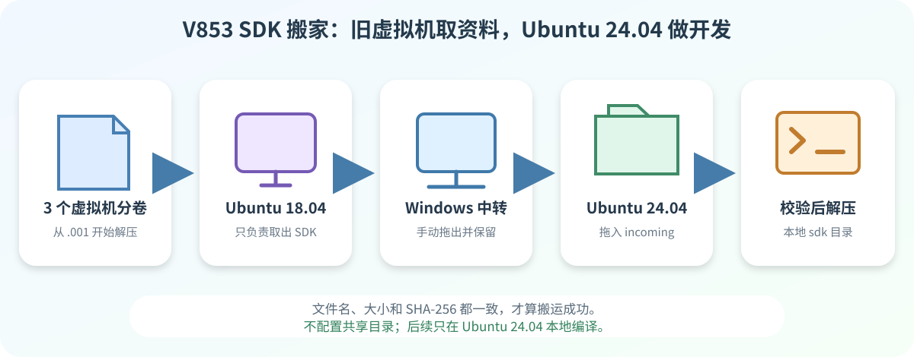

旧虚拟机只取资料，Windows 只中转，Ubuntu 24.04 才是后面的工作环境。

## 操作步骤

### 1. 解压课程资料虚拟机

先确认三个分卷在同一个 Windows 目录中，文件名连续且没有被改过：

~~~text
Ubuntu_18.04.6_VM-100ASK.zip.001
Ubuntu_18.04.6_VM-100ASK.zip.002
Ubuntu_18.04.6_VM-100ASK.zip.003
~~~

只对 `.001` 右键，选择截图箭头所示的“7-Zip → 提取到…\\”。7-Zip 会自动读取后面的分卷。

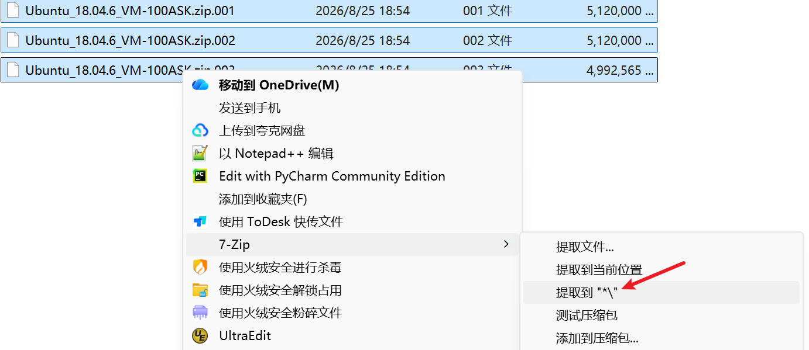

按提示输入课程资料密码。解压完成后，会出现 `Ubuntu_18.04.6_VM-100ASK` 文件夹。

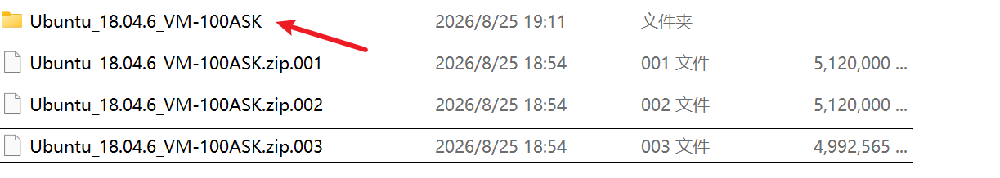

### 2. 打开 Ubuntu 18.04 资料虚拟机

进入刚解压的目录，找到下面的 `.vmx` 文件：

~~~text
Ubuntu_18.04.6_VM_LinuxVMImages.COM.vmx
~~~

双击它即可交给 VMware 打开。

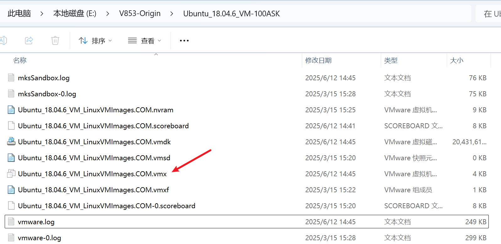

也可以在 VMware 中选择“文件 → 打开”，选中 `.vmx` 后点击“打开”。

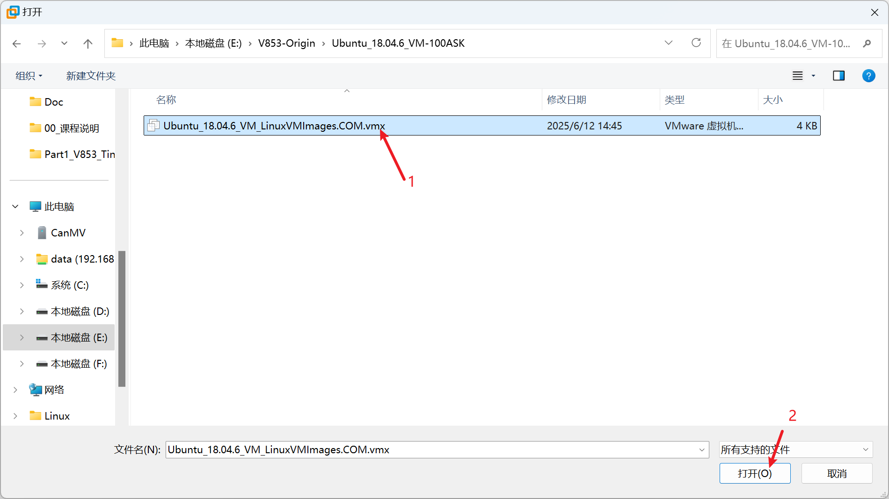

第一次启动时，选择“我已复制该虚拟机”。

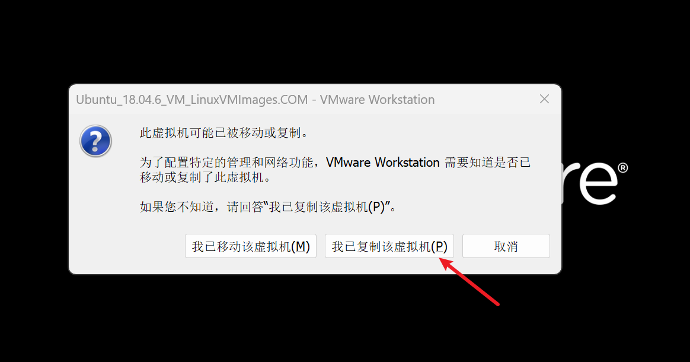

登录信息只用于这台课程资料虚拟机：

- 用户名：`Ubuntu`
- 密码：`ubuntu`

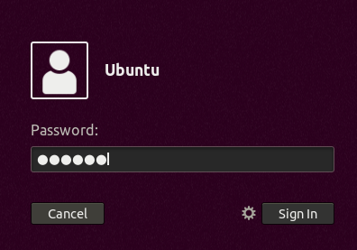

### 3. 把 SDK 复制到 Windows

进入桌面后，点击左侧的“文件”图标。

在主目录中找到真实 SDK：

~~~text
tina-v853-100ask.tar.gz
~~~

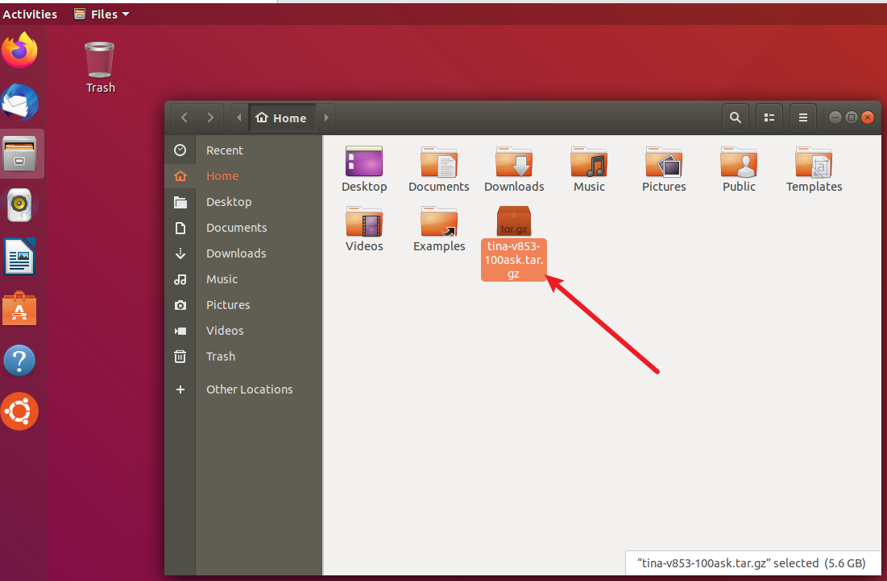

按 `Ctrl + Alt + T` 打开终端，先核对当前课程的 v1.1 SDK：

~~~bash
cd "$HOME"
stat --printf='size=%s bytes\n' tina-v853-100ask.tar.gz
sha256sum tina-v853-100ask.tar.gz
~~~

本课程当前文件应为：

~~~text
size=5577565765 bytes
2233220e050ddbfd2cca53667146bc5cf65afe18f35e31a4ace6c8fea93ca33a
~~~

在 Windows 新建一个容易找到的中转目录，例如 `F:\V853-SDK-transfer`。把 `tina-v853-100ask.tar.gz` 从 Ubuntu 窗口拖到该目录，等待复制进度完全结束。

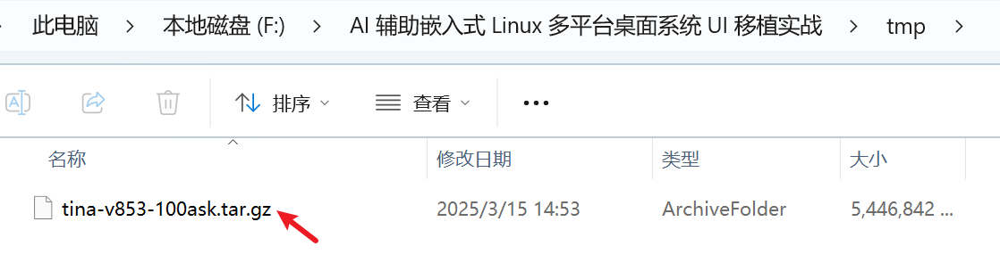

先保留旧虚拟机中的原包。确认 Windows 已看到 SDK 后，再正常关闭这台 Ubuntu 18.04 虚拟机。

### 4. 把 SDK 复制到 Ubuntu 24.04

启动课程使用的 Ubuntu 24.04，打开终端：

~~~bash
SDK_DIR="$HOME/100ask-course/sdk"
mkdir -p "$SDK_DIR"
df -h "$HOME"
nautilus "$SDK_DIR" >/dev/null 2>&1 &
~~~

先看 `Avail`：可用空间不少于 50 GB 才继续。最后一条命令会直接打开接收目录。

**在 Windows 中选中 `tina-v853-100ask.tar.gz`，把它拖进刚打开的 Ubuntu 文件管理器窗口。**

复制过程中不要暂停或关闭虚拟机。进度结束并看到文件后，再进行下一步。

### 5. 解压 SDK

在 `100ask-course/sdk` 目录空白处点击右键，选择“在终端中打开”：

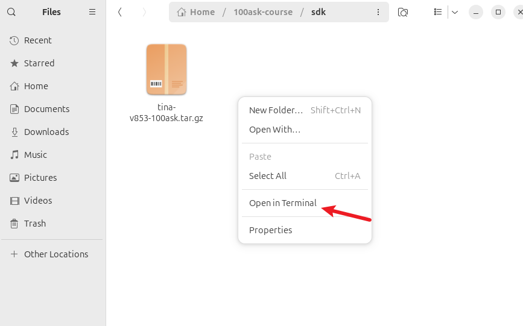

先确认复制到 Ubuntu 24.04 的压缩包没有损坏：

~~~bash
cd "$HOME/100ask-course/sdk"
printf '%s  %s\n' \
  '2233220e050ddbfd2cca53667146bc5cf65afe18f35e31a4ace6c8fea93ca33a' \
  'tina-v853-100ask.tar.gz' | sha256sum --check
~~~

正确结果是：

~~~text
tina-v853-100ask.tar.gz: OK
~~~

确认显示 `OK` 后再解压：

~~~bash
tar -xzf tina-v853-100ask.tar.gz
test -f tina-v853-100ask/build/envsetup.sh && echo "SDK 解压成功"
~~~

解压时暂时没有输出是正常的。看到 `SDK 解压成功` 后继续。

### 6. 安装 Tina SDK 编译依赖

旧版 Tina 文档使用的是 Ubuntu 14.04 软件包名，不能直接照搬到 Ubuntu 24.04。

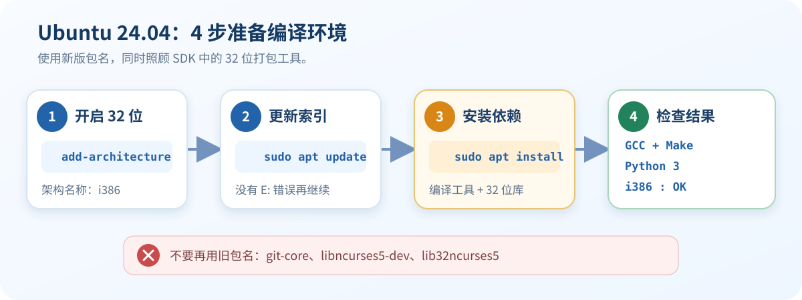

#### 6.1 启用 32 位软件包

SDK 的打包工具中包含 32 位程序，所以先输入：

~~~bash
sudo dpkg --add-architecture i386
sudo apt update
~~~

第一条命令没有输出是正常的。`apt update` 结束且没有 `E:` 开头的错误，再继续。

#### 6.2 安装依赖

复制下面整段命令执行。已经安装过的软件会自动跳过：

~~~bash
sudo apt install -y \
  build-essential git gawk flex bison quilt \
  libncurses-dev zlib1g-dev libssl-dev \
  xsltproc libxml-parser-perl gettext \
  bzip2 unzip file wget openssl \
  python-is-python3 bc cpio rsync fakeroot \
  libselinux1 libpopt0 \
  libc6:i386 libstdc++6:i386
~~~

这里已经使用 Ubuntu 24.04 的新包名，不需要再执行旧教程中的两条安装命令。

#### 6.3 检查结果

~~~bash
gcc --version | head -n 1
make --version | head -n 1
python --version
dpkg --print-foreign-architectures
dpkg -s libselinux1 libpopt0 libc6:i386 \
  libstdc++6:i386 >/dev/null \
  && echo "打包工具运行库：OK"
~~~

依次能看到 GCC、GNU Make、Python 3、`i386` 和 `打包工具运行库：OK`，环境就准备好了。

## 验收标准

- [ ] 三个资料虚拟机分卷完整，并成功打开 Ubuntu 18.04。
- [ ] Windows 中转目录中已有 `tina-v853-100ask.tar.gz`。
- [ ] Ubuntu 24.04 的 SHA-256 校验显示 `OK`。
- [ ] 解压后显示 `SDK 解压成功`。
- [ ] SDK 最终位于 `~/100ask-course/sdk/tina-v853-100ask`。
- [ ] GCC、GNU Make、Python 3 和打包工具运行库检查通过。

## 常见问题

| 现象 | 先检查什么 |
| --- | --- |
| 7-Zip 无法打开 | 三个分卷是否同目录、编号连续，是否从 `.001` 开始 |
| `.vmx` 打不开 | 是否已完整解压，并使用 VMware Workstation 打开 |
| 文件拖不进虚拟机 | 是否完成 Part0 的 Xorg 与 VMware Tools 配置 |
| SHA-256 不是 `OK` | 不要解压；重新从旧虚拟机复制 |
| 解压提示空间不足 | 用 `df -h "$HOME"` 检查 Ubuntu 24.04 可用空间 |
| SDK 目录属于 `root` | 不要使用 `sudo tar`，不要对整个 SDK 执行 `chmod -R 777` |
| 找不到 `git-core`、`libncurses5-dev` 或 `lib32ncurses5` | 使用本节的 Ubuntu 24.04 新命令，不要混用旧清单 |
| 找不到名称以 `:i386` 结尾的软件包 | 重新执行 `sudo dpkg --add-architecture i386` 和 `sudo apt update` |
| `python: command not found` | 补装 `sudo apt install python-is-python3` |

## 版本与变更记录

- 适用 SDK：`tina-v853-100ask v1.1`。
- 2026-08-26：基于课程真实资料补全 Ubuntu 18.04 → Windows → Ubuntu 24.04 的搬运、校验和解压流程。
- 2026-08-26：将旧版依赖清单更新为 Ubuntu 24.04 软件包，并增加 32 位运行库和安装验收。
