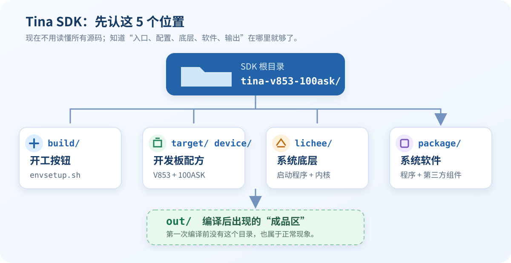

# 05 Tina SDK 介绍

> Tina SDK 可以先理解成一座“系统工厂”：里面放着启动程序、Linux 内核、软件包和 V853 开发板配置。现在不用读懂所有源码，先认路即可。

## 学习目标

- 找到 SDK 根目录和环境脚本。
- 知道以后应该去哪里找板级配置、内核、软件包和编译结果。

## 前置条件

- 已完成 [04 Ubuntu 环境搭建](04-ubuntu-environment.md)。
- SDK 位于 `~/100ask-course/sdk/tina-v853-100ask`。

## 一张图认识 SDK

先记住图中的 5 个位置即可，其余目录用到时再学。

## 操作步骤

### 1. 进入 SDK 根目录

打开终端，输入：

~~~bash
cd "$HOME/100ask-course/sdk/tina-v853-100ask"
pwd
~~~

终端应显示：

~~~text
/home/ubuntu/100ask-course/sdk/tina-v853-100ask
~~~

### 2. 检查环境脚本

~~~bash
test -f build/envsetup.sh && echo "SDK 准备好了"
~~~

看到 `SDK 准备好了`，说明目录和入口文件都正确。

### 3. 认识常用目录

- `build/`：编译入口，下一节会用到 `build/envsetup.sh`。
- `target/`、`device/`：V853 和 100ASK 开发板配置。
- `lichee/`：Boot0、U-Boot 和 Linux 4.9 内核源码。
- `package/`、`external/`：系统中的程序和第三方组件。
- `out/`：编译结果；第一次编译前没有它也正常。

## 验收标准

- [ ] `pwd` 显示正确的 SDK 根目录。
- [ ] 终端显示 `SDK 准备好了`。
- [ ] 能在目录中找到 `build`、`device`、`lichee`、`package` 和 `target`。

## 常见问题

| 现象 | 处理方法 |
| --- | --- |
| `cd` 提示目录不存在 | 回到上一节检查 SDK 是否解压到正确位置 |
| 没有显示“SDK 准备好了” | 确认当前目录不是 SDK 的上一层或压缩包目录 |
| 找不到 `out/` | 正常；完成编译后才会生成 |

## 版本与变更记录

- 适用 SDK：`tina-v853-100ask v1.1`。
- 2026-08-26：根据真实 SDK 目录整理零基础导览。
