# 06–07 V853 SDK 配置与编译

> 本节提供两种方法：自己在终端编译，或者让 AI Agent 代为执行。两种方法的配置和产物完全相同。

## 学习目标

- 选中 `v853_100ask-tina` 配置。
- 从传统编译和 AI Agent 编译中选择一种完成操作。
- 根据退出码和镜像文件判断编译是否成功。
- 使用 `pack` 生成并验证完整烧写固件。
- 使用 Agent 时，只批准与当前错误匹配、可以撤销的修复。

## 前置条件

- 已完成 [05 Tina SDK 介绍](05-tina-sdk-overview.md)。
- Ubuntu 24.04 的编译依赖已经安装完成。
- 使用 Agent 时，已完成 [DeepSeek Harness 安装](../course-preparation/05-deepseek-harness.md)；“AI 平台接入”章节在源资料中尚未提供，请按课程现场说明完成配置。

## 先选择一种编译方式

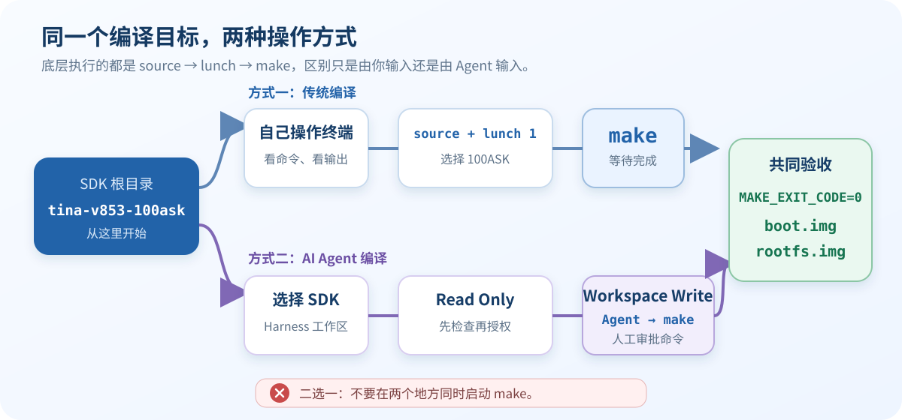

**两种方式任选一种即可，不要同时在终端和 Agent 中启动两个 `make`。**

## 方式一：传统编译

### 1. 加载编译环境

打开终端，输入：

~~~bash
cd "$HOME/100ask-course/sdk/tina-v853-100ask"
source build/envsetup.sh
~~~

看到下面这行，说明加载成功：

~~~text
Setup env done! Please run lunch next.
~~~

### 2. 选择 100ASK 配置

~~~bash
lunch
~~~

菜单会显示：

~~~text
Lunch menu... pick a combo:
1. v853_100ask-tina
2. v853_vision-tina

# Which would you like?:
~~~

输入 `1`，再按回车。输出很多时，先核对这些关键行：

~~~text
TARGET_PRODUCT=v853_100ask
TARGET_BOARD=v853-100ask
TARGET_PLAN=100ask
TARGET_KERNEL_VERSION=4.9
TARGET_UBOOT=u-boot-2018
TARGET_CHIP=sun8iw21p1
~~~

> `source` 和 `lunch` 只对当前终端生效。换了新终端，需要重新执行第 1、2 步。

### 3. 执行 make

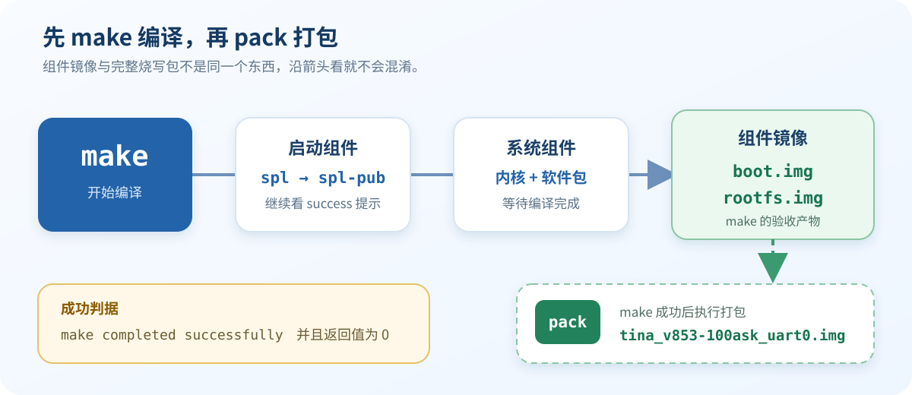

保持当前终端不变，输入：

~~~bash
make
~~~

编译开头可能看到下面这些真实输出：

~~~text
===This's tina environment.===
find: ‘.../lichee/brandy-2.0/spl’: No such file or directory
v853_100ask v853 v853-100ask
build_boot platform:sun8iw21p1 o_option:spl-pub
grep: .../lichee/brandy-2.0/spl/Makefile: No such file or directory
Prepare toolchain ...
--------build for mode:all board:v853-------------------
~~~

`o_option:spl-pub` 表示脚本已切换到 SDK 自带的公开版 SPL。两行 `No such file` 本身不能说明编译失败，继续等待最终结果。

### 4. 检查传统编译结果

`make` 返回后，立即输入：

~~~bash
make_status=$?
printf 'MAKE_EXIT_CODE=%s\n' "$make_status"
~~~

只有看到 `MAKE_EXIT_CODE=0`，才继续检查镜像：

~~~bash
ls -lh out/v853-100ask/boot.img out/v853-100ask/rootfs.img
~~~

两个文件都存在且大小不为 `0`，传统编译完成。退出码不是 `0` 时，先保留第一条有效错误，不要马上清理 SDK 或重复编译。

## 方式二：使用 AI Agent 编译

Agent 只是代替我们操作 Ubuntu 终端，真正完成编译的仍然是 Tina SDK 的 `make`。下面以 DeepSeek Harness 为例。

### 1. 选择 SDK 工作区

打开 Harness 页面，点击新增工作区按钮。页面无法打开时，先回看 [DeepSeek Harness 安装与第一次启动](../course-preparation/05-deepseek-harness.md)。

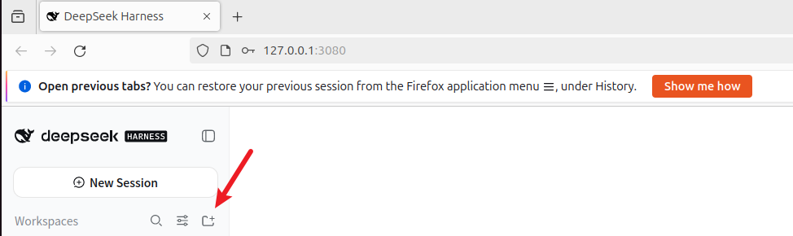

只选择下面这个 SDK 根目录，然后点击 `OK`：

~~~text
/home/ubuntu/100ask-course/sdk/tina-v853-100ask
~~~

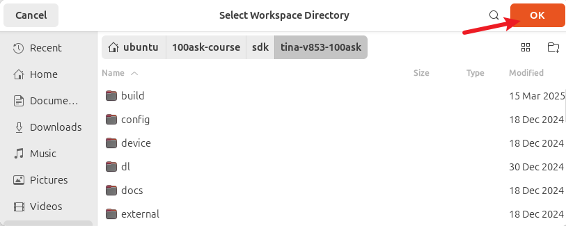

不要选择整个 `/home/ubuntu` 或 `100ask-course`，避免 Agent 获得无关目录的权限。

### 2. 先让 Agent 只读检查

目录添加成功后，点击 `New Session`。确认工作区显示为 `tina-v853-100ask`，`Standard mode` 保持默认；再点击输入框左下角的权限菜单，先选择 **Read Only**。

把下面的提示词发送给 Agent：

~~~text
请先只读检查当前 SDK，暂时不要编译，也不要修改文件。

请确认：
1. 当前工作目录是否为 /home/ubuntu/100ask-course/sdk/tina-v853-100ask；
2. build/envsetup.sh 是否存在；
3. 当前磁盘还有多少可用空间；
4. 展示准备执行的配置与编译命令，然后等待我确认。

不要使用 sudo，不要安装软件，不要清理目录，也不要修改源码或配置。
~~~

目录、脚本和命令都正确后，再把权限切换为截图中的 **Workspace Write**。编译会生成 `.config` 和 `out/`，所以只读权限无法完成 `make`；不需要授予更大的权限。

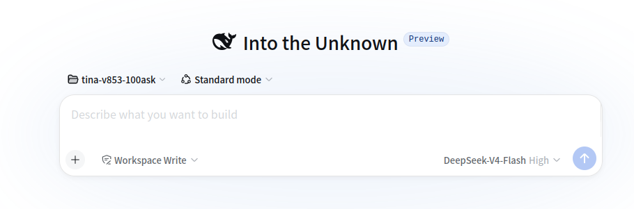

### 3. 授权并提交编译任务

复制下面整段提示词：

~~~text
请在当前 SDK 根目录的同一个 Bash 会话中依次执行：
1. source build/envsetup.sh
2. lunch v853_100ask-tina
3. 确认 TARGET_PLAN=100ask、TARGET_BOARD=v853-100ask
4. make
5. make 结束后立即执行：
   make_status=$?
   printf 'MAKE_EXIT_CODE=%s\n' "$make_status"

MAKE_EXIT_CODE 为 0 时，检查 boot.img 和 rootfs.img 的路径与大小。

限制：source、lunch 或配置检查失败时立即停止；本轮 make 只运行一次；禁止 sudo、apt、联网下载、系统级安装、clean、rm、chmod、修改源码、pack 或烧录，也不要自行构建兼容工具。失败时不要自动修复，只报告第一条有效错误及其附近日志。

最后按“配置、退出码、产物、结论”四项汇总。
~~~

这里直接使用 `lunch v853_100ask-tina`，与菜单中输入 `1` 的效果相同，也不会让 Agent 卡在交互式选择中。

编译长时间没有新输出并不等于卡死，不要重复启动 `make`。看到 `o_option:spl-pub` 时，也应继续等待最终退出码。

### 4. 审批命令并等待

Agent 请求执行权限时，先看清命令。若出现 `sudo`、`rm`、`make clean`、联网下载、系统级安装、修改源码或 `pack`，先拒绝。编译过程中不要关闭 Harness、刷新页面或再次提交任务。

最终必须同时看到：

- 配置是 `v853_100ask-tina`。
- `MAKE_EXIT_CODE=0`。
- `boot.img` 和 `rootfs.img` 都存在且大小不为 `0`。

Agent 口头说“成功”不算证据。失败时先看下一小节；错误与截图不同时，请保存完整日志并按课程现场的 Agent 辅助排错方法处理。相关独立章节在源资料中尚未提供。任务结束后，把权限切回 **Read Only**。

### 5. 常见审批结果（报错时再看）

> 编译正常时跳过本节。下面是本课程环境中实际出现过的审批选择，**只有错误与截图一致时才能照选**。

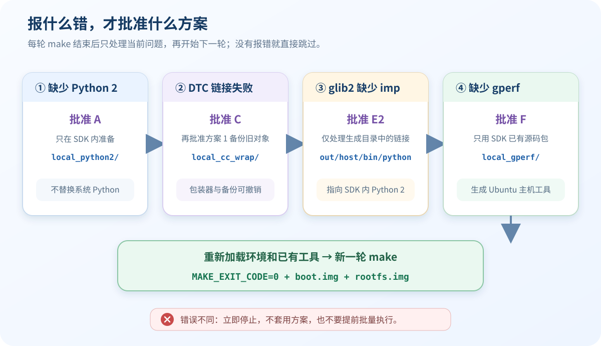

图中的 `A → C → 方案 1 → E2 → F` 是本次实测遇错顺序，不是必须执行的“安装套餐”。每次都要等上一轮 `make` 结束，再根据当前错误批准一个方案；没有出现对应错误，就跳过该方案。

> A 和 F 是“在当前 SDK 内构建本地工具”的限定例外。即使批准它们，也不允许使用 `sudo`、`apt`、联网下载，或写入 `/usr`、`/usr/local`。

#### 情况一：找不到 Python 2.x

第一次 `make` 可能停在 `scons` 安装阶段：

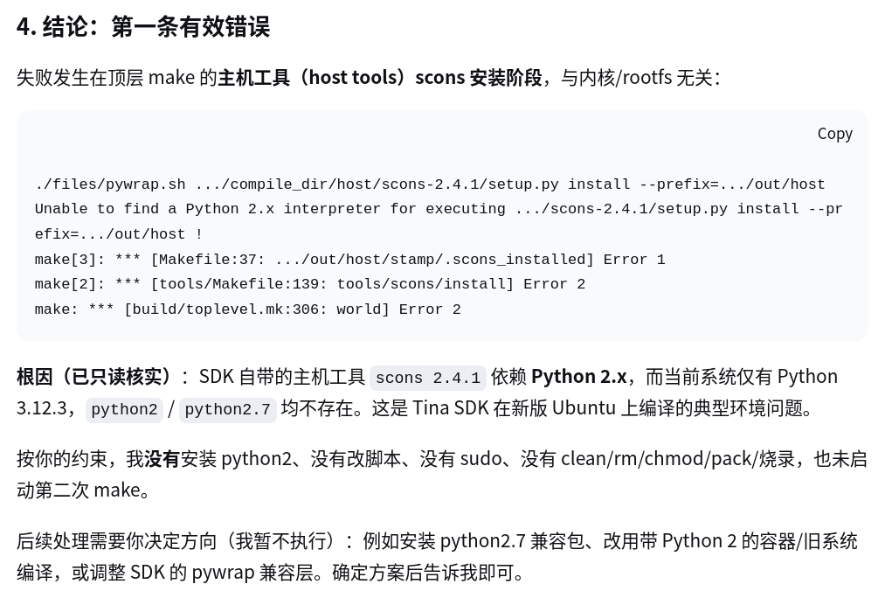

确认这次 `make` 已经结束，再选择 **方案 A** 并点击 `Submit`。

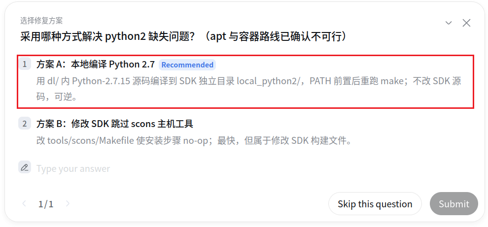

方案 A 把 Python 2.7 放在 SDK 的独立目录中，不替换 Ubuntu 的 Python，也不需要 `sudo`。

#### 情况二：GCC 13 编译 DTC 失败

如果随后明确出现 `-fno-common` 导致 `scripts/dtc` 链接失败，选择 **方案 C** 并点击 `Submit`。

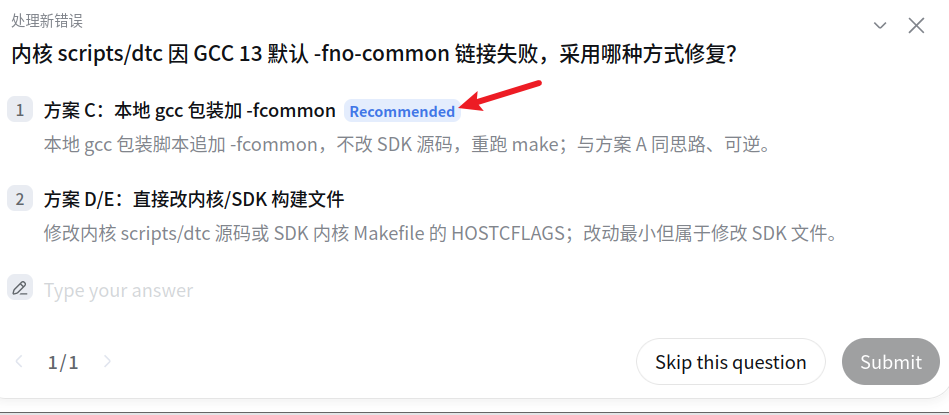

方案 C 使用本地 GCC 包装器，不修改内核源码。若 Agent 需要执行 `chmod +x`，只能批准新建的包装脚本，不能批准递归 `chmod`。

#### 情况三：需要重新生成 DTC 对象

选择 **方案 1**：把旧文件移动到备份目录，再重新编译。

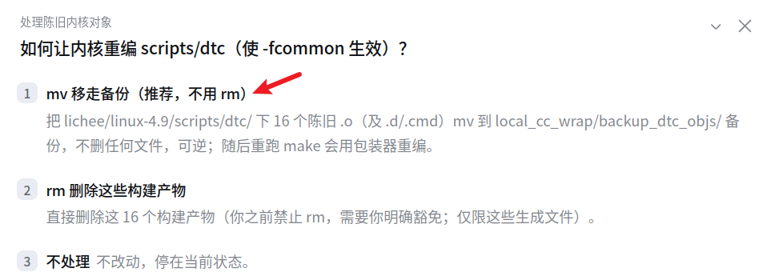

这里使用 `mv` 备份，不使用 `rm` 删除，出现问题时还可以恢复。

> 方案 1 是方案 C 的配套重建动作，因此最终总结中仍然是 4 个兼容问题。

#### 情况四：glib2 仍然调用 Python 3.12

如果 Agent 明确报告 glib2 因 `import imp` 失败，并出现下面的选择：

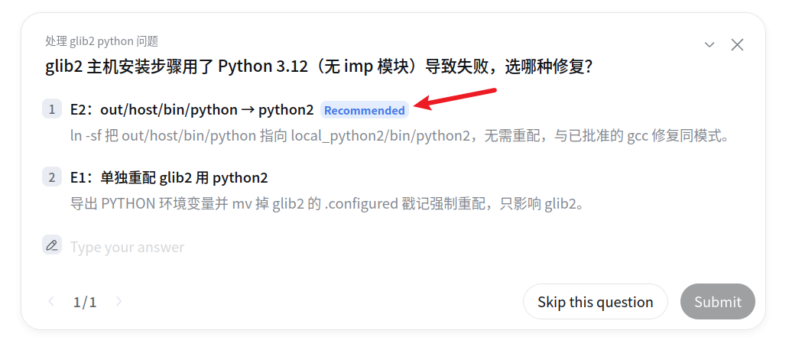

选择 **E2** 并点击 `Submit`。它只把生成目录中的 `out/host/bin/python` 指向前面准备好的 `local_python2/bin/python2`，不修改 SDK 源码。

批准前确认：

- `local_python2/bin/python2` 存在、可以运行，源路径和目标路径都位于当前 SDK 内。
- `out/host/bin/python` 不存在或只是旧符号链接；若它是普通文件，先用 `mv` 备份，不能直接覆盖。
- 完成后，链接最终指向 SDK 内的 Python 2；不得触碰 `/usr/bin/python` 或系统 Python 配置。

E2 处理 Python 入口，方案 C 处理 GCC 入口，两项互不替代。

#### 情况五：fontconfig 缺少 gperf

如果 Agent 确认 SDK 的 `dl/` 中已有 gperf 源码包，并出现下面的选择：

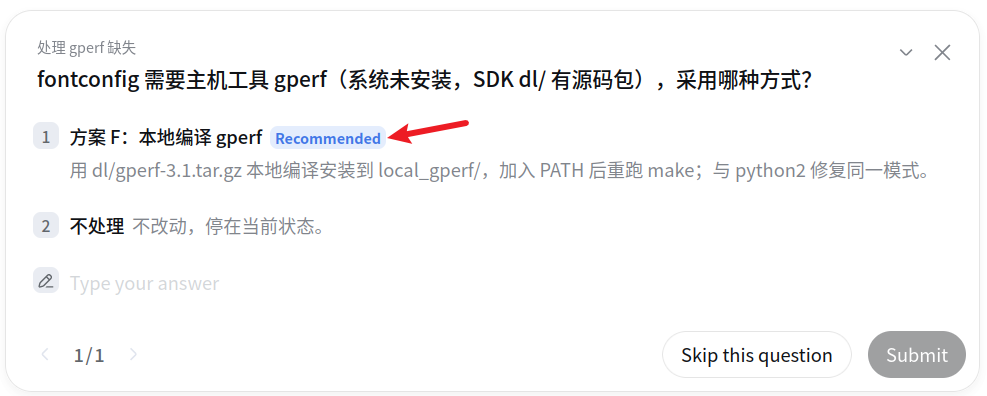

选择 **方案 F** 并点击 `Submit`。它只使用 SDK 已有的 `dl/gperf-3.1.tar.gz`，并把 gperf 编译到当前 SDK 的 `local_gperf/`。

生成的 `local_gperf/bin/gperf` 必须能直接在 Ubuntu 中运行，它是主机工具，不是 ARM 程序。源码包不存在或本地构建失败时立即停止；不得 `apt`、下载源码、安装到系统或修改 fontconfig 源码。

#### 修复后再次编译

每次打开新终端或完成一轮修复后，都要重新加载环境。若已经完整执行 A、C＋方案 1、E2、F，可使用下面的累计 `PATH`：

~~~bash
cd "$HOME/100ask-course/sdk/tina-v853-100ask"
source build/envsetup.sh
lunch v853_100ask-tina
export PATH="$PWD/local_cc_wrap/bin:$PWD/local_python2/bin:$PWD/local_gperf/bin:$PATH"

make
make_status=$?
printf 'MAKE_EXIT_CODE=%s\n' "$make_status"
~~~

只完成部分修复时，只保留已经生成的本地工具目录；方案 1 是一次性重建动作，不需要加入 `PATH`。全新 SDK 或没有执行这些修复时，仍按前面的正常流程编译。

**审批原则：前一次 `make` 已结束、路径位于当前 SDK、改动可以撤销、一次只批准一个方案。** 每完成一次修复，才允许 Agent 开始新一轮 `make`。错误与截图不一致时，不要套用这些方案。

## 编译完成

`make` 只负责编译组件。AI Agent 完成本次编译后，会给出类似下面的汇总：

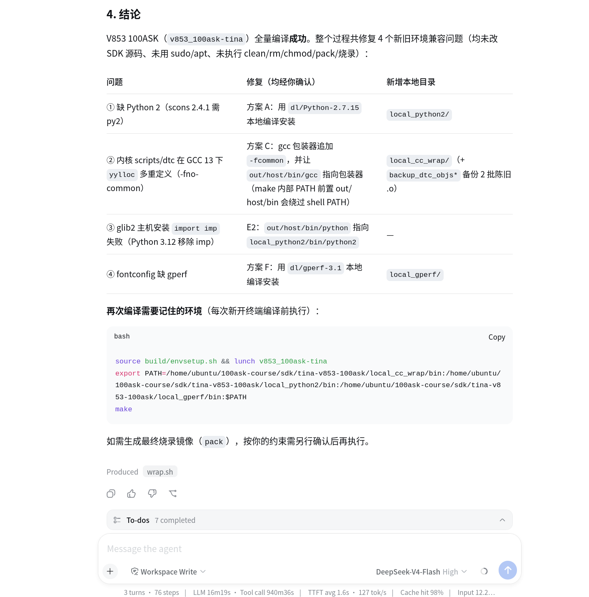

这张图用于回顾修复过程，不能代替最终验收。仍需确认 `MAKE_EXIT_CODE=0`，并检查 `boot.img`、`rootfs.img` 存在且大小不为 `0`。

## 打包固件

`boot.img` 和 `rootfs.img` 是组件镜像；`pack` 会把它们组合成下一节使用的完整烧写固件。**打包只生成文件，不会把固件写入开发板。**

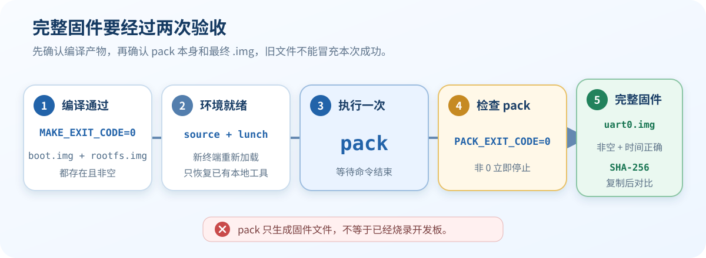

### 1. 打包前确认

只有同时满足下面三项，才能开始打包：

- `MAKE_EXIT_CODE=0`。
- `boot.img` 和 `rootfs.img` 存在且大小不为 `0`。
- 上一次 `make` 已返回终端提示符，当前没有重复运行的 `make` 或 `pack`。

打开新终端时，先重新加载 100ASK 配置：

~~~bash
cd "$HOME/100ask-course/sdk/tina-v853-100ask"
source build/envsetup.sh
lunch v853_100ask-tina
~~~

如果执行过前文的本地兼容性修复，还要在 `lunch` 后恢复**已经生成**的工具目录。三项工具都存在时使用：

~~~bash
export PATH="$PWD/local_cc_wrap/bin:$PWD/local_python2/bin:$PWD/local_gperf/bin:$PATH"
~~~

没有执行过这些修复，就跳过这行；只生成了部分目录，就只加入已经存在的目录。

### 2. 在终端中打包

保持当前终端不变，执行一次 `pack`，并立即记录退出码：

~~~bash
pack
pack_status=$?
printf 'PACK_EXIT_CODE=%s\n' "$pack_status"
~~~

看到 `PACK_EXIT_CODE=0` 后，再验证完整固件：

~~~bash
firmware='out/v853-100ask/tina_v853-100ask_uart0.img'
test -s "$firmware"
firmware_status=$?
printf 'FIRMWARE_CHECK_EXIT_CODE=%s\n' "$firmware_status"
~~~

看到 `FIRMWARE_CHECK_EXIT_CODE=0`，再记录文件大小、修改时间和 SHA-256：

~~~bash
firmware='out/v853-100ask/tina_v853-100ask_uart0.img'
ls -lh --time-style=long-iso "$firmware"
sha256sum "$firmware"
~~~

确认修改时间属于本次打包，并保存最后一行 SHA-256 校验值。

> 旧固件可能仍留在 `out/` 中。因此，即使看到了 `.img` 文件，只要本次 `PACK_EXIT_CODE` 不是 `0`，仍然算打包失败。

### 3. 使用 Agent 打包

将当前 SDK 工作区临时切换为 **Workspace Write**，再发送下面的完整提示词：

~~~text
请只执行 V853 完整固件打包，不要重新 make，也不要烧录。

请在同一个 Bash 会话中完成：
1. 进入 /home/ubuntu/100ask-course/sdk/tina-v853-100ask；
2. source build/envsetup.sh；
3. lunch v853_100ask-tina；
4. 确认 TARGET_PLAN=100ask、TARGET_BOARD=v853-100ask；
5. 只将当前 SDK 内已经存在的 local_cc_wrap/bin、local_python2/bin、local_gperf/bin 加入 PATH；
6. 确认 out/v853-100ask/boot.img 和 out/v853-100ask/rootfs.img 存在且大小不为 0；
7. pack 只运行一次，结束后立即保存并打印 PACK_EXIT_CODE；
8. 退出码为 0 时，检查 out/v853-100ask/tina_v853-100ask_uart0.img 是否非空，并输出大小、修改时间和 sha256sum。

禁止 sudo、apt、联网下载、clean、rm、修改 SDK 源码或系统文件，也不要烧录。
任何检查或 pack 失败时立即停止，不要自动修复；只报告第一条有效错误及附近日志，等待我决定。

最后按“配置、退出码、固件、SHA-256、结论”汇总。
~~~

Agent 请求执行权限时，只批准与上面步骤一致的命令。打包完成后，把工作区切回 **Read Only**。

### 4. pack 因 FORTIFY 检查失败

只有日志明确显示“内核 DTC 在 fex 转换时触发 FORTIFY 检查”，并且相关路径都位于当前 SDK 时，才参考下面的审批：

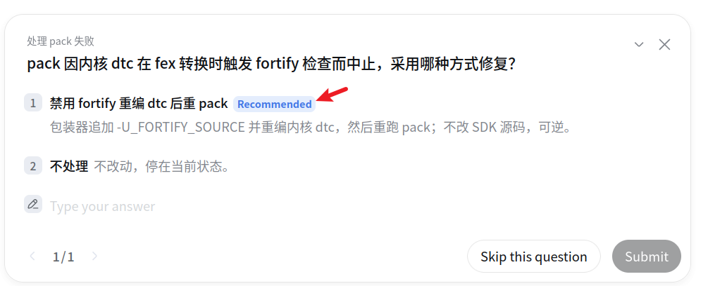

图中的 **Recommended** 不是无条件许可。选择 **方案 1** 前，先确认：

- 前一次 `pack` 已经结束，Agent 只准备重建用于 fex 转换的 Ubuntu 主机端 DTC。
- `-U_FORTIFY_SOURCE` 只添加到当前 SDK 的临时编译器包装器，不修改系统 GCC，也不修改 SDK 源码。
- Agent 已展示包装器的绝对路径、旧 DTC 对象的备份位置和恢复方法；旧文件使用 `mv` 备份，不使用 `rm`。
- 修复过程不包含 `sudo`、`apt`、联网下载、系统目录或开发板烧录。

确认无误后选择 **1**，点击 `Submit`，等待 DTC 重建完成；Agent 再次请求运行 `pack` 时，只批准一次。完成所有验收后，要求 Agent 按之前展示的方法还原包装器，移除临时添加的 `-U_FORTIFY_SOURCE`，不要带着它继续执行普通 `make`。

错误文字、DTC 用途或路径有一项不一致，就选择 **2** 或跳过问题，不要套用这个方案。

### 5. 找到并复制固件

本课程下一节使用的完整烧写包是：

~~~text
out/v853-100ask/tina_v853-100ask_uart0.img
~~~

不要把它和 `boot.img`、`rootfs.img` 混淆。按照 [手动复制 Windows 与 Ubuntu 文件](../course-preparation/02-vm-base-setup.md#3-手动复制-windows-与-ubuntu-文件)，从 Ubuntu 文件管理器拖到 Windows，不配置共享目录。

## 验收标准

- [ ] 只完成了一种编译方式，没有同时启动两个 `make`。
- [ ] 配置结果为 `TARGET_PLAN=100ask`、`TARGET_BOARD=v853-100ask`。
- [ ] `MAKE_EXIT_CODE=0`。
- [ ] `boot.img` 和 `rootfs.img` 都存在且大小不为 `0`。
- [ ] `PACK_EXIT_CODE=0`，完整固件存在且大小不为 `0`。
- [ ] 已记录完整固件的修改时间和 SHA-256。
- [ ] 使用 Agent 时，已核对提示词要求的汇总并把权限切回 `Read Only`。
- [ ] 使用本地兼容工具时，已记录再次编译所需的 `PATH`。

## 常见问题

| 现象 | 处理方法 |
| --- | --- |
| `lunch: command not found` | 在 SDK 根目录重新执行 `source build/envsetup.sh` |
| 误选第 2 项 | 重新执行 `lunch`，输入 `1` |
| 看到 `spl` 不存在 | 继续看是否切换到 `spl-pub`，最终按返回值和产物判断 |
| 提示 `No space left on device` | 用 `df -h "$HOME"` 检查可用空间 |
| Agent 无法生成 `out/` | 只读检查通过后，将当前 SDK 工作区切换为 `Workspace Write` |
| Agent 要求 `sudo`、清理或改源码 | 拒绝该命令，重新发送本节的安全限制 |
| Agent 口头说“成功” | 不作为证据；编译检查 `MAKE_EXIT_CODE`，打包检查 `PACK_EXIT_CODE` 和完整固件 |
| glib2 提示 `import imp` 失败 | 仅在错误一致时查看“情况四”，确认 E2 的两个路径 |
| fontconfig 提示缺少 gperf | 仅在 `dl/` 已有源码包时查看“情况五” |
| `pack: command not found` | 在 SDK 根目录重新执行 `source` 和 `lunch` |
| `pack` 在 DTC 的 fex 转换阶段触发 FORTIFY | 仅在错误完全一致时查看“pack 因 FORTIFY 检查失败” |
| 找到 `.img`，但 `PACK_EXIT_CODE` 非 `0` | 可能是旧固件，本次打包仍按失败处理 |

## 版本与变更记录

- 适用配置：`v853_100ask-tina`，Linux `4.9`，U-Boot `2018`。
- 2026-08-26：将文档重排为“传统编译”和“AI Agent 编译”两条独立路线。
- 2026-08-27：补充 glib2、gperf 审批结果和本地兼容工具的再次编译环境。
- 2026-08-27：补充传统与 Agent 打包、FORTIFY 审批边界和完整固件校验。
