# 08 固件烧录

> 完成固件烧录并验证设备启动状态。

:::warning 本节内容状态

当前源资料已经覆盖 Windows USB 驱动安装和 LYNX 芯桥的基础配置；“使用 AI Agent 烧录固件”、完整验收步骤和故障案例仍待课程后续补充。

:::

## 学习目标

- 让 Windows 正确识别进入 FEL 烧写模式的 V853 设备。
- 安装并完成 LYNX 芯桥的基础单板配置。
- 明确后续固件烧录需要补齐的输入与验收记录。

## 前置条件

- 硬件：V853 开发板、可传输数据的 USB 线。
- 软件：Windows 10/11、全志 USB 烧录驱动、LYNX 芯桥。
- 输入资料：上一节生成的完整固件，以及课程提供的驱动和开发工具目录。

## 安装Windows驱动

**按住开发板的FEL键进，之后按一下RESET键**可以自动进入烧写模式。

这时我们可以看到电脑设备管理器 **通用串行总线控制器** 部分弹出一个 未知设备 ，这个时候我们就需要把我们提前下载好的 **全志USB烧录驱动** 进行修改，然后将解压缩过的 **全志USB烧录驱动** 压缩包，解压缩，可以看到里面有这么几个文件。

```text
InstallUSBDrv.exe
drvinstaller_IA64.exe
drvinstaller_X86.exe
UsbDriver/
drvinstaller_X64.exe
install.bat
```

对于wind7系统的同学，只需要以管理员 打开 `install.bat` 脚本，等待安装，在弹出的 是否安装驱动的对话框里面，点击安装即可。

对于wind10/wind11系统的同学，需要在设备管理器里面进行手动安装驱动。

如下图所示，在第一次插入OTG设备，进入烧写模式设备管理器会弹出一个未知设备。

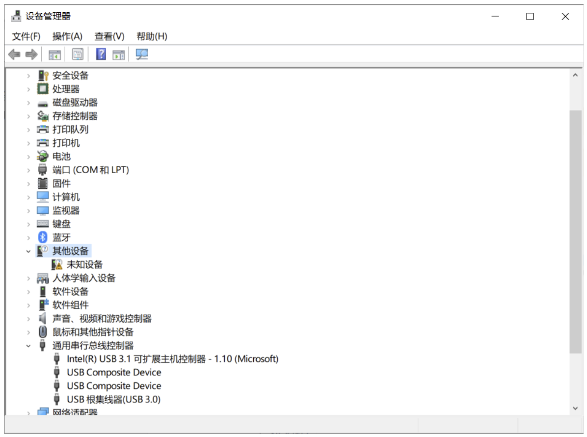

接下来鼠标右键点击这个未知设备，在弹出的对话框里， 点击浏览我计算机以查找驱动程序软件。

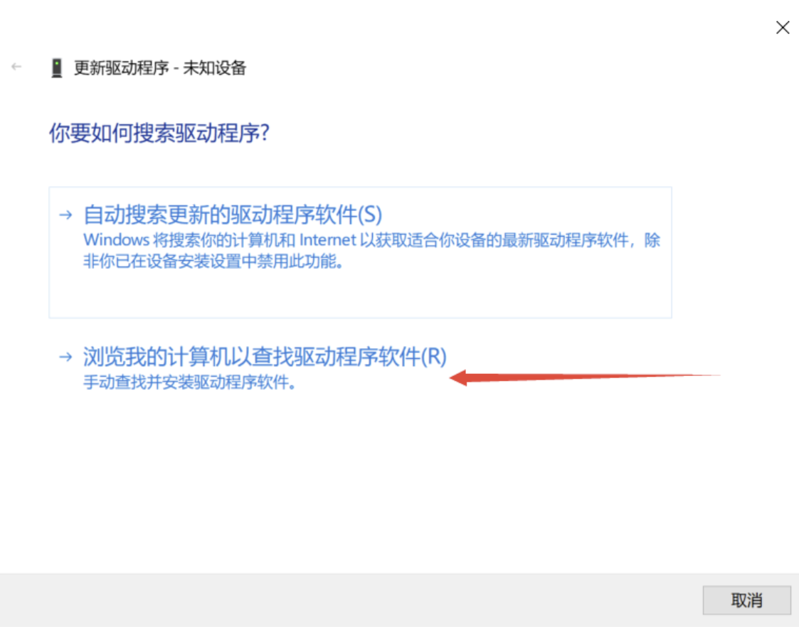

之后在弹出新的对话框里，点击浏览找到我们之前下载好的 usb烧录驱动文件夹内，找到 `UsbDriver/` 这个目录，并进入，之后点击确定即可。

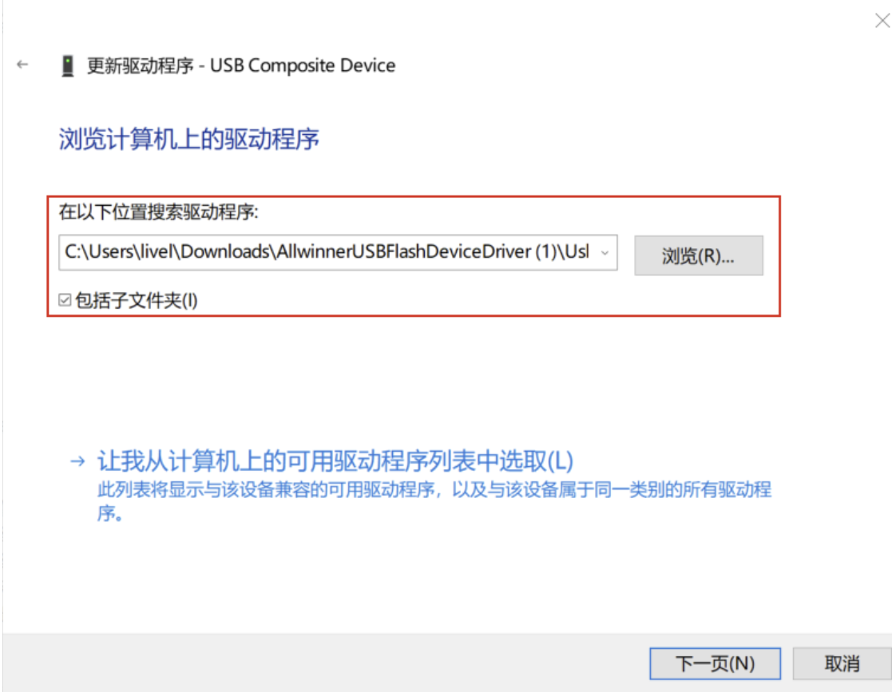

注意进入到 `UsbDriver/` 文件夹，然后点击确定，如下图所示。

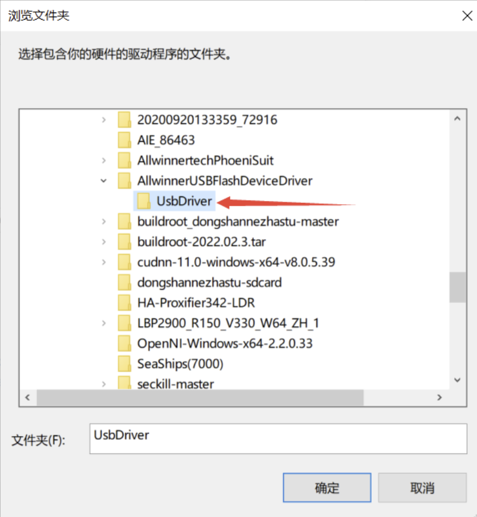

此时，我们继续点击 **下一页** 按钮，这时系统就会提示安装一个驱动程序。

在弹出的对话框里，我们点击 始终安装此驱动程序软件 等待安装完成。

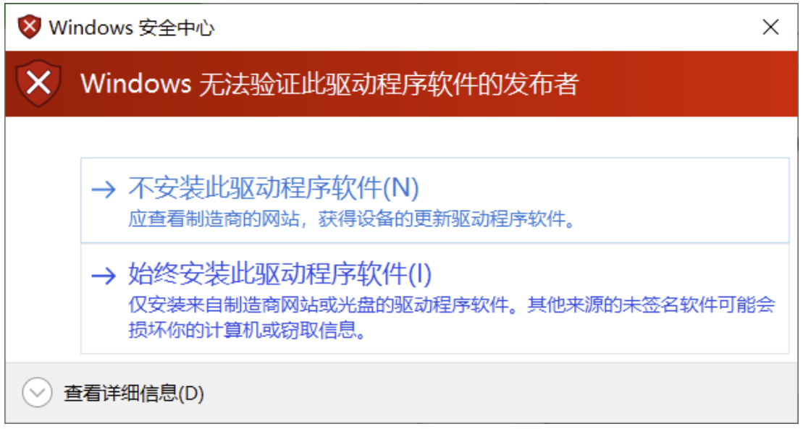

安装完成后，会提示，Windows已成功更新你的驱动程序。

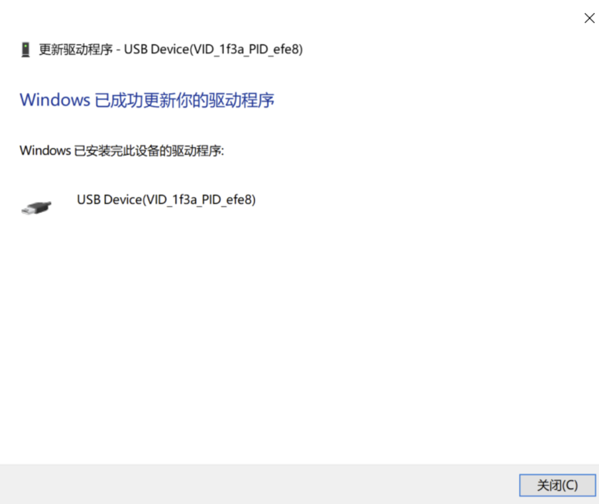


最后我们可以看到，设备管理器 里面的未知设备 变成了一个 `USB Device(VID_1f3a_efe8)`的设备，这时就表明设备驱动已经安装成功。

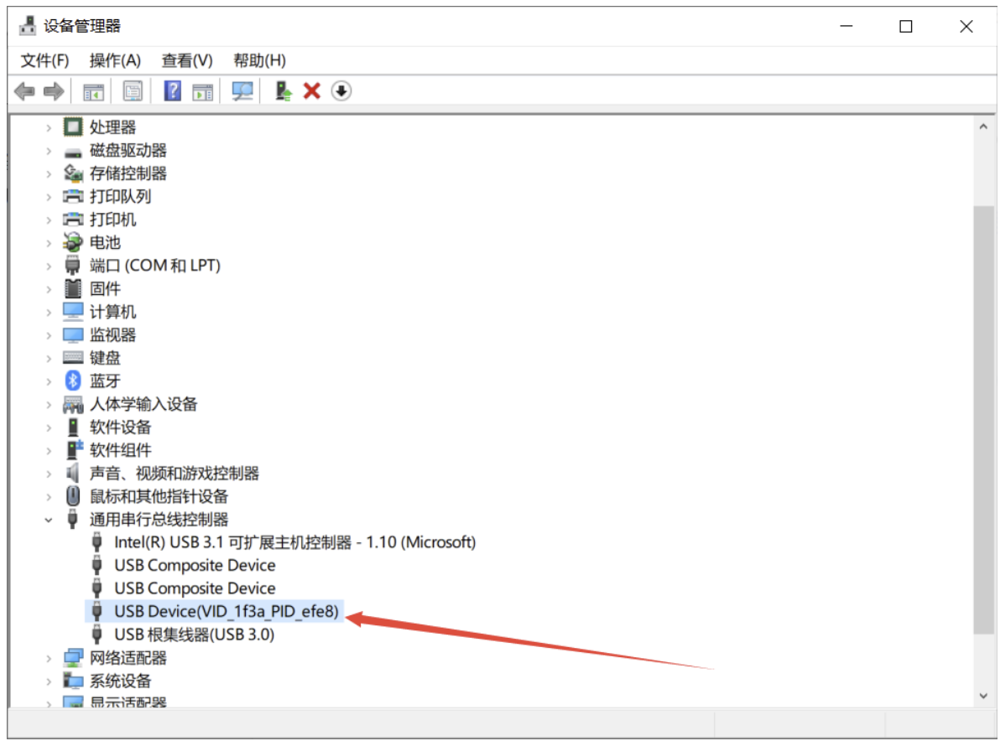

安装完成USB驱动后后续即可正常使用烧录功能。

## 安装LYNX芯桥软件

下载[LYNX芯桥软件](https://github.com/dshanpi/lynx-releases/releases)，软件存放在资料：`06_开发工具/`

安装完成后，打开软件后，选择`Linux工作台`，点击`新建`单板配置。

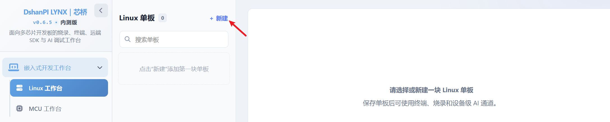

填写基础信息：
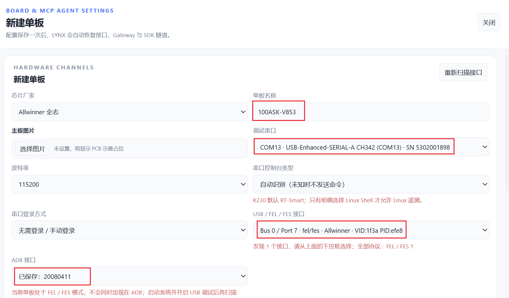

填写完成后点击`保存单板与接口`

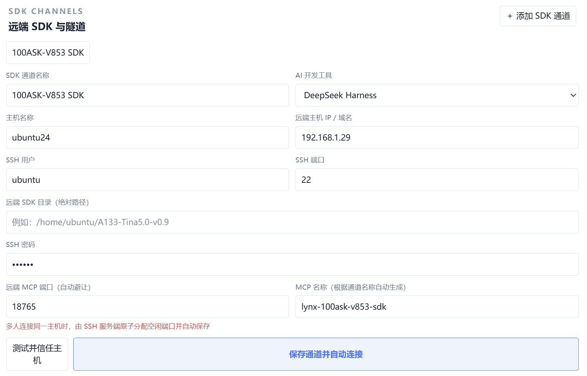

填写主机名称、IP地址、SSH用户名，并点击`保存通道并自动连接`。

## 使用AIAgent烧录固件

在Ubuntu中安装LYNX MCP服务，可以点击复制到Ubuntu中执行（不同的AI Agent的命令会不一致）。

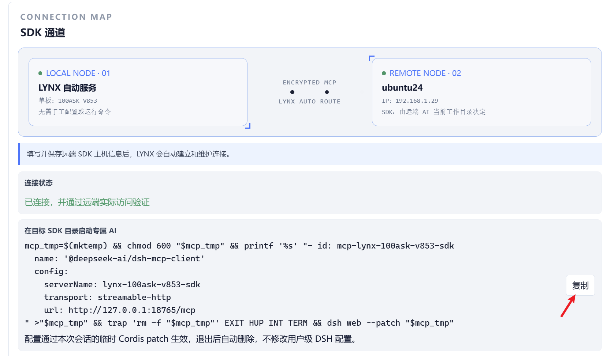

安装成功后，可以使用AI Agent进行烧录测试。

```
检查一下我安装的lynx mcp服务是否正常，如果正常请帮我烧录固件进V853硬件中。
```


## 验收标准

- 关键命令可复现。
- 输出与日志已归档。
- 异常有明确定位证据和处理记录。

## 常见问题

| 现象 | 检查项 | 处理记录 |
|---|---|---|
| 待补充 | 待补充 | 待补充 |
