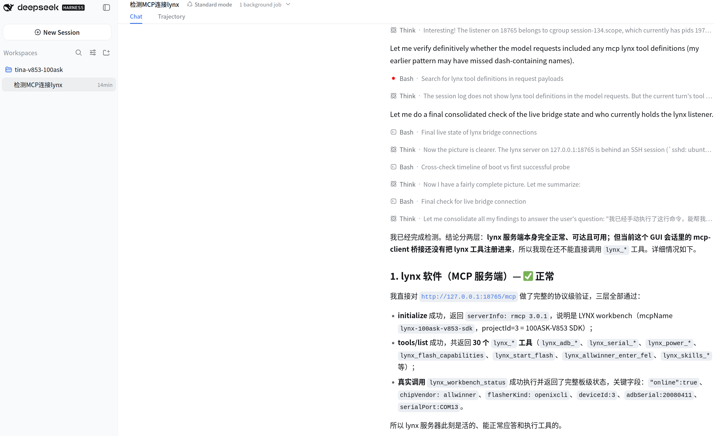
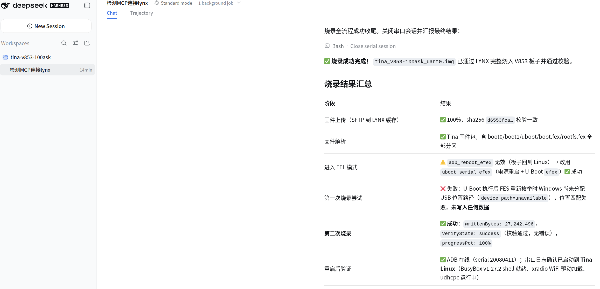

# 08 固件烧录

> 使用 LYNX 芯桥将 Tina 完整固件烧录到 V853 开发板，并用烧录结果与串口启动日志完成验收。

:::danger 烧录会改写开发板存储

开始前必须确认目标设备是课程使用的 V853 开发板，固件是上一节生成的完整 `.img` 文件。烧录期间不要拔插 USB、断电、关闭 LYNX，且不要同时运行其他烧录工具。

:::

## 学习目标

- 让 Windows 正确识别进入 FEL 模式的 V853 开发板。
- 建立 Windows、Ubuntu、LYNX 与 AI Agent 之间的连接。
- 在明确的权限边界内完成一次固件烧录。
- 使用固件来源、烧录工具的写入验证和串口启动日志判断结果，而不是只看 Agent 的文字结论。

## 烧录链路

本节涉及三端，先确认命令和设备所在位置：

| 位置 | 用途 | 本节操作 |
| --- | --- | --- |
| Windows 主机 | 连接 V853 的 USB/FEL 与串口设备 | 安装驱动、运行 LYNX |
| Ubuntu 虚拟机 | 保存 Tina SDK 和待烧录固件 | 启动带 LYNX MCP 配置的 Agent |
| V853 开发板 | 被烧录设备 | 进入 FEL，烧录后从串口验证启动 |

LYNX 通过 SSH 连接 Ubuntu，在远端读取固件；AI Agent 通过 MCP 调用 LYNX；LYNX 最终从 Windows 主机访问 V853 USB 设备。

## 烧录前检查

### 1. 准备硬件与软件

- V853 开发板及配套电源。
- 一根确认可以传输数据的 USB 线。仅能充电的线无法进入 FEL。
- Windows 10/11 主机、全志 USB 烧录驱动和 [LYNX 芯桥](https://github.com/dshanpi/lynx-releases/releases)。课程资料中也提供了 LYNX，目录为 `06_开发工具/`。
- 已启动且 Windows 可以通过 SSH 访问的 Ubuntu 虚拟机。
- 可查看开发板启动输出的串口终端。

### 2. 核对完整固件

本节只能烧录上一节 `pack` 生成的完整固件：

~~~text
/home/ubuntu/100ask-course/sdk/tina-v853-100ask/out/v853-100ask/tina_v853-100ask_uart0.img
~~~

不要选择同目录中的 `boot.img`、`rootfs.img` 或其他分区镜像。在 Ubuntu 中执行：

~~~bash
cd /home/ubuntu/100ask-course/sdk/tina-v853-100ask

firmware='out/v853-100ask/tina_v853-100ask_uart0.img'
test -s "$firmware"
printf 'FIRMWARE_CHECK_EXIT_CODE=%s\n' "$?"
stat --printf='FIRMWARE_SIZE_BYTES=%s\nFIRMWARE_MTIME=%y\n' "$firmware"
~~~

只有同时满足以下条件才继续：

- `FIRMWARE_CHECK_EXIT_CODE=0`。
- 文件修改时间属于本次打包。
- 文件来自上一节成功完成的本轮打包，未被其他产物覆盖。

将文件名、字节数、修改时间和打包结果保存到验收记录。烧录期间不要修改或重新打包这个文件；如果需要使用新的产物，先重新确认文件来源和目标设备。

## 安装 Windows USB 驱动

课程提供的全志 USB 烧录驱动解压后，应能看到类似文件：

~~~text
InstallUSBDrv.exe
drvinstaller_IA64.exe
drvinstaller_X86.exe
UsbDriver/
drvinstaller_X64.exe
install.bat
~~~

### 1. 让开发板进入 FEL 模式

1. 将数据 USB 线连接到开发板的 OTG/烧录接口和 Windows 主机。
2. 按住开发板的 **FEL** 键。
3. 短按一次 **RESET** 键。
4. 先松开 **RESET**，再松开 **FEL**。
5. 打开 Windows“设备管理器”，查看“通用串行总线控制器”或“其他设备”。

首次连接时，设备可能显示为“未知设备”。

### 2. 手动选择驱动目录

本课程以 Windows 10/11 为准：

1. 右键未知设备，选择“更新驱动程序”。
2. 选择“浏览我的计算机以查找驱动程序”。

   

3. 浏览到解压后的 `UsbDriver/` 目录。

   

4. 选中该目录并确认，然后点击“下一步”。

   

5. Windows 出现安全提示时，确认驱动来源是课程提供的驱动包，再选择安装。

   

6. 等待 Windows 提示驱动程序更新成功。

   

安装完成后，设备应显示为 `USB Device(VID_1f3a_efe8)`，且没有黄色感叹号。

> 设备离开 FEL 或重新启动后从设备管理器中消失是正常现象。需要再次烧录时，重新执行进入 FEL 的按键步骤。

## 配置 LYNX 芯桥

### 1. 新建单板

1. 在 Windows 安装并打开 LYNX。
2. 进入“Linux 工作台”，点击“新建”。
3. 选择课程使用的 V853 单板，填写单板名称，保存单板与接口。

### 2. 添加远程 SDK 通道

按实际 Ubuntu 环境填写，不要照抄截图中的 IP 地址和密码：

| 字段 | 本课程示例 | 要求 |
| --- | --- | --- |
| SDK 通道名称 | `100ASK-V853 SDK` | 使用便于识别的名称 |
| AI 开发工具 | `DeepSeek Harness` | 与实际使用的 Agent 一致 |
| 主机名称 | `ubuntu24` | 自定义显示名称 |
| 远程主机 IP/域名 | `192.168.1.29` | 填 Ubuntu 当前地址 |
| SSH 用户 | `ubuntu` | 填实际登录用户 |
| SSH 端口 | `22` | 未修改 SSH 配置时使用默认值 |
| 远程 SDK 目录 | `/home/ubuntu/100ask-course/sdk/tina-v853-100ask` | 必须是绝对路径，且目录中能找到固件 |
| SSH 密码 | 当前 Ubuntu 用户密码 | 不要写入文档、聊天记录或截图 |
| 远程 MCP 端口 | 由 LYNX 分配 | 使用界面显示的值 |

不知道 Ubuntu IP 时，可在 Ubuntu 终端执行 `hostname -I`。先点击“测试并信任主机”，测试通过后再点击“保存通道并自动连接”。

返回 SDK 通道页面，确认两项状态：

- 本地 LYNX 服务在线。
- 远程节点显示“已连接，并通过远端实际访问验证”。

## 连接 AI Agent 与 LYNX MCP

### 1. 启动带临时 MCP 配置的 Agent

在 LYNX 的 SDK 通道页面找到“在目标 SDK 目录启动专属 AI”，点击“复制”。**优先执行界面生成的命令**，因为 MCP 名称、端口和 Agent 命令可能随通道配置变化。

下面是本课程截图对应的示例，仅用于说明命令结构：

~~~bash
cd /home/ubuntu/100ask-course/sdk/tina-v853-100ask

mcp_tmp=$(mktemp) && chmod 600 "$mcp_tmp" && printf '%s' "- id: mcp-lynx-100ask-v853-sdk
  name: '@deepseek-ai/dsh-mcp-client'
  config:
    serverName: lynx-100ask-v853-sdk
    transport: streamable-http
    url: http://127.0.0.1:18765/mcp
" >"$mcp_tmp" && trap 'rm -f "$mcp_tmp"' EXIT HUP INT TERM && dsh web --patch "$mcp_tmp"
~~~

该配置只对本次 Agent 会话生效，退出后临时文件会自动删除。命令中的 `127.0.0.1` 和端口来自 LYNX 建立的远程通道，并不表示 MCP 服务直接运行在 Ubuntu 中。

### 2. 验证 MCP 工具可用

打开上一步启动的新 Agent 会话，发送：

~~~text
请只检查当前会话的 LYNX MCP 连接，不执行烧录、重启、编译、打包或文件修改。

请依次确认：
1. MCP initialize 成功；
2. tools/list 返回 lynx_* 工具；
3. 实际调用一次只读的 LYNX 工作台状态工具；
4. 汇总 MCP 名称、LYNX 在线状态、芯片厂商、烧录器类型和已识别的设备，不显示密码或其他凭据。

任一项失败就停止，只报告失败项和原始错误。
~~~

只有“端口可访问”或“进程存在”不能证明当前 Agent 已加载 LYNX 工具；必须同时看到工具列表和一次只读工具调用成功。

## 使用 AI Agent 烧录固件

### 1. 开始烧录前的最后确认

- 设备管理器能识别 FEL 设备，或 LYNX 已明确识别课程 V853 板卡。
- 串口终端没有被其他软件占用；若 LYNX 需要接管串口，先关闭已有串口会话。
- 笔记本已接电，Windows 与 Ubuntu 不会在烧录过程中休眠。
- 固件绝对路径、文件大小和本轮打包结果均已核对。
- 当前没有 PhoenixSuit、LiveSuit 或另一个 Agent 正在操作同一块板。

### 2. 向 Agent 下达受控烧录任务

确认下面的路径指向本轮成功打包的完整固件，再发送提示词：

~~~text
请使用 LYNX 将下面的完整 Tina 固件烧录到当前唯一连接的课程 V853 开发板：
/home/ubuntu/100ask-course/sdk/tina-v853-100ask/out/v853-100ask/tina_v853-100ask_uart0.img

执行边界：
1. 先只读检查固件存在、大小不为 0，确认路径、修改时间及本轮打包结果；来源不明确立即停止。
2. 查询 LYNX 状态与烧录能力，确认目标是唯一的全志 V853 设备；设备不唯一或型号不明确时停止。
3. 不编译、不重新打包、不修改或删除文件，不安装软件。
4. 预检通过后只启动一次烧录，持续报告进度，烧录过程中不得并行执行其他设备操作。
5. 如果失败，保存原始错误、阶段、已写入字节数和设备状态，不自动重试。
6. 成功必须同时给出 progressPct、writtenBytes 和 verifyState，并在安全关闭烧录/串口会话后汇总结果。
~~~

:::warning 识别 Agent 的权限请求

烧录固件属于预期的设备写入操作，可以在目标设备、固件路径和打包结果都确认无误时批准。凡是涉及重新编译、`pack`、删除文件、安装软件、修改系统配置或操作其他 USB 设备的请求，均不属于本节烧录范围，应拒绝并先检查原因。

:::

烧录期间观察进度，但不要按 RESET、拔线、断电或关闭页面。Agent 报告完成后，至少核对：

- `progressPct` 为 `100%`。
- `writtenBytes` 大于 `0`。
- `verifyState` 为 `success`，或 LYNX 当前版本提供的等价“校验通过”状态。
- 没有尚未处理的设备断连、分区写入或校验错误。

下图中的第一次尝试因 Windows USB 位置重新分配而失败，且 `writtenBytes=0`；重新确认设备状态后，第二次烧录完成并通过校验。它说明失败记录要保留，也说明“最终成功”必须以最后一次烧录的完整状态字段为准。

## 重启并验证新固件

烧录成功不等于系统启动成功。关闭 LYNX 占用的串口会话后，在 Windows 串口终端中选择 `USB-Enhanced-SERIAL-A CH342`，设置为 `115200 8N1`，再复位或重新上电开发板。

### 1. 检查启动日志

从复位开始保存完整串口日志。开发板应完成 U-Boot 和 Linux 启动，并在 120 秒内出现：

~~~text
root@TinaLinux:/#
~~~

不应出现持续重启、Kernel panic、根文件系统挂载失败或反复进入 FEL。

### 2. 记录板端状态

在开发板串口终端执行，注意不是在 Ubuntu 虚拟机中执行：

~~~sh
uname -a
cat /etc/os-release 2>/dev/null || cat /etc/openwrt_release 2>/dev/null
uptime
~~~

课程默认系统的内核版本应包含 `4.9.191`。若课程为本次固件加入了版本号、构建日期或其他唯一标记，还必须检查该标记；仅凭设备能够启动，无法证明运行的一定是本次生成的镜像。

接着按 [外设验证：LCD 与 Touch](./10-peripheral-validation.md) 完成屏幕和触摸验收。

## 验收清单

### 固件与连接

- [ ] 烧录文件是 `tina_v853-100ask_uart0.img`，不是单独的分区镜像。
- [ ] 固件非空，修改时间属于本轮打包，实际烧录路径正确。
- [ ] Windows 将 FEL 设备识别为 `VID_1f3a_efe8`，且设备没有黄色感叹号。
- [ ] LYNX 本地服务和 Ubuntu 远程 SDK 通道均在线，SDK 绝对路径正确。
- [ ] 当前 Agent 的 `tools/list` 能看到 `lynx_*` 工具，且一次只读状态调用成功。

### 烧录与启动

- [ ] 烧录结果同时满足 `progressPct=100%`、`writtenBytes>0`、`verifyState=success` 或等价状态。
- [ ] 烧录期间没有断电、拔线、休眠或并行运行其他烧录工具。
- [ ] 复位后 120 秒内出现 `root@TinaLinux:/#`，且没有 Kernel panic、挂载失败或重启循环。
- [ ] `uname -a`、系统版本信息和本次固件的唯一标记（如果有）符合预期。
- [ ] 下一节的 LCD 与 Touch 验证可以继续执行。

### 验收记录

- [ ] 已保存固件路径、字节数、修改时间和打包结果。
- [ ] 已保存烧录开始/结束时间、目标设备、最终进度、写入字节数和校验状态。
- [ ] 已保存从复位到登录提示符的完整串口日志。
- [ ] 若发生失败，已保留每次尝试的错误、是否写入数据和处理记录，没有用最终成功覆盖中间失败。

以上三组全部通过，本节才算验收完成。

## 验收记录模板

~~~text
日期：
操作人：

[固件]
绝对路径：
文件大小（字节）：
修改时间：
打包结果：

[设备与连接]
开发板：V853-100ASK
Windows FEL 设备：USB Device (VID_1f3a_efe8) / 未识别
LYNX 通道名称：
LYNX 状态：在线 / 离线
MCP 工具调用：成功 / 失败

[烧录]
开始时间：
结束时间：
progressPct：
writtenBytes：
verifyState：
错误与处理：

[启动]
出现 root@TinaLinux 提示符：是 / 否
启动耗时：
uname -a：
系统版本/唯一标记：
串口日志文件：

最终结论：通过 / 不通过
~~~

## 常见问题

| 现象 | 可能原因 | 处理方法 |
| --- | --- | --- |
| 按键后没有出现 USB 设备 | USB 线仅支持充电、接口选错、FEL 时序不正确 | 更换已验证的数据线，确认连接 OTG/烧录口，重新按“FEL → RESET → 先松 RESET”的顺序操作 |
| 显示未知设备或黄色感叹号 | 全志 USB 驱动未安装或选择了错误目录 | 在设备管理器中重新指定课程驱动包的 `UsbDriver/` 目录 |
| 安装驱动后设备消失 | 开发板已退出 FEL | 这是可能的正常现象；需要烧录时重新进入 FEL，再确认 VID |
| LYNX 无法连接 Ubuntu | IP 变化、SSH 未启动、账号或端口错误 | 用 `hostname -I` 确认地址；先从 Windows 测试 SSH，再在 LYNX 中测试并信任主机 |
| LYNX 已连接，但找不到固件 | 远程 SDK 目录为空或使用了相对路径 | 改为 `/home/ubuntu/100ask-course/sdk/tina-v853-100ask`，并在 Ubuntu 中执行 `test -s` |
| MCP 端口可访问，但 Agent 没有 `lynx_*` 工具 | Agent 不是由带 `--patch` 的新会话启动，或临时配置不匹配 | 退出当前会话，从 LYNX 页面重新复制命令并启动新会话，再检查 `tools/list` |
| 进入 FEL 后报告 `device_path=unavailable` | Windows 在 USB 重新枚举后改变了设备位置 | 停止本次任务；确认 `writtenBytes=0`，重新进入 FEL 并等待设备稳定，再由用户发起新一次烧录 |
| 进度长期不变化 | USB/供电不稳定、设备掉线或工具失去连接 | 不要立即断电；先保存 LYNX 状态与错误。工具已明确失败后，再退出并检查线缆、供电和设备管理器 |
| `progressPct=100%` 但校验失败 | 写入完成不代表读取校验通过 | 判定本次失败，保存 `verifyState` 与原始错误；排除连接和固件问题后重新发起烧录 |
| 烧录成功但没有启动提示符 | 串口选择或参数错误、板卡未复位、固件启动失败 | 确认 CH342 串口和 `115200 8N1`，重新复位并保存完整日志；按首条有效错误定位 |
| 启动后仍像旧固件 | 烧错文件、固件未包含可识别变化、烧录目标错误 | 核对实际烧录路径和目标设备；使用构建时写入的唯一版本标记确认，不能只凭界面外观判断 |

## 失败后的恢复原则

1. 先保存本次烧录状态和串口日志，不要连续自动重试。
2. 若 LYNX 明确显示 `writtenBytes=0`，说明本次没有写入数据；修复连接后再由用户发起新任务。
3. 若已经写入部分数据或烧录工具的写入验证失败，不要尝试从当前系统正常启动。重新进入 FEL，确认完整固件来自成功打包的产物及目标设备无误后，再执行一次新的完整烧录。
4. 新固件持续无法启动时，使用课程提供且已验证的已知良好完整固件恢复；仍然执行同一套设备、校验和串口验收。

## 版本与变更记录

- 适用板卡：V853-100ASK。
- 适用固件：`tina_v853-100ask_uart0.img`，Tina Linux `4.9.191`。
- 2026-09-03：重构驱动、LYNX、MCP、烧录和启动验证流程，增加安全边界、可量化验收标准、记录模板与故障恢复原则。
