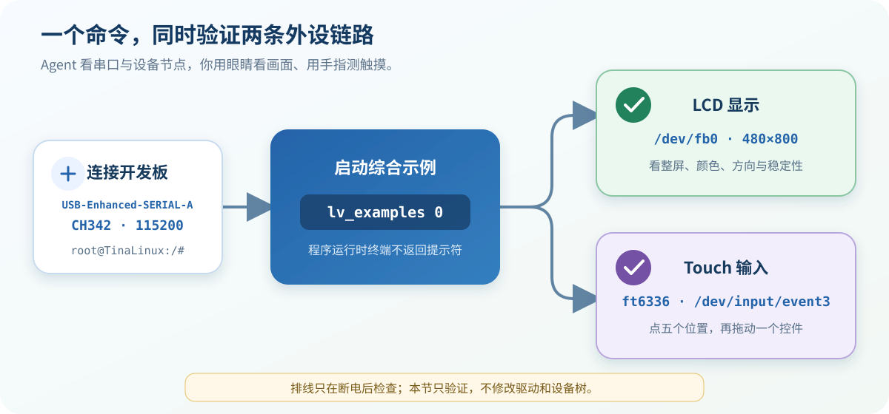
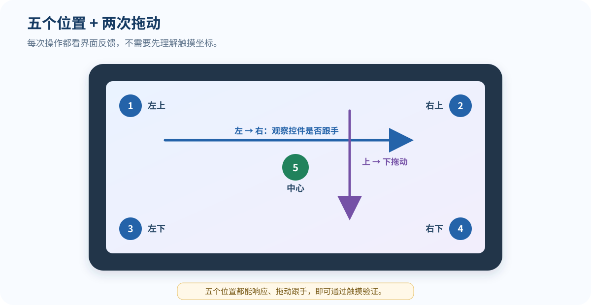

# 10 外设验证：LCD 与 Touch

> 默认固件已经适配 LCD 和触摸。本节只运行一个示例完成验收，不修改驱动、设备树或内核。

## 验证前准备

- 开发板已烧录课程默认固件，并能正常启动。
- 在串口终端中选择 `USB-Enhanced-SERIAL-A CH342`，参数设为 `115200 8N1`。设备名称后面的 COM 编号以电脑实际显示为准。
- 检查或重插 LCD、Touch 排线前，必须先断开开发板电源。

**下面的命令在开发板串口终端执行，不是在 Ubuntu 虚拟机中执行。**

## 1. 运行验证程序

1. 打开串口终端并给开发板上电。

2. 等待看到开发板命令提示符：

   ~~~text
   root@TinaLinux:/#
   ~~~

3. 输入下面的命令并按回车：

   ~~~sh
   lv_examples 0
   ~~~

4. 程序启动后，串口会打印类似信息：

   ~~~text
   wh=480x800, vwh=480x1600, bpp=32, rotated=0
   Turn on double buffering.
   ~~~

终端暂时不再出现命令提示符，通常表示示例正在前台运行，并不是开发板卡死。

## 2. 检查 LCD

1. 观察 LCD 是否出现 LVGL 示例界面。

2. 检查画面是否铺满屏幕，有没有花屏、撕裂或持续闪烁。

3. 检查颜色和显示方向是否正常。

4. 拍一张包含整块屏幕的照片，作为验收记录。

> 串口可以确认程序已经打开 `/dev/fb0`，但颜色、花屏和屏幕方向仍需要用眼睛观察。

## 3. 检查 Touch

1. 依次点击左上、右上、左下、右下和中心区域。

2. 点击画面中可以操作的按钮、开关或选项，确认界面有反馈。

3. 找到可以拖动的控件，从左向右、从上向下各拖动一次。

4. 五个区域都能点击、控件能够跟随手指移动，即可判定触摸验证通过。

> 本板触摸设备实测名称为 `ft6336`，节点为 `/dev/input/event3`。`eventN` 编号可能随固件变化，排查时应优先认设备名称。

## 4. 退出示例

验证完成后，在串口终端按：

~~~text
Ctrl + C
~~~

重新看到下面的提示符，就表示程序已经退出：

~~~text
root@TinaLinux:/#
~~~

## 本板串口实测结果

| 项目 | 实测结果 |
| --- | --- |
| 系统 | TinaLinux 4.9.191，V853-100ASK |
| LCD 节点 | `/dev/fb0` |
| LCD 参数 | `480×800`，32 bpp，stride `1920` |
| 双缓冲 | 虚拟画布 `480×1600`，示例打印 `Turn on double buffering.` |
| Touch 设备 | `ft6336` |
| Touch 节点 | `/dev/input/event3` |
| 示例程序 | `/usr/bin/lv_examples` |
| Agent 串口验证 | `lv_examples 0` 启动成功，并同时打开 `/dev/fb0` 与 `/dev/input/event3` |
| 人工观察 | LCD 画面与真实触摸反馈由现场操作人员勾选确认 |

## 异常速查

| 现象 | 先检查什么 |
| --- | --- |
| 找不到或打不开 `USB-Enhanced-SERIAL-A CH342` | 关闭 MobaXterm 等正在占用串口的软件，再重新连接 |
| 提示 `lv_examples: not found` | 尝试执行 `/usr/bin/lv_examples 0` |
| 背光亮但没有示例画面 | 确认运行的是默认固件，并保存串口报错 |
| 画面花屏、裁切或方向错误 | 拍照并记录现象，本节不要先修改 LCD 驱动 |
| 点击没有反应 | 断电检查 Touch 排线，再确认输入设备名称是否为 `ft6336` |

需要收集日志时，先按 `Ctrl + C` 退出示例，再执行：

~~~sh
echo '=== LCD ==='
dmesg | grep -Ei 'disp|lcd|panel|framebuffer|fb'

echo '=== Touch ==='
dmesg | grep -Ei 'ft6336|touch|input|i2c|irq'
~~~

## 验收清单

- [ ] `lv_examples 0` 可以正常启动。
- [ ] LCD 画面完整、稳定，颜色和方向正常。
- [ ] 五个区域都能点击，拖动操作能够跟手。
- [ ] 验证过程中没有修改驱动、设备树或内核。

任意一项未通过时，先记录画面和串口日志，再进入对应章节排查。
